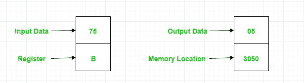
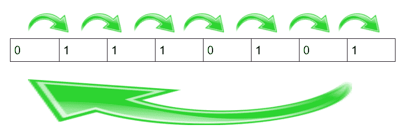

# 8085 程序对寄存器B内容中的1进行计数

> 原文: [https://www.geeksforgeeks.org/assembly-language-program-8085-microprocessor-count-number-ones-contents-register-b/](https://www.geeksforgeeks.org/assembly-language-program-8085-microprocessor-count-number-ones-contents-register-b/)

## 问题
编写汇编语言程序，统计寄存器 B 内容中的 1 个数，并将结果存储在内存位置 `3050`。

## 示例

## 算法
*   将累加器中的十进制数转换为其二进制等价物
*   将二进制数的数字向右旋转，不带进位
*   应用一个循环，直到计数不为零，以改变 `D` 寄存器和计数的值
*   将 `D` 寄存器的值复制到累加器并存储结果

## 程序
| 存储地址 | 记忆术 | 评论 |
| --- | --- | --- |
| `2000` | `MVI B 75` | `B <- 75` |
| `2002` | `MVI C 08` | `C <- 08` |
| `2004` | `MVI D 00` | `D <- 00` |
| `2006` | `MOV A B` | `A <- B` |
| `2007` | `RRC` | 不带进位向右旋转 |
| `2008` | `JNC 200B` | 不进位则跳转 |
| `200B` | `INR D` | `D+1` |
| `200C` | `DCR C` | `C-1` |
| `200D` | `JNZ 2007` | 如果非零则跳转 |
| `2010` | `MOV A, D` | `A <- D` |
| `2011` | `STA 3050` | `A -> 3050` |
| `2014` | `HLT` | 停止执行 |

## 解释
1.  `MVI B 75` 将 `75` 十进制数移入 `B` 寄存器
2.  `MVI C 08` 将 `08` 十进制数移入 `C` 寄存器，作为计数器，其位数为 8 位
3.  `MVI D 00` 将 `00` 移入 `D` 寄存器
4.  `MOV A, B` 将 `B` 寄存器的内容移入 `A`（累加器）寄存器
5.  `RRC` 向右旋转 `A`（`75`，二进制等价 `01110101`）的内容
    
6.  `JNC 200C` 如果进位标志不为零，则跳转到 `200C` 地址并执行写在那里的指令
7.  `INR D` 通过将 `D` 寄存器的内容加 1 来增加 `D` 寄存器的值
8.  `DCR C` 通过从其内容中减去一来减少 `C` 寄存器的值
9.  `JNZ 2007` 如果零标志不为零，则跳转到 `2007` 地址，执行写在那里的指令
10. `MOV A, D` 将 `D` 寄存器的内容移入 `A` 寄存器
11. `STA 3050` 将 `A` 的内容存储在 `3050` 存储位置
12. `HLT` 停止执行