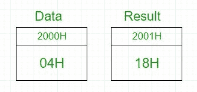
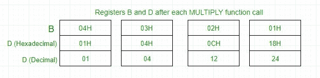

# 8085 程序求一个数的阶乘

> 原文: [https://www.geeksforgeeks.org/assembly-language-program-8085-microprocessor-find-factorial-number/](https://www.geeksforgeeks.org/assembly-language-program-8085-microprocessor-find-factorial-number/)

## 问题
用 8085 微处理器编写一个计算一个数的阶乘的汇编语言程序。

## 示例
```
Input : 04H
Output : 18H 
as 04*03*02*01 = 24 in decimal => 18H
```



在 8085 微处理器中，不存在直接将两个数相乘的指令，所以乘法是通过重复加法来完成的，因为 `4×3` 相当于 `4+4+4`（即 3 次）。
在 `D` 寄存器加载 `04H` -> 添加 `04H` 3 次 -> `D` 寄存器现在包含 `0CH` -> 添加 `0CH` 2 次 -> `D` 寄存器现在包含 `18H` -> 添加 `18H` 1 次 -> `D` 寄存器现在包含 `18H` -> 输出为 `18H`。



## 算法
1.  将数据载入寄存器 `B`。
2.  若要开始乘法，请将 `D` 设置为 `01H`。
3.  跳到第 7 步。
4.  递减 `B` 以乘以上一个数字。
5.  跳到步骤 3，直到值 `B>0`。
6.  将内存指针指向下一个位置并存储结果。
7.  用 `B` 的内容物装载 `E`，并清除累加器。
8.  将 `D` 的内容重复添加到累加器 `E` 中多次。
9.  将累加器内容存储到 `D`。
10. 转到第 4 步。

```
| 地址 | 标签 | 记忆的 | 评论 |
| --- | --- | --- | --- |
| 2000H | DATA |  | 数据字节 |
| 2001H | RESULT |  | 阶乘结果 |
| 2002H |  | LXI H, 2000H | 从内存中加载数据 |
| 2005H |  | MOV B, M | 将数据载入 B 寄存器 |
| 2006H |  | MVI D, 01H | 用 1 设置 D 寄存器 |
| 2008H | FACTORIAL | CALL MULTIPLY | 乘法子程序调用 |
| 200BH |  | DCR B | 减量 B |
| 200CH |  | JNZ FACTORIAL | 调用阶乘，直到 B 变成 0 |
| 200FH |  | INX H | 增量内存 |
| 2010H |  | MOV M, D | 将结果存储在内存中 |
| 2011H |  | HLT | 停止 |
| 2100H | MULTIPLY | MOV E, B | 将 B 的内容转移到 E |
| 2101H |  | MVI A, 00H | 清除累加器以存储结果 |
| 2103H | MULTIPLYLOOP | ADD D | 将 D 的内容添加到 A 中 |
| 2104H |  | DCR E | 减量 E |
| 2105H |  | JNZ MULTIPLYLOOP | 叠加 |
| 2108H |  | MOV D, A | 将 A 的内容转移到 D |
| 2109H |  | RET | 从子程序返回 |
```

## 解释
1.  首先用数据设置寄存器 `B`。
2.  通过调用乘法子程序一次，用数据设置寄存器 `D`。
3.  通过调用 `MULTIPLY` 子例程将 `B` 减 1，将 `D` 加到自身 `B` 次，因为 `4*3` 相当于 `4+4+4`（即 3 次）。
4.  重复上述步骤，直到 `B` 达到 0，然后退出程序。
5.  结果在存储在存储器中的 `D` 寄存器中获得。