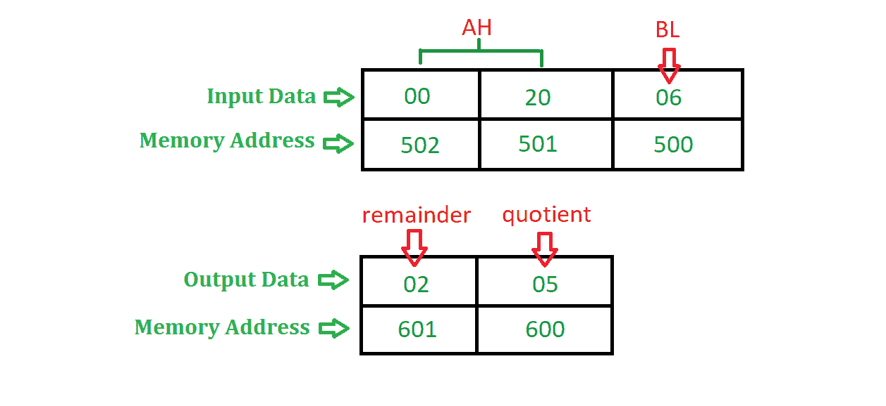

# 8086 编程将 16 位数字除以 8 位数字

> 原文：[https://www.geeksforgeeks.org/assembly-language-program-8086-microprocessor-divide-16-bit-number-8-bit-number/](https://www.geeksforgeeks.org/assembly-language-program-8086-microprocessor-divide-16-bit-number-8-bit-number/)

## 问题
在 8086 微处理器中编写汇编语言程序，将 16 位数字除以 8 位数字。

## 示例

## 算法
1.  在 `DS` 中赋值 `500`，在 `ES` 中赋值 `600`。
2.  将 `[SI]` 的内容移动到 `BL` 中，并将 `SI` 增加 1。
3.  将 `[SI]` 和 `[SI + 1]` 的内容移动到 `AX` 中。
4.  使用 `DIV` 指令将 `AX` 除以 `BL`。
5.  将 `AX` 的内容移动到 `[DI]` 中。
6.  暂停程序。

## 假设
每个段寄存器的初始值为 `0000H`。

## 物理内存地址的计算
内存地址 = 段寄存器 * `10H` + 偏移量，
其中段寄存器和偏移量根据下表决定。

| 操作 | 段寄存器 | 偏移 |
| :--- | :--- | :--- |
| 取指令 | 代码段 | 指令指针 |
| 数据操作 | 数据段 | 基础寄存器 `BX`，位移 `DISP` |
| 堆叠操作 | 堆叠段 | 栈指针 `SP`，基指针 `BP` |
| 以弦为源 | 数据段 | 源索引 `SI` |
| 字符串作为目的地 | 额外段 | 目的地索引 `DI` |

## 程序

| 内存地址 | 助记符 | 注释 |
| :--- | :--- | :--- |
| `0400` | `MOV SI, 500` | `SI <- 500` |
| `0403` | `MOV DI, 600` | `DI <- 600` |
| `0406` | `MOV BL, [SI]` | `BL <- [SI]` |
| `0408` | `INC SI` | `SI <- SI + 1` |
| `0409` | `MOV AX, [SI]` | `AX <- [SI]` |
| `040B` | `DIV BL` | `AX <- AX / BL` |
| `040D` | `MOV [DI], AX` | `[DI] <- AX` |
| `040F` | `HLT` | 程序结束 |

## 解释
使用的寄存器：`AX`、`BL`、`SI`、`DI`。

1.  `MOV SI, 500`：给 `SI` 分配 `500`。
2.  `MOV DI, 600`：给 `DI` 分配 `600`。
3.  `MOV BL, [SI]`：将 `[SI]` 的内容移动到 `BL` 寄存器，即除数的值将存储在 `BL` 中。
4.  `INC SI`：将 `SI` 的值增加 1。
5.  `MOV AX, [SI]`：将 `[SI]` 和 `[SI + 1]` 的内容移动到 `AX` 寄存器，即被除数值将存储在 `AX` 中。
6.  `DIV BL`：将 `AX` 的内容除以 `BL`，执行此指令后，商存储在 `AL` 中，余数存储在 `AH` 中。
7.  `MOV [DI], AX`：将 `AX` 的内容移动到 `[DI]`。
8.  `HLT`：停止执行程序并停止任何进一步的执行。