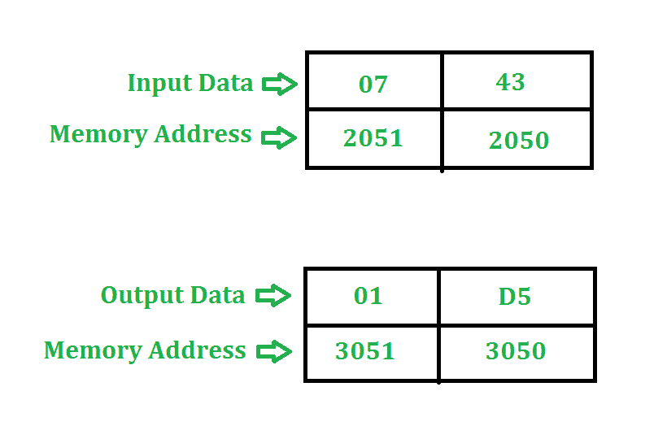

# 8085 程序将两个 8 位数字相乘

> 原文: [https://www.geeksforgeeks.org/assembly-language-program-multiply-two-8-bit-numbers-8085-microprocessor/](https://www.geeksforgeeks.org/assembly-language-program-multiply-two-8-bit-numbers-8085-microprocessor/)

## 问题
将存储在地址 `2050` 和 `2051` 的两个 8 位数字相乘。结果存储在地址 `3050` 和 `3051`。程序的起始地址取 `2000`。

## 示例


## 算法
1.  在这个例子中，我们把数字 `43` 加七 (`7`) 次。
2.  由于两个 8 位数字的相乘最多可以是 16 位，所以我们需要寄存器对来存储结果。

## 程序
```
| 存储地址 | 记忆术     | 评论                     |
|----------|------------|--------------------------|
| 2000     | LHLD 2050  | H<-2051, L<-2050         |
| 2003     | XCHG       | H<->D, L<->E             |
| 2004     | MOV C, D   | C<-D                     |
| 2005     | MVI D 00   | D<-00                    |
| 2007     | LXI H 0000 | H<-00, L<-00             |
| 200A     | DAD D      | HL<-HL+DE                |
| 200B     | DCR C      | C<-C-1                   |
| 200C     | JNZ 200A   | 如果零标志=0，转到 200A  |
| 200F     | SHLD 3050  | H->3051, L->3050         |
| 2012     | HLT        | 停止                     |
```

## 解释
使用的寄存器: `A`, `H`, `L`, `C`, `D`, `E`

1.  `LHLD 2050` 加载 `H` 中的 `2051` 含量和 `L` 中的 `2050` 含量。
2.  `XCHG` 交换 `H` 和 `D` 的含量，交换 `L` 和 `E` 的含量。
3.  `MOV C, D` 复制 `C` 中 `D` 的内容。
4.  `MVI D 00` 将 `00` 分配给 `D`。
5.  `LXI H 0000` 给 `H` 分配 `00`，给 `L` 分配 `00`。
6.  `DAD D` 将 `HL` 和 `DE` 相加，并将结果赋给 `HL`。
7.  `DCR C` 将 `C` 减 `1`。
8.  `JNZ 200A` 如果零标志=`0`，将程序计数器跳至 `200A`。
9.  `SHLD` 将 `H` 值存储在存储单元 `3051`，将 `L` 值存储在存储单元 `3050`。
10. `HLT` 停止执行程序并停止任何进一步的执行。

接下来阅读: [汇编语言程序(8085 微处理器)添加两个 8 位数字](https://www.geeksforgeeks.org/assembly-language-program-8085-microprocessor-add-two-8-bit-numbers/)

## 另一种方法
我们可以在不使用 `DAD` 和 `XCHG` 命令的情况下进行两个 8 位数字的乘法运算。

### 程序
```
| 地址   | 记忆术      | 评论                     |
|--------|-------------|--------------------------|
| 2000   | LXI H, 2050H|                          |
| 2003   | MOV B, M    | B<-(M)                   |
| 2004   | INX H       |                          |
| 2005   | MOV C, M    | C<-(M)                   |
| 2006   | MVI A, 00H  | A<-00                    |
| 2008   | TOP: ADD B  | A<-A+B                   |
| 2009   | DCR C       | C<-C-1                   |
| 200A   | JNZ TOP     | 如果零标志=0，跳转到 TOP |
| 200D   | INX H       |                          |
| 200E   | MOV M, A    | (M)<-A                   |
| 200F   | HLT         | 终止程序                 |
```

### 说明
寄存器 `A`, `H`, `L`, `C`, `B` 用于通用。

1.  `LXI H, 2050` 将用存储单元的地址 `2050` 加载 `HL` 对寄存器。
2.  `MOV B, M` 将内存内容复制到寄存器 `B`。
3.  `INX H` 将 `HL` 对的地址递增 `1`，使其为 `2051H`。
4.  `MOV C, M` 将内存内容复制到寄存器 `C`。
5.  `MVI A, 00H` 给 `A` 分配 `00`。
6.  `TOP: ADD B` 用寄存器 `B` 添加累加器的内容，并将结果存储在累加器中。
7.  `DCR C` 递减寄存器 `C`。
8.  `JNZ TOP` 跳到 `TOP`，直到 `C` 没有变成 `0`。
9.  `INX H` 将 `HL` 对的地址递增 `1`，使其为 `2052H`。
10. `MOV M, A` 复制 `A` 的内容，这是我们注册 `M` 的答案。
11. `HLT` 停止执行程序，并停止任何进一步的执行。