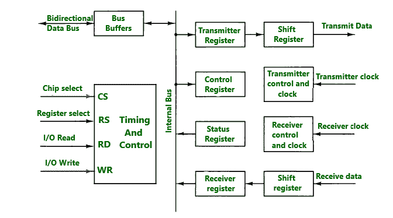
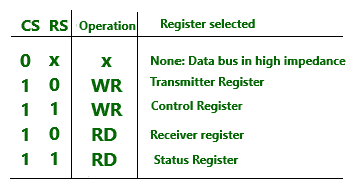

# 异步通信接口

> 原文:[https://www . geesforgeks . org/异步-通信-接口/](https://www.geeksforgeeks.org/asynchronous-communication-interface/)

异步通信接口的框图如上所示。它既是发射机又是接收机。

## 部分接口

接口通过载入`控制寄存器`的控制位进行初始化。`发送器寄存器`通过`数据总线`接收来自`中央处理器`的数据字节，然后传输到`移位寄存器`进行串行传输。串行信息被接收到另一个`移位寄存器`中，并在累积了一个完整的数据字节后传输到`接收器寄存器`。`状态寄存器`中的位用于检查传输过程中的任何错误，以及可由`中央处理器`读取的输入和输出标志。`芯片选择(CS)`输入用于通过`地址总线`选择接口。`寄存器选择(RS)`与`读(RD)`和`写(WR)`控制相关联。两个寄存器只能读写。

选择的寄存器是`遥感值`和`研发`和`WR`状态的函数，如下表所示。

## 接口工作

接口由`中央处理器`通过向`控制寄存器`发送一个字节来初始化。`状态寄存器`中的两位用作标志，一位用于指示`传输寄存器`是否为空，另一位用于指示`接收器寄存器`是否已满。

## 变送器部分的工作

`中央处理器`读取`状态寄存器`并检查`变送器`。如果`发射器`是空的，则`中央处理器`将字符传输到`发射器`。`发送器`中的第一位设置为`0`，产生一个`起始位`。字符从`发送器寄存器`并行传输到`移位寄存器`。然后`变送器`被标记为空。在检查`状态寄存器`中的标志后，`中央处理器`可以将另一个字符传送到`发送器寄存器`。

## 接收部分工作

线路空闲时，接收数据输入为`1`状态。`接收器控制`监控接收数据线以检测`起始位`的出现。一旦检测到`起始位`，字符位就被转移到`移位寄存器`。当接收到`停止位`时，字符从`移位寄存器`并行传输到`接收器寄存器`。

接口检查传输过程中的任何错误，并在`状态寄存器`中设置适当的位。接口检查的三个可能的错误是`奇偶校验错误`、`帧错误`和`溢出错误`。