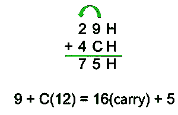

# 8086 微处理器中的辅助进位标志

> 原文: [https://www.geeksforgeeks.org/auxiliary-carry-flag-in-8086-microprocessor/](https://www.geeksforgeeks.org/auxiliary-carry-flag-in-8086-microprocessor/)

`辅助进位标志(AF)` 是 8086 微处理器中的六个状态标志之一。

*   该标志用于 `BCD` (二进制编码十进制)操作。
*   对于 `算术逻辑单元` 执行的每一次算术或逻辑运算，都会更新该标志的状态。
*   如果在二进制表示中，较低半字节有`进位`或较低半字节有`借位`，则该标志设置为 `1`。
*   否则设置为`零`。

**注意:** 当十六进制表示的单位有进位时，`辅助进位标志`设置为 `1`。与二进制表示中的下半字节相同。

**示例:**

在下图中，您可以看到从单位数字开始进位。因此，`辅助进位标志`在这里被设置为 `1`。这里的“`H`”代表一个十六进制数。



十六进制表示的`辅助进位标志`

让我们考虑二进制表示中的同一个例子。

```
  29H = 0010 1001
+ 4CH = 0100 1100
-----------------
  75H = 0111 0101
```

^这里有进位生成并转发到下一个半字节，因此`辅助进位标志`设置为 `1`。