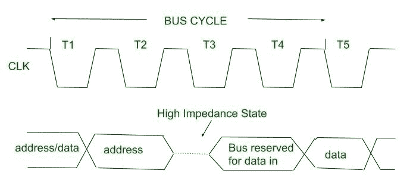
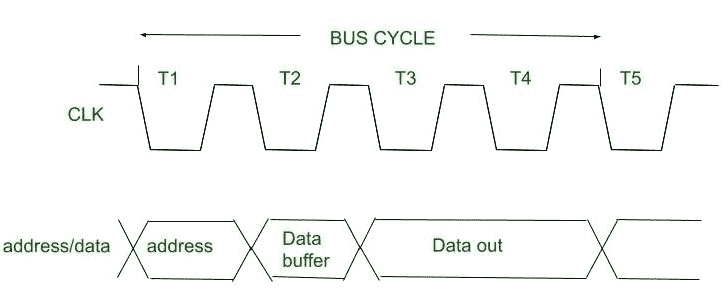

# 8086 微处理器的总线周期

> 原文：[https://www.geeksforgeeks.org/bus-cycles-of-8086-microprocessor/](https://www.geeksforgeeks.org/bus-cycles-of-8086-microprocessor/)

总线周期也称为机器周期。[8086](https://www.geeksforgeeks.org/architecture-of-8086/)的总线周期用于访问存储器、外围设备（输入/输出设备）和中断控制器。总线周期对应于一系列事件，从系统地址总线上输出的地址开始，然后是写或读数据传输。在这些操作期间，微处理器还产生一系列控制信号来控制总线的方向和定时。

8086 微处理器的总线周期中至少有四个时钟周期。这四个时钟周期称为`T1`、`T2`、`T3`和`T4`状态。

在`5 MhZ` 8086系统中，这四种时钟状态的总线周期持续时间为`200 ns *4 = 800 ns`。

## 读周期

当要执行读周期时，在`T1`期间，微处理器在地址总线上放置一个地址，然后在`T2`状态期间，总线被置于高阻抗状态。在`T3`和`T4`期间，要读取的数据必须在总线上输出。在`T3`期间总线被“保留用于数据输入”，最终在`T4`期间读取数据。

## 写周期

在写存储器周期的情况下，在`T1`状态期间，微处理器在地址总线上放置一个地址。数据由CPU在`T2`状态期间放到数据总线上，并在`T3`和`T4`状态期间保持，然后被写入存储器或I/O设备。

