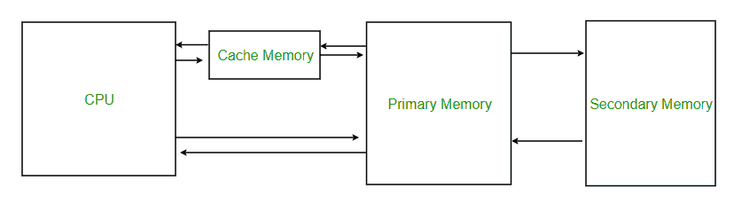
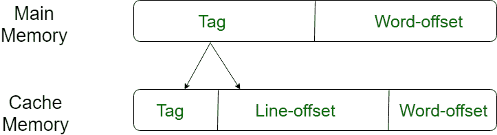
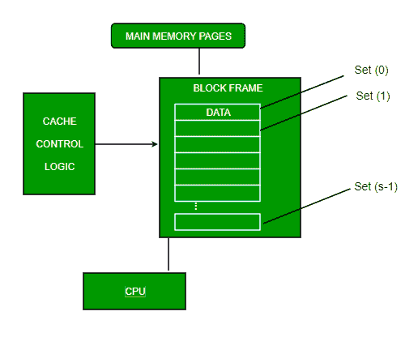
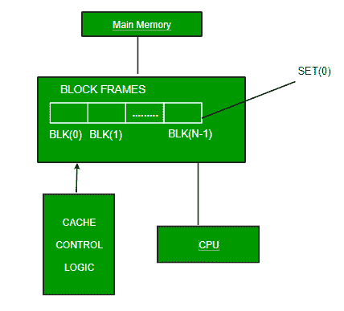
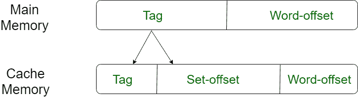
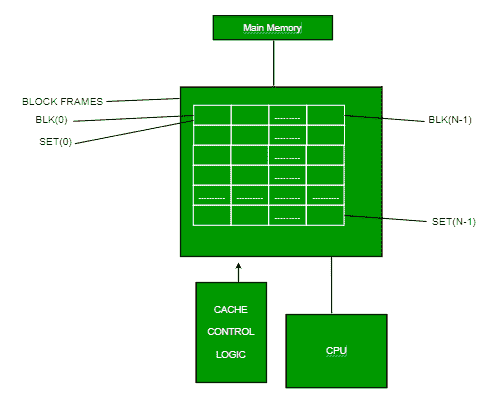

# 计算机组织中的高速缓冲存储器

> 原文：[https://www.geeksforgeeks.org/cache-memory-in-computer-organization/](https://www.geeksforgeeks.org/cache-memory-in-computer-organization/)

**缓存**是一种特殊的非常高速的内存。用于高速 CPU 的加速和同步。高速缓冲存储器比主存或磁盘存储器更贵，但比中央处理器寄存器更经济。高速缓冲存储器是一种速度极快的存储器类型，充当内存和中央处理器之间的缓冲区。它保存经常请求的数据和指令，以便在需要时可以立即提供给中央处理器。

高速缓冲存储器用于减少从主存储器访问数据的平均时间。缓存是一种更小、更快的内存，它存储来自常用主内存位置的数据副本。中央处理器中有各种不同的独立缓存，用于存储指令和数据。



## 记忆等级

### 1 级或寄存器
它是一种存储和接受数据的存储器，数据立即存储在中央处理器中。最常用的寄存器是累加器、程序计数器、地址寄存器等。

### 二级或高速缓冲存储器
它是最快的存储器，具有更快的访问时间，其中数据被临时存储以实现更快的访问。

### 三级或主内存
是计算机当前工作的内存。它体积小，一旦断电，数据就不再保留在内存中。

### 4 级或二级内存
它是外部内存，没有主内存快，但数据会永久保留在这个内存中。

## 缓存性能
当处理器需要读取或写入主内存中的某个位置时，它首先会检查缓存中是否有相应的条目。

*   如果处理器发现存储器位置在高速缓存中，则发生**高速缓存命中**，并且从高速缓存中读取数据。
*   如果处理器**没有在高速缓存中找到存储器位置**，则发生了**高速缓存未命中**。对于缓存未命中，缓存分配一个新条目，并从主内存复制数据，然后从缓存的内容中满足请求。

高速缓冲存储器的性能经常用一个叫做**命中率**的量来衡量。

```
Hit ratio = hit / (hit + miss) = no. of hits/total accesses
```

我们可以使用更高的缓存块大小、更高的关联性来提高缓存性能，降低未命中率，减少未命中损失，并减少缓存命中时间。

## 缓存映射
有三种不同类型的映射用于缓存，如下所示：直接映射、关联映射和集关联映射。这些解释如下。

### 直接映射
最简单的技术称为直接映射，它将主存的每个块映射到唯一可能的缓存行。或者，在直接映射中，将每个内存块分配给缓存中的特定行。如果一行先前已被一个内存块占用，而当需要加载一个新块时，旧块将被替换。地址空间被分为两部分：索引字段和标签字段。缓存用于存储标签字段，而其余部分存储在主存中。直接映射的性能与命中率成正比。

```
i = j modulo m
where
i=cache line number
j=main memory block number
m=number of lines in the cache
```

出于高速缓存访问的目的，每个主存储器地址可以被视为由三个字段组成。最低有效 `w` 位标识主存储器块中的唯一字或字节。在大多数现代机器中，地址是字节级的。剩余的 `s` 位指定主存储器的 `2^s` 块之一。高速缓存逻辑将这些 `s` 位解释为 `s-r` 位的标签（最高有效部分）和 `r` 位的行字段。后一个字段标识高速缓存的 `m=2^r` 行之一。





### 关联映射
在这种映射类型中，使用关联存储器来存储内存字的内容和地址。任何块都可以放入缓存的任何行中。这意味着字标识位用于标识块中需要哪个字，但标签变为所有剩余的位。这使得可以将任何字放置在高速缓存内存中的任何位置。它被认为是最快速和最灵活的映射形式。



### 集关联映射
这种映射形式是直接映射的增强形式，消除了直接映射的缺点。集关联解决了直接映射方法中可能发生的抖动问题。它通过说明缓存中一个块可以映射到的行不是只有一行，而是将几行分组创建一个**组**来实现这一点。然后，内存中的一个块可以映射到特定组中的任何一行。集关联映射允许缓存中存在的每个字在主存中对于相同的索引地址可以有两个或更多字。集关联缓存映射结合了直接映射和关联缓存映射技术的最佳优点。

在这种情况下，缓存由许多集合组成，每个集合由许多行组成。这些关系是：

```
m = v * k
i = j mod v
where
i=cache set number
j=main memory block number
v=number of sets
m=number of lines in the cache
k=number of lines in each set
```





## 高速缓冲存储器的应用
1.  通常，高速缓冲存储器可以在任何给定时间存储合理数量的块，但是与主存储器中的块总数相比，这个数量很小。
2.  主存储块和高速缓存中的存储块之间的对应关系由映射函数指定。

## 缓存类型
### 主缓存
主缓存始终位于处理器芯片上。该缓存很小，其访问时间与处理器寄存器相当。

### 辅助缓存
辅助缓存位于主缓存和其余内存之间。它被称为 2 级（`L2`）缓存。通常，二级高速缓存也位于处理器芯片上。

## 引用位置
因为与主内存相比，缓存内存的大小较小。因此，检查主内存的哪个部分应该被赋予优先级并加载到缓存中是基于引用的局部性来决定的。

### 参考位置的类型
1.  **参考点的空间位置**
    这表示元素有可能会出现在参考点附近，并且下次如果再次搜索，则更接近参考点。
2.  **时间参考位置**
    在这个最近最少使用的算法将被使用。每当一个字出现页面错误时，不仅会在主内存中加载该字，还会加载完整的页面错误，因为引用规则的空间局部性规定，如果您引用任何字，下一个字将在其寄存器中被引用，这就是为什么我们加载完整的页面表，以便加载完整的块。

## GATE 练习题

### Que-1
一台计算机有一个 256 千字节的 4 路集关联回写数据缓存，块大小为 32 字节。处理器向高速缓存控制器发送 32 位地址。除了地址标签之外，每个高速缓存标签目录条目还包含 2 个有效位、1 个修改位和 1 个替换位。地址的标签字段中的位数是

```
(A) 11
(B) 14
(C) 16
(D) 27
```

答：`(C)`

**解说：** [https://www.geeksforgeeks.org/gate-gate-cs-2012-question-54/](https://www.geeksforgeeks.org/gate-gate-cs-2012-question-54/)

### Que-2
考虑上一题给出的数据。缓存标记目录的大小为

```
(A) 160 Kbits
(B) 136 bits
(C) 40 Kbits
(D) 32 bits
```

答：`(A)`

**解说：** [https://www.geeksforgeeks.org/gate-gate-cs-2012-question-55/](https://www.geeksforgeeks.org/gate-gate-cs-2012-question-55/)

### Que-3
8KB 直接映射回写缓存被组织为多个块，每个块的大小为 32 字节。处理器生成 32 位地址。高速缓存控制器维护每个高速缓存块的标签信息，包括以下内容。

```
1 Valid bit
1 Modified bit
```

识别高速缓存中映射的内存块所需的最少位数。缓存控制器存储缓存元数据（标签）所需的总内存大小是多少？

```
(A) 4864 bits
(B) 6144 bits
(C) 6656 bits
(D) 5376 bits
```

答：`(D)`

**解说：** [https://www.geeksforgeeks.org/gate-gate-cs-2011-question-43/](https://www.geeksforgeeks.org/gate-gate-cs-2011-question-43/)

**Pooja Taneja 和 Vaishali Bhatia** 供稿。如果你发现任何不正确的地方，或者你想分享更多关于上面讨论的话题的信息，请写评论。