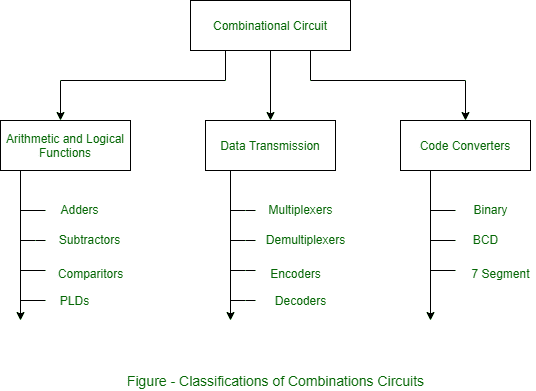
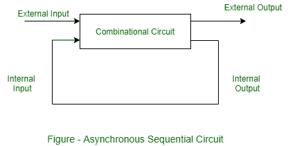
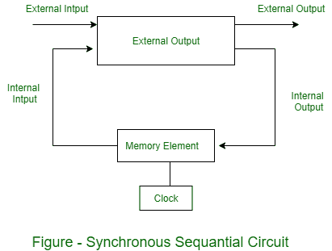

# 组合电路和时序电路的分类

> 原文:[https://www . geeksforgeeks . org/组合和时序电路分类/](https://www.geeksforgeeks.org/classifications-of-combinational-and-sequential-circuits/)

## 1. 组合电路的分类

[组合电路](https://www.geeksforgeeks.org/combinational-circuits-using-decoder/)主要有三类：算术或逻辑功能、数据传输和[代码转换器](https://www.geeksforgeeks.org/code-converters-binary-to-from-gray-code/)，如下图所示。

组合电路的功能通常用布尔代数、真值表或逻辑图来表示。布尔代数是以表达式形式表达的逻辑函数。真值表包含所有可能输入的输出。而逻辑图是使用逻辑门的逻辑功能的图形表示。组合电路图有逻辑门，没有反馈路径或存储元件。对于特定的逻辑电路，这三种表示总是相等的。

## 2. [时序电路](https://www.geeksforgeeks.org/introduction-of-sequential-circuits/)

现在，这些是时序电路的类型和分类。

### 时序电路类型

时序电路可以是事件驱动、时钟驱动和脉冲驱动。时序电路有两种主要类型：(a)同步的和(b)异步的。

*   **(a). [异步时序电路](https://www.geeksforgeeks.org/asynchronous-sequential-circuits/) –**
    异步电路不同步于时钟信号的正边沿或负边沿，这意味着异步时序电路的输出不会同时改变或受影响，并且当输入信号发生变化时会立即改变其状态。因此，这些电路速度更快，独立于内部时钟脉冲。但这些电路的输出具有不确定性，并且难以设计。

*   **(b). [同步时序电路](https://www.geeksforgeeks.org/synchronous-sequential-circuits-in-digital-logic/) –**
    同步电路同步于时钟信号的正边沿或负边沿，这意味着同步时序电路的输出会同时改变或受影响。这些电路使用时钟信号和电平输入（或受脉冲宽度和电路传播限制的脉冲）。由于它们等待下一个时钟脉冲到来以执行下一个操作，因此这些电路比异步电路稍慢。电平输出在输入脉冲开始时改变状态，并保持该状态直到下一个输入或时钟脉冲。同步时序电路可以是锁定的或未锁定的（或脉冲式的）。

[计数器](https://www.geeksforgeeks.org/counters-in-digital-logic/)、[触发器](https://www.geeksforgeeks.org/flip-flop-types-and-their-conversion/)和[米尔摩尔机器](https://www.geeksforgeeks.org/mealy-and-moore-machines-in-toc/)的设计都是同步时序电路的例子。