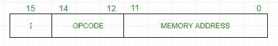
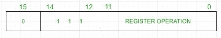
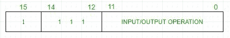

# 计算机组织

## 基本计算机指令

> 原文: [https://www.geeksforgeeks.org/computer-organization-basic-computer-instructions/](https://www.geeksforgeeks.org/computer-organization-basic-computer-instructions/)

基本计算机有 16 位指令寄存器，可以表示存储器参考或寄存器参考或输入输出指令。

### 1. 存储器参考指令

这些指令将内存地址作为操作数。另一个操作数总是累加器。它指定了 12 位地址、3 位操作码（除 `111` 外）以及 1 位用于直接和间接寻址的寻址模式。



**例–**
`IR` 寄存器包含 = `0001XXXXXXXXXXXX`，即取指令解码后的 `ADD`，我们发现它是进行 `ADD` 运算的内存引用指令。

```
Hence, DR ← M[AR]
AC ← AC + DR, SC ← 0
```

### 2. 寄存器参考指令

这些指令在寄存器上执行操作，而不是内存地址。`IR(14 – 12)` 是 `111`（将其与存储器参考指令区分开），`IR(15)` 是 `0`（将其与输入/输出指令区分开）。其余 12 位指定寄存器操作。



**例–**
`IR` 寄存器包含 = `0111001000000000`，即取解码周期后的 `CMA`，我们发现它是补码累加器的寄存器引用指令。

```
Hence, AC ← ~AC
```

### 3. 输入/输出指令

这些指令用于计算机与外部环境之间的通信。`IR(14 – 12)` 是 `111`（将其与存储器参考指令区分开），`IR(15)` 是 `1`（将其与寄存器参考指令区分开）。其余 12 位指定 I/O 操作。



**例–**
`IR` 寄存器包含 = `1111100000000000`，即取解码周期后的 `INP`，我们发现是输入字符的输入输出指令。因此，来自外围设备的输入字符。

包含在 16 位 `IR` 寄存器中的指令集包括:

1.  算术、逻辑和移位指令（和、加、补、左循环、右循环等）
2.  将信息移入和移出存储器（存储累加器，加载累加器）
3.  带有状态条件的程序控制指令（分支、跳过）
4.  输入输出指令（输入字符、输出字符）

| 标志 | 十六进制代码 | 描述 |
| --- | --- | --- |
| `AND` | `0xx` / `8xxx` | 和存储字到 `AC` |
| `ADD` | `1xx` / `9xxx` | 将记忆单词添加到 `AC` |
| `LDA` | `2xxx` / `Axxx` | 将内存字加载到 `AC` |
| `STA` | `3xxx` / `Bxxx` | 将 `AC` 内容存储在内存中 |
| `BUN` | `4xxx` / `Cxxx` | 无条件转移 |
| `BSA` | `5xx` / `Dxxx` | 分支并保存返回地址 |
| `ISZ` | `6xx` / `Exxx` | 如果为 0，递增并跳过 |
| `CLA` | `7800` | 清除 `AC` |
| `CLE` | `7400` | 清除 `E`（溢出位） |
| `CMA` | `7200` | 补码 `AC` |
| `CME` | `7100` | 补码 `E` |
| `CIR` | `7080` | 循环右移 `AC` 和 `E` |
| `CIL` | `7040` | 循环左移 `AC` 和 `E` |
| `INC` | `7020` | `AC` 增加 |
| `SPA` | `7010` | 如果 `AC > 0`，跳过下一个指令 |
| `SNA` | `7008` | 如果 `AC < 0`，跳过下一条指令 |
| `SZA` | `7004` | 如果 `AC = 0`，跳过下一条指令 |
| `SZE` | `7002` | 如果 `E = 0`，跳过下一条指令 |
| `HLT` | `7001` | 停止计算机 |
| `INP` | `F800` | `AC` 输入字符 |
| `OUT` | `F400` | `AC` 输出字符 |
| `SKI` | `F200` | 输入时跳过标志 |
| `SKO` | `F100` | 输出时跳过标志 |
| `ION` | `F080` | 中断开启 |
| `IOF` | `F040` | 中断关闭 |