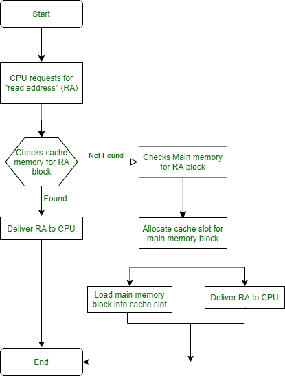

# 缓存设计概念

> 原文：[https://www.geeksforgeeks.org/concept-of-cache-memory-design/](https://www.geeksforgeeks.org/concept-of-cache-memory-design/)

[高速缓冲存储器](https://www.geeksforgeeks.org/cache-memory-in-computer-organization/)通过提供对数据/指令的快速访问，在减少程序处理时间方面发挥了重要作用。缓存内存小而快，主存大而慢。

缓存的概念解释如下。

## 缓存原则

缓存的目的是在不影响内存大小和价格的情况下，提供最快的资源访问。试图读取一个字节数据的处理器首先查看高速缓冲存储器。如果缓存内存中不存在该字节，它将在主内存中搜索该字节。一旦在主存储器中找到该字节，包含固定字节数的块被读入高速缓冲存储器，然后进入处理器。在高速缓冲存储器中找到后续字节的概率增加，因为较早读入高速缓冲存储器的块包含与该过程相关的字节，这是由于被称为`引用的局部性`或`局部性原则`的现象。

## 缓存设计

1.  **缓存大小与块大小**
    为了与处理器速度匹配，缓存内存非常小，以便查找和获取数据所需时间更少。它们通常根据架构分为多个层次。缓存的大小应能容纳块的大小，而块的大小又由处理器的架构决定。当块大小增加时，由于局部性原理，命中率最初会增加。

    导致将更多数据带入高速缓存的块大小的进一步增加将降低命中率，因为在某个时间点之后，使用由新块带入的新数据的概率小于重新使用正被清空以给新块腾出空间的数据的概率。

2.  **映射函数**
    当从主存储器中读取一个数据块时，映射函数决定该主存块将占据缓存中的哪个位置。如果缓存已满，则需要用主存块替换缓存块，这会导致复杂性问题：应该替换哪个缓存块？

    应注意不要替换更有可能被处理器引用的缓存块。替换算法直接依赖于映射函数，使得如果映射函数更灵活，替换算法将提供最大命中率。但是，为了提供更大的灵活性，在高速缓冲存储器中搜索以确定块是否存在的电路的复杂性增加了。

3.  **替换算法**
    它在缓存满的情况下，根据映射函数的一定约束，决定缓存中的哪个块被主内存中的读入块替换。在不久的将来不会被引用的缓存块应该被替换，但是确定哪个块不会被引用是非常不可能的。因此，高速缓存中长时间未被引用的块应该被来自主存储器的新的读入块替换。这被称为`最近最少使用的算法`。

4.  **写策略**
    内存缓存最重要的方面之一。被选中要由新读入的主存块替换的缓存数据块，应首先被写回主存。这是为了防止数据丢失。需要决定何时将缓存块写回主存。

    这两个可用选项如下：
    1.  当从主存储器中选择用新的读入块替换高速缓存块时，将高速缓存块写回主存储器。
    2.  每次更新块后，将缓存块写回主存储器。

    写策略决定何时将缓存块写回主内存。如果选择选项 1，则在主存储器上执行过多的写操作。如果选择选项 2，在多处理器系统的情况下，主存储器中的块是过时的，因为它还没有从高速缓冲存储器中被替换，但是它已经经历了改变。

## 示例

*   什么是`命中率`？
    命中次数（在缓存中成功搜索）/ 总尝试次数（总搜索）。
*   什么是 `LRU` 算法？
    [更多详情这里](https://www.geeksforgeeks.org/lru-cache-implementation/)
*   有哪些不同的缓存层？
    [更多详情这里](https://searchstorage.techtarget.com/definition/cache-memory)和[这里](https://www.geeksforgeeks.org/multilevel-cache-organisation/?ref=rp)。
*   如何在我的 Windows PC 中检查缓存内存的不同层？
    打开任务管理器 -> 性能 -> CPU（例如 L1、L2、L3）。