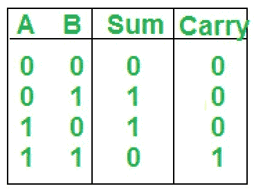
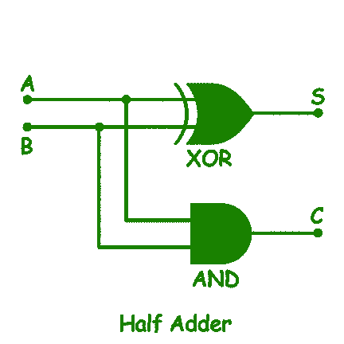

# 组合电路的构造

> 原文: [https://www.geeksforgeeks.org/construction-of-combinational-circuits/](https://www.geeksforgeeks.org/construction-of-combinational-circuits/)

一个[组合电路](https://www.geeksforgeeks.org/difference-between-combinational-and-sequential-circuit/)由逻辑门组成，其在任何时刻的输出都直接由当前的输入组合决定，而不考虑先前的输入。组合电路的例子:加法器、减法器、转换器和编码器/解码器。

在这里，我们将学习如何使用四个通用步骤来构造和分析任何类型的组合电路。我将借助一个组合电路来解释这个技巧，你可以用同样的技巧来实现其他组合电路。

以下是构造和分析任何组合电路的四个步骤。

*   **步骤-1:** 识别电路的输入和输出数量。
    首先，我们必须考虑电路的输入和输出，考虑我们想对电路执行哪种逻辑操作。
    比如我们要创建一个可以加两位的电路。为此，我们需要两个输入(一个用于第一位(`A`)，另一个用于第二位(`B`))和两个输出，一个用于两位的和(`S`)，另一个用于进位(`C`)。

我们总共需要 2 个输入和 2 个输出。我们的第一步就完成了。

*   **步骤-2:** 创建真值表。
    在这一步中，我们必须为我们的电路创建真值表。为此，我们首先创建输入列并列出所有可能的输入组合。在我们的例子中，**2** 位最多可以有 **4** 种组合 **(00 01 10 11)**。
    在输出部分，我们有两个列（`Sum` 和 `Carry`），如前面所讨论。现在我们必须根据我们正在构建电路的逻辑操作来填写输出列。

在我们的电路中，我们需要加法，所以我们将这些输入位相加，并将这些位的总和写入 `Sum` 列，如果产生进位，我们将写入 **1**，否则写入 **0** 在 `Carry` 列。



*   **步骤-3:** 简化每个输出的布尔函数。
    在这一步中，我们只需要根据上一步获得的真值表的输入和输出创建一个简化的布尔函数。
    对于 `Sum`，

    ```
    Sum = A'B + AB' = A XOR B
    ```

    对于 `Carry`，

    ```
    Carry = AB = A AND B
    ```

*   **步骤-4:** 使用第三步获得的布尔函数构造电路。
    对于 `Sum`，我们得到了 (`A XOR B`)，所以我们将 `A` 和 `B` 连接到 `XOR` 门的输入，并将其输出作为和。对于 `Carry`，我们得到了 (`A AND B`)，所以我们将 `A` 和 `B` 连接到 `AND` 门的输入，并将其输出作为进位。



现在在这个电路中，如果你在 `A` 端和 `B` 端提供输入。根据我们在上面创建的真值表，您将获得求和和进位输出。这里我们已经完成了创建组合电路的四个步骤。

因此，我们创建了一个名为**半加法器**的组合电路。你可以用同样的步骤来创建任何其他的组合电路。