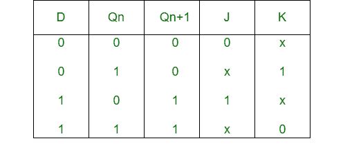
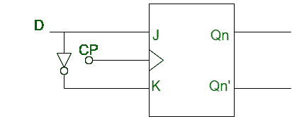

# J-K 触发器到 D 触发器的转换

> 原文: [https://www.geeksforgeeks.org/conversion-of-j-k-flip-flop-into-d-flip-flop/](https://www.geeksforgeeks.org/conversion-of-j-k-flip-flop-into-d-flip-flop/)

先决条件 – [触发器](https://www.geeksforgeeks.org/flip-flop-types-their-conversion-and-applications/)

## `JK 触发器`:
`JK 触发器`基本上是一个门控 `SR 触发器`，它有一个额外的输入，即时钟输入。它防止两个输入都为 1 时可能获得的无效输出。

## `D 触发器`:
`D 触发器`是一种带有附加反相器的改进型 `SR 触发器`。它防止输入变成相同的值。

## `J-K 触发器`到 `D 触发器`的转换:

*   **Step-1:**
    我们构建 `D 触发器`的特征表和 `JK 触发器`的激励表。



*   **Step-2:**
    使用卡诺图（K-map）我们找出 `J` 和 `K` 关于 `D` 的布尔表达式。


```
J = D
K = D'
```

*   **Step-3:**
    我们构建将 `JK 触发器`转换为 `D 触发器`的电路图。

