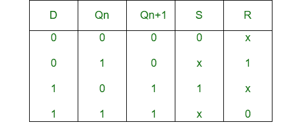
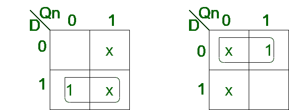
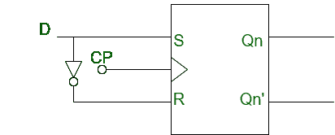

# S-R 触发器到 D 触发器的转换

> 原文: [https://www.geeksforgeeks.org/conversion-of-s-r-flip-flop-into-d-flip-flop/](https://www.geeksforgeeks.org/conversion-of-s-r-flip-flop-into-d-flip-flop/)

先决条件 – [`Flip-flop`](http://Flip-flop)

## 1. S-R 触发器:
`S-R` 触发器类似于 `S-R` 锁存器的期望时钟信号和两个与门。该电路响应输入 `S` 和 `r` 的时钟脉冲的正沿。

## 2. D 触发器:
`D` 触发器是一种带有附加反相器的改进型 `SR` 触发器。它防止输入变成相同的值。

## S-R 触发器向 D 触发器的转换:

*   **Step-1:**
    我们构造 `D` 触发器的特性表和 `S-R` 触发器的激励表。



*   **Step-2:**
    使用 `K-map` 我们找到 `S` 和 `R` 关于 `D` 的布尔表达式。



```
S = D
R = D'
```

*   **Step-3:**
    我们构建将 `S-R` 触发器转换为 `D` 触发器的电路图。

