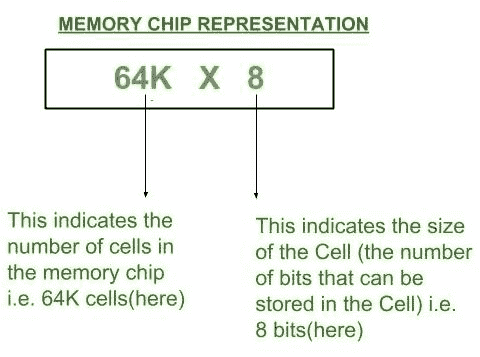

# 字节可寻址存储器和字可寻址存储器的区别

> 原文：[https://www.geeksforgeeks.org/difference-between-byte-addressable-memory-and-word-addressable-memory/](https://www.geeksforgeeks.org/difference-between-byte-addressable-memory-and-word-addressable-memory/)

内存是计算机中用于存储应用程序的存储组件。存储芯片被分成相等的部分，称为“细胞”。每个细胞由一个二进制数唯一标识，称为“地址”。例如，内存芯片配置表示为`64k x 8`，如下图所示。

从上面显示的存储器芯片表示可以获得以下信息：

1.  芯片中的数据空间 = `64K x 8`
2.  单元中的数据空间 = `8` 位
3.  芯片中的地址空间 =  = `16` 位

现在我们可以清楚地说明字节可寻址存储器和字可寻址存储器之间的区别。

| 字节可寻址存储器 | 字可寻址存储器 |
| --- | --- |
| 当单元中的数据空间 = `8` 位时，则相应的地址空间被称为字节地址。 | 当单元中的数据空间 = CPU 的字长时，则对应的地址空间被称为字地址。 |
| 基于该数据存储，即字节宽度存储，存储器芯片配置被命名为字节可寻址存储器。 | 基于该数据存储，即字向存储，存储器芯片配置命名为字可寻址存储器。 |
| 例如：`64K X 8` 芯片有 `16` 位地址，单元大小 = `8` 位（`1` 字节），这意味着在该芯片中，数据是逐字节存储的。 | 例如：对于一个 `16` 位的 CPU，`64K X 16` 芯片有 `16` 位地址 & 单元大小 = `16` 位（CPU 字长），这意味着在这个芯片中，数据是一个字一个字地存储的。 |

## 注：
i) 需要注意的最重要的一点是，无论是字节地址还是字地址，地址大小可以是任意位数（取决于芯片中的单元数量），但单元大小在每种情况下都有所不同。

ii) 计算机设计中的默认内存配置是字节可寻址的。