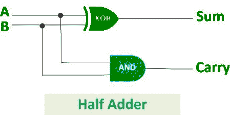
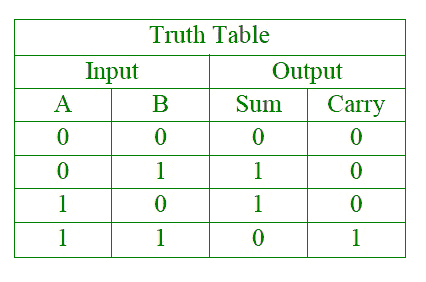
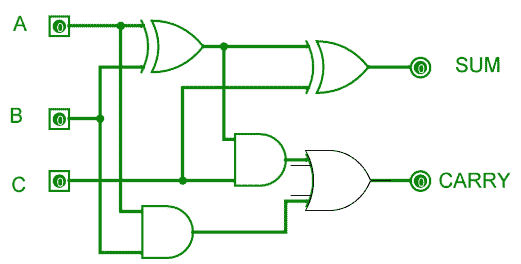
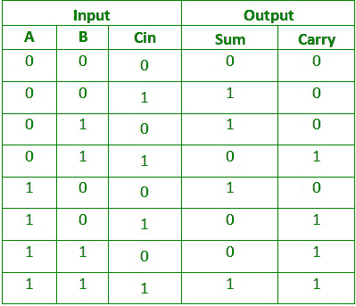

# 半加法器和全加器的区别

> 原文：[https://www.geeksforgeeks.org/difference-between-half-adder-and-full-adder/](https://www.geeksforgeeks.org/difference-between-half-adder-and-full-adder/)

## 1. 半加法器

半加法器是由一个 `EX-OR` 门和一个 `AND` 门连接而成的组合逻辑电路。半加法器电路有两个输入端：`A` 和 `B`，它们相加两个输入数字，并产生一个进位和一个和。



异或门的输出是两个数的和，与门的输出是进位。将不会有进位加法的转发，因为没有逻辑门来处理它。因此，这被称为半加法器电路。

**逻辑表达式：**

```
Sum = A XOR B
Carry = A AND B
```

**真值表：**



## 2. 全加器

全加器是由两个异或门、两个与门和一个或门组成的电路。全加器是将三个输入相加并产生两个输出的加法器，由两个异或门、两个与门和一个或门组成。前两个输入是 `A` 和 `B`，第三个输入是作为 `C-IN` 的输入进位。输出进位被指定为 `C-OUT`，正常输出被指定为 `S`，即 `SUM`。



`EX-OR` 门得到的方程是二进制数的和。而与门得到的输出是加法得到的进位。

**真值表：**



**逻辑表达式：**

```
SUM = (A XOR B) XOR Cin = (A ⊕ B) ⊕ Cin
CARRY-OUT = A AND B OR Cin(A XOR B) = A.B + Cin(A ⊕ B)
```

## 半加法器和全加器的区别

| 序号 | 半加器 | 全加器 |
| :--- | :--- | :--- |
| 1 | 半加法器是将两个 1 位数字相加的组合逻辑电路。半加法器产生两个输入的和。 | 全加器是对三个一位二进制数执行加法运算的组合逻辑电路。全加器产生三个输入和进位值的总和。 |
| 2 | 不使用以前的进位。 | 使用前一进位。 |
| 3 | 在半加法器中有两个输入位 (`A`，`B`)。 | 全加器有三个输入位 (`A`，`B`，`C-in`)。 |
| 4 | 半加法器的逻辑表达式为：`S = A ⊕ B`；`C = A * B`。 | 全加器的逻辑表达式为：`S = A ⊕ B ⊕ Cin`；`Cout = (A * B) + (Cin * (A ⊕ B))`。 |
| 5 | 它由一个异或门和一个与门组成。 | 它由两个异或门、两个与门和一个或门组成。 |
| 6 | 它用于计算器、计算机、数字测量设备等。 | 它用于多位加法、数字处理器等。 |