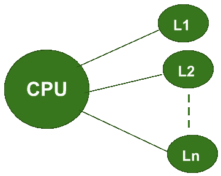
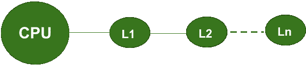

# 同时存取和分级存取存储器组织的区别

> 原文: [https://www.geeksforgeeks.org/difference-between-simultaneous-and-hierarchical-access-memory-organisations/](https://www.geeksforgeeks.org/difference-between-simultaneous-and-hierarchical-access-memory-organisations/)

在计算机系统设计中，根据中央处理器试图访问不同级别内存的方式，内存组织主要分为两种主要类型。

这两种类型包括**同时存取存储器组织**和**分级存取存储器组织**。让我们从下表中了解两者之间的区别:



<center>**Figure –** Simultaneous Access Memory Organisation</center>



<center>**Figure –** Hierarchical Access Memory Organisation</center>

## 同时存取和分级存取存储器组织的区别

| 同时存取存储器组织 | 分级存取存储器组织 |
| --- | --- |
| 在这个组织中，中央处理器直接连接到所有级别的内存。 | 在这个组织中，中央处理器总是直接连接到`L1`，即只有一级内存。 |
| 中央处理器同时访问各级存储器的数据。 | 中央处理器总是从一级存储器访问数据。 |
| 对于在`L1`内存中遇到的任何`未命中`，CPU可以直接从更高的内存级别访问数据(即`L2`、`L3`、…..`Ln`)。 | 对于在`L1`内存中遇到的任何`未命中`，CPU无法从更高的内存级别(即`L2`、`L3`、….`Ln`)直接访问数据。首先，所需的数据将从较高的内存级别传输到`L1`内存。只有这样，它才能被中央处理器访问。 |
| 如果`H1`和`H2`是命中率，`T1`和`T2`分别是`L1`和`L2`内存级别的访问时间，那么*平均内存访问时间*可以计算为：```T = (H1 * T1) + ((1 - H1) * H2 * T2)``` | 如果`H1`和`H2`是命中率，`T1`和`T2`分别是`L1`和`L2`内存级别的访问时间，那么*平均内存访问时间*可以计算为：```T = (H1 * T1) + ((1 - H1) * H2 * (T1 + T2))``` |

## 注

1.  默认情况下，计算机系统的内存结构是用分级访问内存组织设计的。这是因为在这种类型的内存组织中，由于引用的局部性，平均访问时间减少了。
2.  同步访问内存组织用于实现`直写缓存`。
3.  在两种类型的内存组织中，最后一个内存级别的命中率始终为 1。