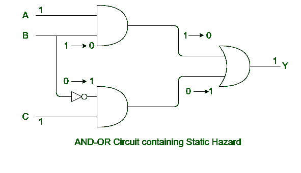
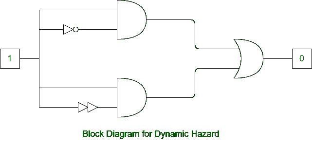

# 静态和动态危险的区别

> 原文：[https://www.geeksforgeeks.org/difference-between-static-and-dynamic-hazard-need-updated-diagrams/](https://www.geeksforgeeks.org/difference-between-static-and-dynamic-hazard-need-updated-diagrams/)

## 静态危险

静态危险发生在`组合电路`中，可以通过使用`冗余门`来消除。静态危险进一步分为：

- `Static-1 hazard`
- `Static-0 hazard`

## 动态危险

当输出变化几次，那么它应该从 1 到 0 或者从 0 到 1 只变化一次，这被称为动态危险。当两个相邻输入组合的输出在变化时发生变化时，就会出现动态危险，输出应该只变化一次。但是由于几条路径的延迟不同，它可能会在短时间间隔内改变三次或更多次。动态危险只发生在`多电平电路`中。

## 静态和动态危险的区别

| 静态危险 | 动态危险 |
| --- | --- |
| 当输入发生变化时，静态危险就会发生，它会导致输出在输出稳定之前的同一时刻发生变化。 | 当两个相邻输入的输出发生变化，而输出只应变化一次时，就会发生动态危险。 |
| 静态危险发生在`组合电路`中。 | 动态危险只发生在`多级电路`中。 |
| 静态危险很容易解决。 | 动态危险很难解决。 |
| 它可以通过使用`冗余门`来消除。 | 消除`静态-1`危险确保不会发生动态危险。 |
| 静态危险进一步分为`静态-1`和`静态-0`。 | 动态危险没有进一步分类。 |
| 它会导致临时的假输出值。 | 它会导致过渡到错误的稳定状态。 |