# 计算机组织 | 不同指令周期

> 原文: [https://www.geeksforgeeks.org/different-instruction-cycles/](https://www.geeksforgeeks.org/different-instruction-cycles/)

先决条件 – [执行、阶段和吞吐量](https://www.geeksforgeeks.org/computer-organization-and-architecture-pipelining-set-1-execution-stages-and-throughput/)

每个指令周期中涉及的寄存器:

*   **内存地址寄存器 (`MAR`)** : 连接到系统总线的地址线。它为读或写操作指定内存中的地址。
*   **内存缓冲寄存器 (`MBR`)** : 连接到系统总线的数据线。它包含要存储在内存中的值或从内存中读取的最后一个值。
*   **程序计数器 (`PC`)** : 保存下一条待取指令的地址。
*   **指令寄存器 (`IR`)** : 保存最后提取的指令。

## 指令周期 –

指令周期的每个阶段都可以分解成一系列基本微操作。在以上示例中，*获取、间接、执行和中断周期*各有一个序列。

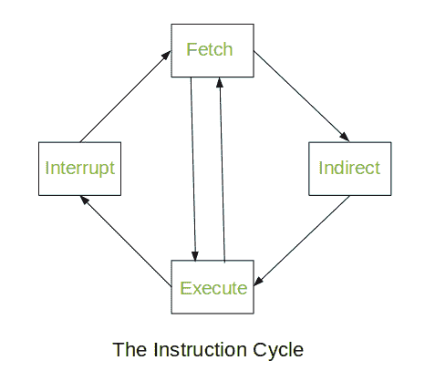

*间接循环*之后总是跟随*执行循环*。*中断周期*之后始终是*提取周期*。对于获取和执行周期，下一个周期取决于系统的状态。

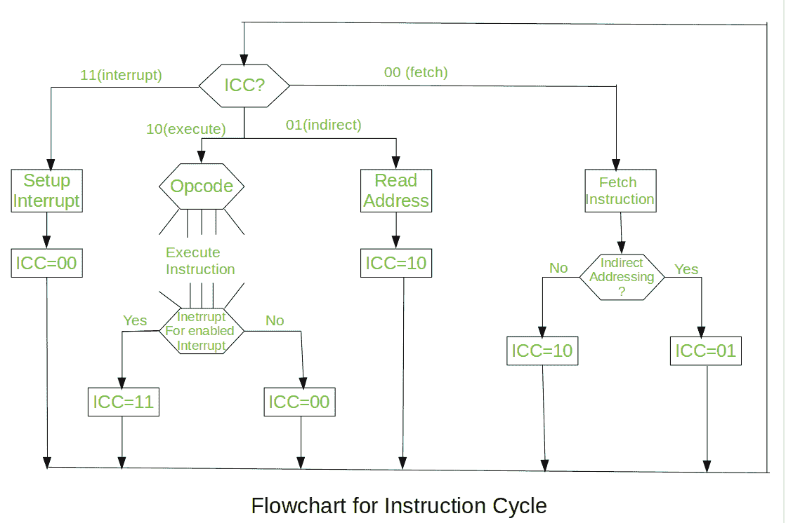

我们假设一个新的 2 位寄存器叫做*指令周期码* (`ICC`)。`ICC` 根据处理器处于周期的哪个部分来指定处理器的状态:

*   `00`: 获取周期
*   `01`: 间接周期
*   `10`: 执行周期
*   `11`: 中断周期

在每个周期结束时，`ICC` 被适当地设置。*指令周期*的上述流程图描述了微操作的完整顺序，仅取决于指令顺序和中断模式(这是一个简化的例子)。处理器的操作被描述为一系列微操作的执行。

## 提取周期 –

在提取周期开始时，下一条要执行的指令的地址在*程序计数器* (`PC`)中。

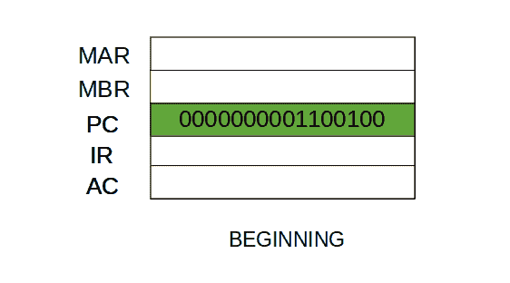

*   步骤 1: 程序计数器中的地址被移动到存储器地址寄存器(`MAR`)，因为这是连接到系统总线地址线的唯一寄存器。

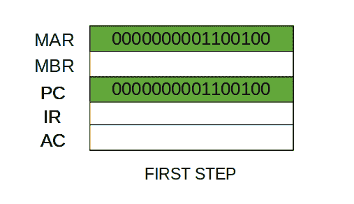

*   步骤 2: `MAR` 中的地址被放置在地址总线上，现在控制单元在控制总线上发出 `READ` 命令，结果出现在数据总线上，然后被复制到内存缓冲寄存器(`MBR`)。程序计数器递增一，为下一条指令做准备。(这两个操作可以同时执行以节省时间)

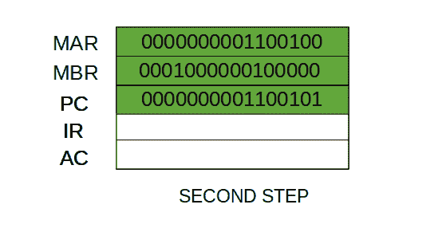

*   步骤 3: `MBR` 的内容被移动到指令寄存器(`IR`)。

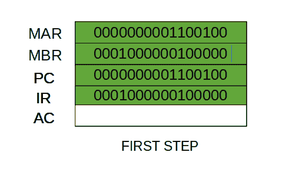

*   因此，一个简单的*提取周期*由三个步骤和四个微操作组成。象征性地，我们可以把这些事件的顺序写如下

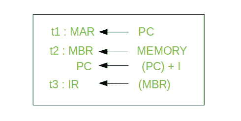

*   这里 `I` 是指令长度。符号 (`t1`, `t2`, `t3`) 表示连续的时间单位。我们假设有一个时钟可用于计时目的，它会发出规则间隔的时钟脉冲。每个时钟脉冲定义一个时间单位。因此，所有时间单位的持续时间相等。每个微操作可以在单个时间单位的时间内执行。
    第一个时间单位: 将 `PC` 的内容移动到 `MAR`。
    第二个时间单位: 将 `MAR` 指定的内存位置的内容移动到 `MBR`。将 `PC` 的内容增加 `I`。
    第三个时间单位: 将 `MBR` 的内容移动到 `IR`。
    **注意:** 第二个和第三个微操作都在第二个时间单位内发生。

## 间接循环 –

一旦提取了指令，下一步就是提取源操作数。*源操作数*通过间接寻址获取(可以通过任何[寻址模式](https://www.geeksforgeeks.org/addressing-modes/)获取，这里是通过间接寻址获取)。不需要提取基于寄存器的操作数。一旦操作码被执行，可能需要类似的过程来将结果存储在主存储器中。在*微操作*发生后:-

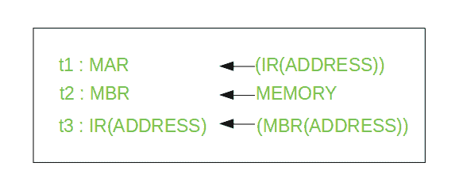

*   步骤 1: 指令的地址字段被传输到 `MAR`。这用于获取操作数的地址。
    步骤 2: `IR` 的地址字段从 `MBR` 更新。(因此它现在包含直接寻址而不是间接寻址)
    步骤 3: `IR` 现在处于状态，就好像间接寻址没有发生一样。

**注意:** 现在 `IR` 已经为执行周期做好了准备，但是它会跳过该周期一会儿来考虑*中断周期*。

## 执行周期

其他三个周期(*提取、间接和中断*)简单且可预测。它们都需要简单、小而固定的微操作顺序。在每种情况下，每次都重复相同的微操作。
执行周期与他们不同。就像，对于一个有 `N` 个不同操作码的机器，有 `N` 个不同的微操作序列可以发生。
让我们举一个假设的例子:-
考虑一个加法指令:

*   在这里，该指令将位置 `X` 的内容添加到寄存器 `r` 中。相应的微操作将是:-

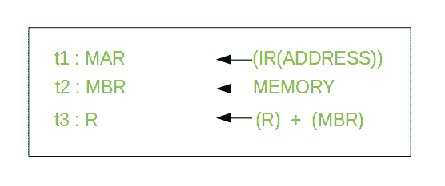

*   我们从 `IR` 包含 `ADD` 指令开始。
    步骤 1: `IR` 的地址部分被加载到 `MAR`。
    步骤 2: `IR` 的地址字段从 `MBR` 更新，因此引用的内存位置被读取。
    步骤 3: 现在，`R` 和 `MBR` 的内容由 `ALU` 相加。

让我们举一个复杂的例子

*   在这里，位置 `X` 的内容增加 1。如果结果为 0，则下一条指令将被跳过。相应的微操作序列将是:-

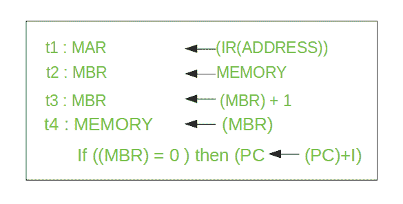

*   在这里，如果 `(MBR) = 0`，则 `PC` 递增。这个测试 (`MBR` 是否等于零) 和动作 (`PC` 递增 1) 可以作为一个微操作实现。
    **注意** : 这个测试和动作微操作可以在更新后的值 `MBR` 存储回内存的同一时间单位内执行。

## 中断周期

在执行周期完成时，进行测试以确定是否发生了任何启用的中断。如果发生了使能中断，则发生中断周期。这种循环的性质因机器而异。
让我们进行一系列微操作:-

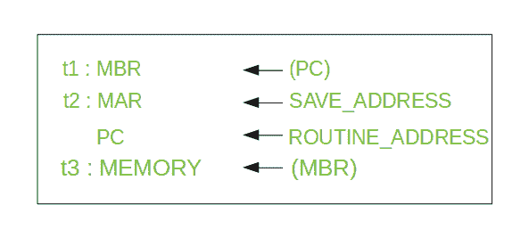

*   步骤 1: `PC` 的内容被传输到 `MBR`，以便可以保存用于返回。
    步骤 2: `MAR` 被加载到要保存 `PC` 内容的地址。
    `PC` 被加载到中断处理例程开始的地址。
    步骤 3: `MBR` 包含 `PC` 的旧值，被存储在内存中。

**注意:** 在步骤 2 中，两个动作作为一个微操作实现。然而，大多数处理器提供多种类型的中断，可能需要一个或多个微操作来获得保存地址和例程地址，然后分别将其传输到 `MAR` 和 `PC`。