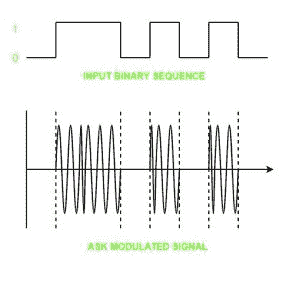
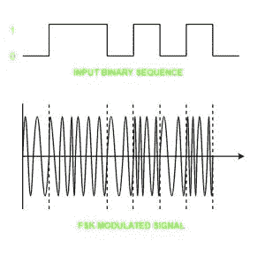
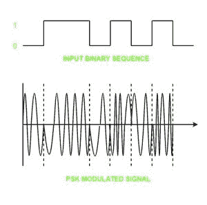

# 数模转换

> 原文：[https://www.geeksforgeeks.org/digital-to-analog-conversion/](https://www.geeksforgeeks.org/digital-to-analog-conversion/)

**数字信号**是将数据表示为离散值序列的信号；在任何给定的时间，它只能接受有限数量的值中的一个。

**模拟信号**是任何连续信号，其信号的时变特征是某个其他时变量的表示，即类似于另一个时变信号。

以下技术可用于数模转换：

## 1. 振幅移位键控

振幅移位键控是一种载波信号是模拟的，而要调制的数据是数字的技术。模拟载波信号的幅度被修改以反映二进制数据。

当二进制数据表示 0 时，调制后的二进制信号给出零值，而当数据为 1 时，给出载波输出。载波信号的频率和相位保持不变。

### 幅移键控的优点

*   它可用于通过光纤传输数字数据。
*   接收器和发射器设计简单，成本也相对较低。
*   与 `FSK` 相比，它使用更少的带宽，因此它提供了更高的带宽效率。

### 振幅移位键控的缺点

*   它容易受到噪声干扰，因此整个传输可能会丢失。
*   它的功率效率较低。

## 2. 频移键控

在这种调制中，模拟载波信号的频率被修改以反映二进制数据。

对于二进制高输入，频移键控调制波的输出频率较高，对于二进制低输入，其输出频率较低。载波信号的幅度和相位保持不变。

### 频移键控的优点

*   频移键控调制信号有助于避免 `ASK` 带来的噪声问题。
*   它出错的几率更低。
*   它提供高信噪比。
*   发射机和接收机的实现对于低数据速率应用来说很简单。

### 频移键控的缺点

*   与 `ASK` 相比，它使用更大的带宽，因此带宽效率更低。
*   它的功率效率较低。

## 3. 相移键控

在这种调制中，模拟载波信号的相位被修改以反映二进制数据。载波信号的幅度和频率保持不变。

它进一步分类如下：

1.  **二进制相移键控 (BPSK):**
    `BPSK` 也称为反相键控或 `2PSK`，是相移键控最简单的形式。载波波的相位根据两个二进制输入而改变。在二进制相移键控中，二进制 1 和二进制 0 之间使用 180 度的相移差。

    这被认为是最稳健的数字调制技术，用于长距离无线通信。

2.  **正交相移键控:**
    这种技术用于提高比特率，即我们可以将两个比特编码到一个单一元素上。它使用四个相位来为每个符号编码两个比特。`QPSK` 使用 90 度倍数的相移。

    与 `BPSK` 相比，它具有双倍数据速率承载能力，因为两个比特被映射在每个星座点上。

### 相移键控的优点

*   与 `ASK` 和 `FSK` 相比，这是一种功率效率更高的调制技术。
*   它出错的几率更低。
*   与 `FSK` 相比，它允许数据更有效地沿着通信信号传输。

### 相移键控的缺点

*   它提供低带宽效率。
*   二进制数据的检测和恢复算法非常复杂。
*   这是一个非相干参考信号。

**参考**
[数模转换器–维基百科](https://en.wikipedia.org/wiki/Digital-to-analog_converter)