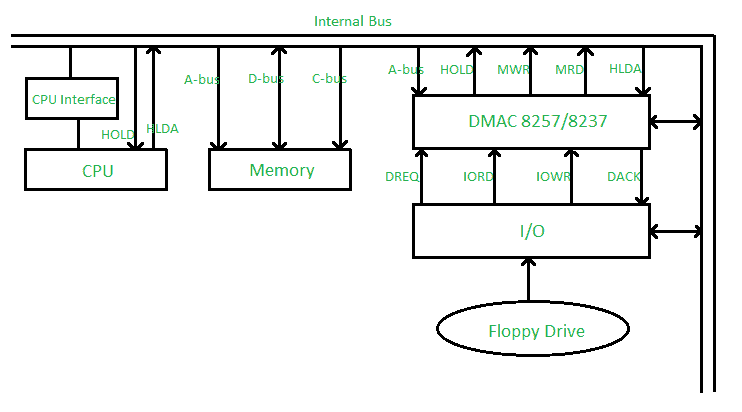
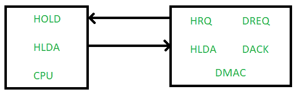
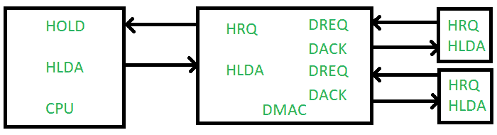

# 用 DMA 控制器 8257/8237 直接内存访问

> 原文: [https://www.geeksforgeeks.org/direct-memory-access-with-dma-controller-8257-8237/](https://www.geeksforgeeks.org/direct-memory-access-with-dma-controller-8257-8237/)

假设任何连接在输入输出端口的设备想要传输数据到内存，首先它会发送输入输出端口地址和控制信号，输入输出读取到输入输出端口，然后它会发送内存地址和内存写入信号到需要传输数据的内存。在正常的输入输出技术中，处理器忙于检查下一个输入输出操作是否完成，因此这种技术很慢。

通过实现直接存储器存取技术，避免了输入输出端口和存储器之间或两个存储器之间数据传输缓慢的问题。由于微处理器/计算机被绕过，地址总线和数据总线的控制交给了直接存储器存取控制器，因此速度更快。

*   `HOLD` – 保持信号
*   `HLDA` – 保持确认
*   `DREQ` – DMA 请求
*   `DACK` – DMA 确认

假设连接在输入输出端口的软驱想要将数据传输到内存，执行以下步骤:

*   `Step-1:` 首先，软盘驱动器会向 `DMAC` 发送 `DREQ`，这意味着软盘驱动器需要其 `DMA` 服务。
*   `Step-2:` 现在 `DMAC` 会向 `CPU` 发送 `HOLD` 信号。
*   `Step-3:` 在接受来自 `DMAC` 的 `DMA` 服务请求后，`CPU` 会向 `DMAC` 发送 `HLDA`，这意味着微处理器已经释放了地址总线和数据总线的控制权给 `DMAC`，在 `DMA` 服务期间微处理器/计算机被绕过。
*   `Step-4:` 现在 `DMAC` 会向连接在输入输出端口的软盘驱动器发送一个确认信号 `DACK`。这意味着 `DMAC` 告诉软盘驱动器准备好进行其 `DMA` 服务。
*   `Step-5:` 现在在输入输出读和存储器写信号的帮助下，数据从软盘驱动器传输到存储器。

## `DMAC` 的模式

1.  **单模式 (`Single Mode`)** – 在此模式下只使用一个通道，意味着只有一个 `DMAC` 连接到总线系统。

2.  **级联模式 (`Cascade Mode`)** – 在此模式下使用多个通道，我们可以进一步级联更多数量的 `DMAC`。

