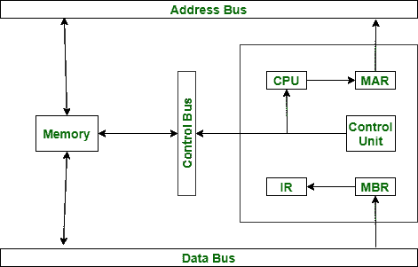

# 指令执行的基本寄存器

> 原文：[`https://www.geeksforgeeks.org/essential-registers-for-instruction-execution/`](https://www.geeksforgeeks.org/essential-registers-for-instruction-execution/)

这些是执行指令所需的各种寄存器：程序计数器、指令寄存器、内存缓冲（或数据）寄存器和内存地址寄存器。这些解释如下。

1.  `Program Counter (PC)`：它包含下一条要执行的指令的地址。CPU 在每条指令执行后更新 PC，使其始终指向要执行的下一条指令。分支或跳转指令也会修改 PC 的内容。
2.  `Instruction Register (IR)`：它包含最近获取或执行的指令。获取的指令被加载到 IR 中，然后分析其中的操作码和操作数说明符。
3.  `Memory Buffer (or Data) Register (MBR or MDR)`：它包含要写入内存的数据字或最近读取的数据字。`MBR` 的内容直接连接到数据总线。
4.  `存储器地址寄存器(MAR)`：它包含主存储器位置的地址，为了存储信息，必须从该位置获取信息。`MAR` 的内容直接连接到地址总线。

除了这些寄存器，我们还可以使用用户看不到的其他寄存器，例如临时缓冲寄存器。