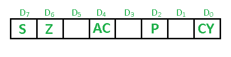

# 8085 微处理器中的标志寄存器

> 原文：[https://www.geeksforgeeks.org/flag-register-8085-microprocessor/](https://www.geeksforgeeks.org/flag-register-8085-microprocessor/)

先决条件 – [8085 微处理器中的寄存器](https://www.geeksforgeeks.org/registers-8085-microprocessor/)
**标志寄存器**是专用寄存器。根据任何算术和逻辑运算后的结果值，标志位变为置位（1）或复位（0）。在 8085 微处理器中，标志寄存器由 8 位组成，其中只有 5 位是有用的。

这 5 个标志是：



## 符号标志 (S)
任何操作后，如果结果的 MSB (`B(7)`) 为 1，则表示数字为负，符号标志变为置位，即 1。如果 MSB 为 0，则表示数字为正，符号标志变为复位，即 0。
- 从 `00H` 到 `7F`，标志为 0
- 从 `80H` 到 `FF`，标志为 1
- 1 - MSB 为 1（负）
- 0 - MSB 为 0（正）

**示例：**
```
MVI A 30    (在寄存器 A 中加载 30H)
MVI B 40    (在寄存器 B 中加载 40H)
SUB B       (A = A–B)
```
这组指令将符号标志设置为 1，因为 `30–40` 是负数。

```
MVI A 40    (在寄存器 A 中加载 40H)
MVI B 30    (在寄存器 B 中加载 30H)
SUB B       (A = A–B)
```
这组指令将符号标志重置为 0，因为 `40–30` 是正数。

## 零标志 (Z)
在任何算术或逻辑运算后，如果结果为 0 (`00H`)，零标志变为置位，即 1，否则变为复位，即 0。
- `00H` 零标志为 1。
- 从 `01H` 到 `FFH` 零标志为 0。
- 1 - 零结果
- 0 - 非零结果

**示例：**
```
MVI A 10    (在寄存器 A 中加载 10H)
SUB A       (A = A–A)
```
这组指令将把零标志设置为 1，因为 `10H–10H` 是 `00H`。

## 辅助进位标志 (AC)
此标志用于 BCD 数字系统（0-9）。如果在任何算术或逻辑运算后，`D(3)` 产生进位并传递到 `B(4)`，此标志变为置位，即 1，否则变为复位，即 0。这是唯一一个程序员无法直接访问的标志寄存器。
- 1 - 加法时从位 3 执行或减法时借用到位 3
- 0 - 否则

**示例：**
```
MOV A 2B    (在寄存器 A 中加载 2BH)
MOV B 39    (在寄存器 B 中加载 39H)
ADD B       (A = A+B)
```
这组指令将辅助进位标志设置为 1，因为添加 `2B` 和 `39` 时，较低阶的半字节 `B` 和 `9` 相加将生成进位。

## 奇偶标志 (P)
在任何算术或逻辑运算后，如果结果具有偶数奇偶性（即 1 位的个数为偶数），奇偶标志变为置位，即 1，否则变为复位，即 0。
- 1 - 累加器有偶数个 1 位
- 0 - 累加器有奇数个奇偶校验位

**示例：**
```
MVI A 05    (加载寄存器 A 中的 05H)
```
该指令将奇偶校验标志设置为 1，因为 `05H` 的二进制码是 `00000101`，它包含偶数个 1，即 2。

## 进位标志 (CY)
当执行 n 位操作且结果超过 n 位时，会产生进位，此时此标志变为置位，即 1，否则变为复位，即 0。
在减法 (`A-B`) 期间，如果 `A>B` 则它复位，如果 `A<B` 则它置位。
进位标志也称为借位标志。
- 1 - 加法时从 MSB 位执行或减法时借用到 MSB 位
- 0 - 不执行或借用到 MSB 位

**示例：**
```
MVI A 30    (在寄存器 A 中加载 30H)
MVI B 40    (在寄存器 B 中加载 40H)
SUB B       (A = A–B)
```
这组指令将进位标志设置为 1，因为 `30–40` 产生进位/借位。

```
MVI A 40    (在寄存器 A 中加载 40H)
MVI B 30    (在寄存器 B 中加载 30H)
SUB B       (A = A–B)
```
这组指令将进位标志重置为 0，因为 `40–30` 不产生任何进位/借位。