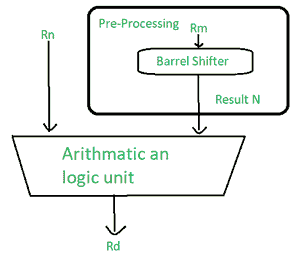

# 微控制器的指令集

> 原文: [https://www.geeksforgeeks.org/instruction-sets-of-a-microcontroller/](https://www.geeksforgeeks.org/instruction-sets-of-a-microcontroller/)

## 数据处理指令

我们使用数据处理指令来操作寄存器内的数据。

数据处理说明的类型：

*   算术指令
*   逻辑指令
*   乘法指令
*   比较说明
*   移动指令

大多数数据处理指令使用一个桶形移位器来预处理其中一个操作数的数据。每个操作都会更新 `CPSR` 中的不同标志（了解更多关于 `CPSR`，搜索“ARM 中的 `CPSR`”）。

让我们详细讨论一下说明。

### 1. 算术指令

算术指令主要实现 32 位有符号和无符号值的加减运算。

语法：`<instruction>{<cond>}{S} Rd, Rn, N`

| 助记符 | 描述 | 运算 |
| :--- | :--- | :--- |
| `ADC` | 带进位加法 | `Rd = Rn + N + 进位` |
| `ADD` | 加法 | `Rd = Rn + N` |
| `RSB` | 反向减法 | `Rd = N - Rn` |
| `RSC` | 带进位反向减法 | `Rd = N - Rn - !(进位标志)` |
| `SBC` | 带进位减法 | `Rd = Rn - N - !(进位标志)` |
| `SUB` | 减法 | `Rd = Rn - N` |

> `N` 是移位操作的结果。

**示例 1：**
这个简单的减法指令从寄存器 `r1` 中存储的值中减去寄存器 `r2` 中存储的值。结果存储在寄存器 `r0` 中。

**PRE**
```
r0 = 0x00000000; 由于该寄存器是保存输出的寄存器，所以执行前为空
r1 = 0x00000002; 寄存器 r1 保存值 '2'
r2 = 0x00000001; r2 持有另一个值 '1'
SUB r0, r1, r2; r0 = r1 - r2。在此，执行运算后，减去的值(r0 - r1)被移动到 r0。
```

**POST**
```
r0 = 0x00000001; 这是移动到 r0 寄存器的上述指令的输出
```

**示例 2：**
这个反向减法指令 (`RSB`) 从常数值 `#0` 中减去 `r1`，将结果写入 `r0`。反向减法对整数值有帮助，这样就可以不复杂地减去指令。

**PRE**
```
r0 = 0x00000000; 输出寄存器
r1 = 0x00000077; 要反向减去的值
RSB r0, r1, #0; rd = 0x - r1
```

**POST**
```
r0 = -r1 = 0xffffff89; 产生反向输出并存储在寄存器 r0 中
```

**桶形移位器与算术指令的使用**
桶形移位器是 ARM 指令集的强大功能之一。在对其中一个操作数/寄存器执行操作之前，对其进行预处理。

**示例：**

**PRE**
```
r0 = 0x00000000
r1 = 0x00000005
ADD r0, r1, r1, LSL #1
```

**POST**
```
r0 = 0x0000000f
r1 = 0x00000005
```

### 2. 逻辑指令

逻辑指令对两个源寄存器执行按位逻辑运算。
语法：`<instruction>{<cond>}{S} Rd, Rn, N`

| 助记符 | 描述 | 运算 |
| :--- | :--- | :--- |
| `AND` | 逻辑按位与 | `Rd = Rn & N` |
| `ORR` | 逻辑按位或 | `Rd = Rn | N` |
| `EOR` | 逻辑异或 | `Rd = Rn ^ N` |
| `BIC` | 逻辑位清零（与非） | `Rd = Rn &~ N` |

**示例 1：**
本例显示了寄存器 `r1` 和 `r2` 之间的逻辑或运算，`r0` 保存结果。

**PRE**
```
r0 = 0x00000000
r1 = 0x12345678
r2 = 0x10305070
ORR r0, r1, r2
```

**POST**
```
r0 = 0x12345678
```

**示例 2：**
这个例子展示了一个更复杂的逻辑指令，叫做 `BIC`，它执行一个逻辑位清零。

**PRE**
```
r1 = 0b1111
r2 = 0b0101
BIC r0, r1, r2
```

**POST**
```
r0 = 0b1010
```

### 3. 乘法指令

乘法指令根据指令将一对寄存器的内容相乘，并将结果与另一个寄存器累加。长乘法累加到一对代表 64 位值的寄存器上。最终结果放在目标寄存器或寄存器对上。

语法：`MLA{<cond>}{S} Rd, Rm, Rs, Rn`
`MUL{<cond>}{S} Rd, Rm, Rs`

| 助记符 | 描述 | 运算 |
| :--- | :--- | :--- |
| `MLA` | 乘法和累加 | `Rd = (Rm * Rs) + Rn` |
| `MUL` | 乘法 | `Rd = Rm * Rs` |

语法：`<instruction>{<cond>} RdLo, RdHi, Rm, Rs`

| 助记符 | 描述 | 运算 |
| :--- | :--- | :--- |
| `SMLAL` | 有符号乘法长累加 | `[RdHi, RdLo] = [RdHi, RdLo] + (Rm * Rs)` |
| `SMULL` | 有符号乘法长 | `[RdHi, RdLo] = Rm * Rs` |
| `UMLAL` | 无符号乘法长累加 | `[RdHi, RdLo] = [RdHi, RdLo] + (Rm * Rs)` |
| `UMULL` | 无符号长乘 | `[RdHi, RdLo] = Rm * Rs` |

处理器实现处理执行乘法指令所需的周期数。

**示例 1：**
*   此示例表示简单的乘法指令，将寄存器 `r1` 和 `r2` 相乘，并将结果放入寄存器 `r0`。
*   寄存器 `r1` 等于值 2，`r2` 等于 2，然后被替换为 `r0`。

**PRE**
```
r0 = 0x00000000; 寄存器保存输出
r1 = 0x00000002; 保存操作数 1 值的寄存器
r2 = 0x00000002; 保存操作数 2 值的寄存器
MUL r0, r1, r2; r0 = r1 * r2
```

**POST**
```
r0 = 0x00000004; 乘法运算的输出
r1 = 0x00000002
r2 = 0x00000002; 操作数
```

**示例 2：**

**PRE**
```
r0 = 0x00000000
r1 = 0x00000000
r2 = 0x00000002
r3 = 0x00000002
UMLAL r0, r1, r2, r3; [r1, r0] = r2 * r3
```

**POST**
```
r0 = 0x00000004; = RdLo
r1 = 0x00000001; = RdHi
```

### 4. 比较指令

这些指令用于比较或测试具有 32 位值的寄存器。它们根据结果更新 `CPSR` 标志位，但不影响其他寄存器。在这些位被置位之后，这些信息就可以通过使用条件执行来改变程序流程。

语法：`<instruction>{<cond>} Rn, N`

| 助记符 | 描述 | 运算 |
| :--- | :--- | :--- |
| `CMN` | 比较被否定 | 根据 `Rn + N` 设置标志 |
| `CMP` | 比较 | 根据 `Rn - N` 设置标志 |
| `TEQ` | 测试两个 32 位值的相等性 | 根据 `Rn ^ N` 设置标志 |
| `TST` | 测试位 | 根据 `Rn & N` 设置标志 |

> `N` 是移位器操作的结果。

**示例：**

**PRE**
```
cpsr = nzcvqift_USER
r0 = 4; 待比较寄存器
r9 = 4; 待比较寄存器
CMP r0, r9
```

**POST**
```
cpsr = nzcvqift_USER; 比较后生成的输出
```

### 5. 移动指令

移动是最简单的 ARM 指令。它将 `N` 复制到目的寄存器 `Rd` 中，其中 `N` 是寄存器或立即值。该指令对于设置初始值和在寄存器之间传输数据非常有用。

语法：`<instruction>{<cond>}{S} Rd, N`

| 助记符 | 描述 | 运算 |
| :--- | :--- | :--- |
| `MOV` | 将 32 位值移入寄存器 | `Rd = N` |
| `MVN` | 将 32 位值的非移入寄存器 | `Rd = ~N` |

**示例：**
**PRE**
```
r5 = 5; 寄存器值
r7 = 8; 寄存器值
MOV r7, r5; 让 r7 = r5
```

**POST**
```
r5 = 5; 将 r5 数据移入 r7 后寄存器中的数据
r7 = 5; 移动操作后的输出
```

## 桶形移位器

它是一个移动可变数量单词的装置。它是一种逻辑器件，用于在对算术逻辑单元操作进行操作之前预处理一个操作数/寄存器。这是 ARM 最好的特性之一。



桶形移位

| 助记符 | 描述 | 移位 | 结果 | 移位量 |
| :--- | :--- | :--- | :--- | :--- |
| `LSL` | 逻辑左移 | `x << y` | `x << y` | `#0-31` 或 `Rs` |
| `LSR` | 逻辑右移 | `x >> y` | (无符号) `x >> y` | `#1-32` 或 `Rs` |
| `ASR` | 算术右移 | `x >> y` | `x >> y` (有符号) | `#1-32` 或 `Rs` |
| `ROR` | 右旋 | `x ROR y` | `((unsigned)x >> y) | (x << (32-y))` | `#1-31` 或 `Rs` |
| `RRX` | 带扩展的右旋 | `x RRX` | `(C 标志 << 31) | (x >> 1)` | 无 |

> `x` 代表被移位的寄存器，`y` 代表移位量。

| 移位操作 | 语法 |
| :--- | :--- |
| 立即数 | `#立即数` |
| 寄存器 | `Rs` |
| 立即逻辑左移 | `Rm, LSL #shift_imm` |
| 寄存器逻辑左移 | `Rm, LSL Rs` |
| 立即逻辑右移 | `Rm, LSR #shift_imm` |
| 寄存器逻辑右移 | `Rm, LSR Rs` |
| 立即算术右移 | `Rm, ASR #shift_imm` |
| 寄存器算术右移 | `Rm, ASR Rs` |
| 立即右旋 | `Rm, ROR #shift_imm` |
| 寄存器右旋 | `Rm, ROR Rs` |
| 带扩展右旋 | `Rm, RRX` |

**示例：**
*   这个 `MOVS` 指令的例子将寄存器 `r1` 左移一位。
*   这会将寄存器 `r1` 乘以值 `2^1`。

**PRE**
```
cpsr = nzcvqift_user
r0 = 0x00000000
r1 = 0x80000004
MOVS r0, r1, LSL #1
```

**POST**
```
cpsr = nzcvqift_USER
r0 = 0x00000008
r1 = 0x80000004
```

*   在 `CPSR` 更新 `C` 标志，因为 `S` 后缀出现在指令助记符中。