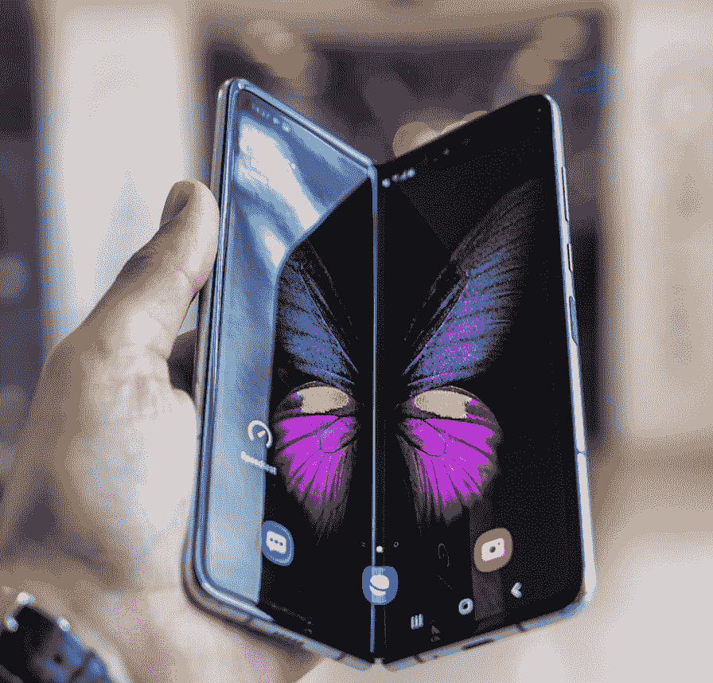
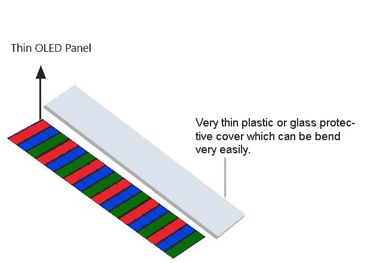

# 折叠屏介绍

> 原文：[https://www.geeksforgeeks.org/introduction-of-foldable-screens/](https://www.geeksforgeks.org/introduction-of-foldable-screens/)

**可折叠屏幕**，曾经被认为是不可能的，但在如今这个时代似乎没有什么是不可能的，而这些可折叠屏幕以可折叠手机的形式成为了现实。这款手机打开后会变成平板电脑，折叠后会变成口袋大小的智能手机。但是，问题是他们是如何实现这一技术壮举的。
嗯，答案是柔性屏幕；这是其他几项进步之一，也是可折叠设备和轻薄电视的重要组成部分。

*Image credits: – Photo by Mika Baumeister on Unsplash*

用于制造可折叠设备的屏幕被称为`OLED`（Organic Light Emitting Diode，有机发光二极管），由有机化合物制成。当电流通过时，它们会自发光，这意味着这些屏幕不需要背光灯即可工作，使得屏幕更薄、更灵活，并且能产生更准确的色彩和拥有更大的色域，不像`LCD`需要背光光源才能工作，因此`LCD`会变得厚重。`LED`显示屏实际上被印刷在一层薄塑料上，这使得它们能够以多种方式弯曲和折叠。

## 可折叠显示器的工作原理

屏幕非常薄，因此它们可以很容易地弯曲，因为它们被印刷在柔性塑料膜上。大多数设备不是使用钢化玻璃来保护屏幕，而是使用塑料材料来保护屏幕，保持其可折叠的特性。

如图所示，彩色发光二极管由有机化合物制成，顶层由透明塑料或可折叠的非常薄的玻璃片制成。有机发光二极管面板自己产生光，省去了需要背光面板才能工作的麻烦。原理简单但非常有效。同样，我们正在向`QLED`显示器发展，那里的像素非常小，我们可能几乎不会注意到它们。

三星`galaxy Z-flip`是唯一一款拥有真正可折叠玻璃的手机。玻璃能够折叠的原因是它非常薄，玻璃制造商说，“如果你能制造足够薄的玻璃层，那么你实际上可以弯曲它”。
而三星`galaxy fold`没有防护玻璃，取而代之的是一张薄薄的塑料覆盖屏幕。

## 利弊

### 1. 优点

*   `OLED`显示器产生鲜艳的颜色。
*   拥有广阔的色域。
*   产生自己的光。
*   可以做得很薄。

### 2. 缺点

*   显示器很贵。
*   如果某些内容在同一帧中长时间停留在屏幕上，该帧就会被印在显示器上，从而干扰其他内容（烧屏）。
*   屏幕会随着折叠和展开而磨损。

第一个问题是，随着时间的推移，屏幕会随着不断的折叠和展开而损坏，而且由于用户必须与屏幕交互，它会在一段时间内损坏。
最后但并非最不重要的是，这些显示器很贵，因为`galaxy fold`本身的价格约为2000美元，接近144000印度卢比，比任何其他设备都贵。类似的由柔性屏幕制成的设备，如电视、显示器，实际上成本很高。

那么，这些显示器的未来会怎样呢？嗯，专家说，未来的小工具肯定会使用可折叠显示器来管理空间、移动性、耐用性等。