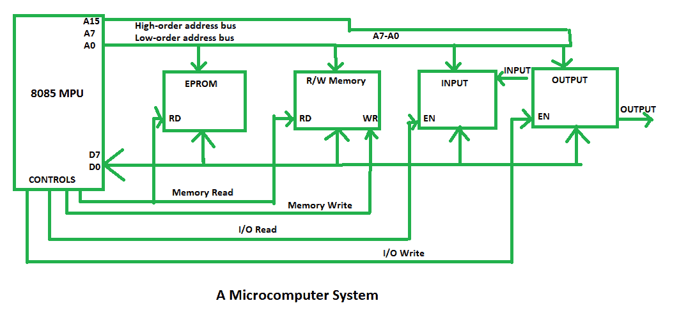

# 微机系统介绍

> 原文:[https://www . geesforgeks . org/微机系统简介/](https://www.geeksforgeeks.org/introduction-of-microcomputer-system/)

`8085微处理器`是微型计算机系统的一个例子。微处理器系统包含两种类型的存储器，即`EPROM`和`R/WM`、输入和输出设备，以及用于将所有外围设备(存储器和输入/输出设备)连接到微处理器的`总线`。

在`8085`中，我们有16条地址线，范围从`A0`到`A15`，用于寻址存储器。`地址总线A0-A7`用于识别输入和输出设备。该微机系统有8条`数据线D0-D7`，它们是双向的，所有设备共用。

它产生四个`控制信号`：`内存读取`、`内存写入`、`I/O读取`和`I/O写入`，它们连接到不同的外围设备。微处理器通过其控制信号使能外围设备，一次只与一个外围设备通信。

例如，向输出设备发送数据时，微处理器将`设备地址`(或`输出端口号`)放在`地址总线`上，将数据放在`数据总线`上，并通过使用其控制信号`输入/输出写入`来启用输出设备。之后，输出设备显示结果。

另一个未使能的外设保持高阻抗状态，称为`三态`。`总线驱动器`增加总线的当前驱动能力，`解码器`解码地址以识别输出端口，`锁存器`保存数据输出以供显示。这些设备被称为`接口设备`。这些接口设备是将外围设备连接到总线系统所需的半导体芯片。

微型计算机系统的框图如下所示:

