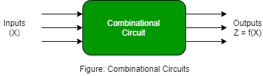
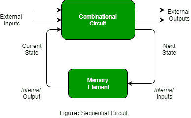
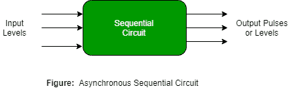
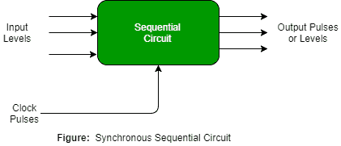

# 时序电路介绍

> 原文：[https://www.geeksforgeeks.org/introduction-of-sequential-circuits/](https://www.geeksforgeeks.org/introduction-of-sequential-circuits/)

一个`时序电路`是由输入变量(`X`)、逻辑门（计算电路）和输出变量(`Z`)组成的组合逻辑电路。

组合电路仅基于输入变量产生输出，但是`时序电路`基于`当前输入和先前输入变量`产生输出。这意味着时序电路包括能够存储二进制信息的存储元件。该二进制信息定义了时序电路当时的状态。一种能够存储一位信息的锁存器。

如图所示，组合逻辑有两种类型的输入：

1.  不受电路控制的外部输入。
2.  内部输入是先前输出状态的函数。

次级输入是由存储元件产生的状态变量，而次级输出是对存储元件的激励。

## 时序电路的类型

时序电路有两种类型：

### 异步时序电路

这些电路`不使用时钟信号`，而是使用输入脉冲。这些电路比同步时序电路`更快`，因为没有时钟脉冲，并且当输入信号发生变化时立即改变其状态。当操作速度很重要且`独立`于内部时钟脉冲时，我们使用异步时序电路。

但是这些电路更难设计，它们的输出是不确定的。

### 同步时序电路

这些电路`使用时钟信号`和电平输入（或脉冲）（对脉冲宽度和电路传播有限制）。对于时序电路，输出脉冲与时钟脉冲的持续时间相同。由于它们等待下一个时钟脉冲到来以执行下一个操作，因此这些电路比异步电路`稍慢`。电平输出在输入脉冲开始时改变状态，并保持该状态直到下一个输入或时钟脉冲。

我们在同步计数器、触发器和`MOORE-MEALY`状态管理机的设计中使用同步时序电路。

我们使用时序电路来设计计数器、寄存器、随机存取存储器、`MOORE/MEALY`机器和其他状态保持机器。

## GATE CS 角题

练习下面的题有助于测试你的知识。所有的问题在前几年的`GATE`考试或`GATE`模拟考试中都被问过。强烈建议你练习一下。

1.  [GATE CS 2010，第 65 题](https://www.geeksforgeeks.org/gate-gate-cs-2010-question-32/)
2.  [GATE CS 1999，问题 33](https://www.geeksforgeeks.org/gate-gate-cs-1999-question-33/)
3.  [GATE CS 2014(第三集)，第 65 题](https://www.geeksforgeeks.org/gate-gate-cs-2014-set-3-question-55/)

## 参考资料

- [时序电路](http://www.ee.surrey.ac.uk/Projects/Labview/Sequential/Course/03-Seq_Intro/Intro.html)
- [时序逻辑–维基百科](https://en.wikipedia.org/wiki/Sequential_logic)

本文由 [Mithlesh Upadhyay](https://www.linkedin.com/in/mithlesh-upadhyay/) 供稿。如果你喜欢极客博客并想投稿，你也可以用`write.geeksforgeeks.org`写一篇文章或者把你的文章邮寄到`review-team@geeksforgeeks.org`。看到你的文章出现在极客博客主页上，帮助其他极客。

如果你发现任何不正确的地方，或者你想分享更多关于上面讨论的话题的信息，请写评论。