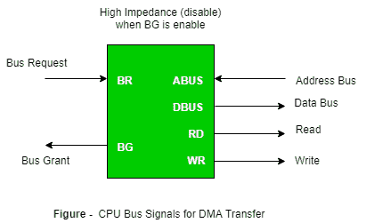

# 输入输出接口(中断和直接存储器存取模式)

> 原文: [https://www.geeksforgeeks.org/io-interface-interrupt-dma-mode/](https://www.geeksforgeeks.org/io-interface-interrupt-dma-mode/)

用于在内部存储和外部输入/输出设备之间传输信息的方法称为输入/输出接口。连接到任何计算机系统的外围设备使用特殊的通信链路连接中央处理器。这些通信链路用于解决中央处理器和外围设备之间的差异。在中央处理器和外围设备之间存在特殊的硬件组件来监控和同步所有的输入和输出传输，称为接口单元。

## 转移方式:

从外部设备接收的二进制信息通常存储在存储单元中。从中央处理器传输到外部设备的信息来自存储单元。中央处理器只是处理信息，但源和目标始终是存储单元。中央处理器和输入/输出设备之间的数据传输可以在不同的模式下完成。

进出外围设备的数据传输可以通过三种可能的方式中的任何一种来完成：

1.  编程输入输出
2.  中断启动的输入输出
3.  直接存储器存取。

现在让我们逐一讨论每种模式。

### 1. 编程输入/输出 (Programmed I/O)

它是计算机程序中编写的 I/O 指令的结果。每个数据项的传输都由程序中的一条指令启动。通常传输发生在 CPU 寄存器和内存之间。在这种情况下，CPU 需要持续监控外围设备。

**编程输入/输出示例:** 在这种情况下，输入/输出设备不能直接访问存储单元。从输入/输出设备到内存的传输需要中央处理器执行几条指令，包括将数据从设备传输到中央处理器的输入指令和将数据从中央处理器传输到内存的存储指令。在编程输入/输出中，中央处理器保持在程序循环中，直到输入/输出单元表明它准备好进行数据传输。这是一个耗时的过程，因为它不必要地使中央处理器保持忙碌。这种情况可以通过使用中断工具来避免。这将在下面讨论。

### 2. 中断启动的输入输出 (Interrupt-initiated I/O)

由于在上述情况中我们看到 CPU 被不必要地保持忙碌。这种情况可以通过使用中断驱动的数据传输方法来很好地避免。通过使用中断功能和特殊命令来通知接口，当任何设备数据可用时发出中断请求信号。与此同时，CPU 可以继续执行其他程序。接口在此期间持续监控设备。一旦确定设备准备好进行数据传输，它就向计算机发起一个中断请求信号。检测到外部中断信号后，CPU 会短暂停止它正在执行的任务，转到服务程序以处理 I/O 传输，然后返回到它最初执行的任务。

**注意:** 编程 I/O 和中断驱动 I/O 这两种方法都需要处理器的主动干预才能在内存和 I/O 模块之间传输数据，任何数据传输都必须横穿一条通过处理器的路径。因此，这两种形式的输入/输出都有两个固有的缺点。

*   输入/输出传输速率受处理器测试和服务设备的速度限制。
*   处理器忙于管理输入/输出传输；每次输入输出传输必须执行若干指令。

### 3. 直接存储器存取 (Direct Memory Access)

快速存储介质（如磁盘）和内存单元之间的数据传输受到 CPU 速度的限制。因此，我们可以允许外围设备直接使用内存总线相互通信，消除 CPU 的干预。这种数据传输技术称为 DMA 或直接存储器存取。在 DMA 期间，CPU 处于空闲状态，并且对内存总线没有控制权。DMA 控制器接管总线，以管理 I/O 设备和内存单元之间的直接传输。



**总线请求:** 由 DMA 控制器使用，请求 CPU 放弃对总线的控制。

**总线授权:** 由中央处理器激活，通知外部 DMA 控制器总线处于高阻抗状态，请求 DMA 可以控制总线。一旦直接存储器存取控制了总线，它就传输数据。这种转移可以通过多种方式进行。

#### 使用 DMA 控制器的 DMA 传输类型:

**突发传输:**
DMA 完成数据传输后返回总线。寄存器用作字节计数，在每次字节传输时递减，当字节计数达到零时，DMAC 将释放总线。当 DMAC 在突发模式下运行时，中央处理器在数据传输期间暂停。
涉及的步骤有:

1.  总线授权请求时间。
2.  以设备的传输速率传输整个数据块，因为设备通常比数据传输到中央处理器的速度慢。
3.  将总线控制释放回中央处理器。

因此，传输 `N` 个字节所花费的总时间 = 总线授权请求时间 + (`N`) * (内存传输速率) + 总线释放控制时间。

```
Where,
X µsec = data transfer time or preparation time (words/block)
Y µsec = memory cycle time or cycle time or transfer time (words/block)
% CPU idle (Blocked) = (Y / X + Y) * 100
% CPU Busy = (X / X + Y) * 100
```

**循环窃取 (Cycle Stealing):**
一种替代方法，其中 DMA 控制器一次传输一个字，之后必须将总线的控制权返回给 CPU。中央处理器仅将其操作延迟一个内存周期，以允许直接内存输入/输出传输“窃取”一个内存周期。
涉及的步骤有:

1.  将字节缓冲到缓冲区中。
2.  通知中央处理器设备有 1 个字节要传输（即总线授权请求）。
3.  传输字节（以系统总线速度）。
4.  将总线的控制权释放回 CPU。

在继续传输下一字节数据之前，设备再次执行步骤 1，这样总线就不会被占用，并且传输不会依赖于设备的传输速率。
因此，对于 1 字节的数据传输，使用周期窃取模式所花费的时间 (`T`) = 总线授权所需时间 + 1 个总线周期传输数据 + 释放总线所需时间，将为 `N x T`。

在周期窃取模式下，我们始终遵循流水线概念，即当一个字节被传输时，设备并行准备下一个字节。如果询问“CPU 时间与数据传输时间的比例”，则使用周期窃取模式。

```
Where,
X µsec = data transfer time or preparation time (words/block)
Y µsec = memory cycle time or cycle time or transfer time (words/block)
% CPU idle (Blocked) = (Y / X) * 100
% CPU busy = (X / Y) * 100
```

**交错模式:** 在这种技术中，当微处理器不使用时，DMA 控制器接管系统总线。交替半周期，即半周期 DMA + 半周期处理器。

**注意:** 在考试中你可以直接将以上公式应用于不同模式的 DMA 传输。

本文由**纳米塔·辛格**供稿。

如果你发现任何不正确的地方，或者你想分享更多关于上面讨论的话题的信息，请写评论。