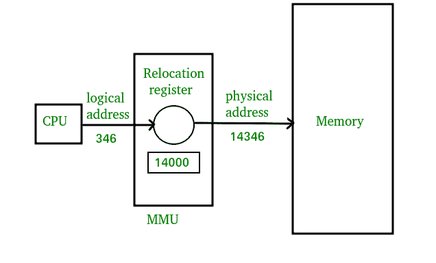

# 操作系统中的逻辑和物理地址

> 原文：[https://www.geeksforgeeks.org/logical-and-physical-address-in-operating-system/](https://www.geeksforgeeks.org/logical-and-physical-address-in-operating-system/)

`逻辑地址`是程序运行时由`中央处理器`生成的。`逻辑地址`是虚拟地址，因为它在物理上不存在，因此，它也被称为虚拟地址。该地址用作`中央处理器`访问物理内存位置的参考。术语“逻辑地址空间”用于由程序视角生成的所有逻辑地址的集合。
称为`内存管理单元`的硬件设备用于将`逻辑地址`映射到其对应的物理地址。

`物理地址`标识存储器中所需数据的物理位置。用户从不直接处理`物理地址`，但可以通过其对应的`逻辑地址`进行访问。用户程序生成`逻辑地址`，认为程序在这个`逻辑地址`上运行，但程序的执行需要物理内存，因此，`逻辑地址`在使用前必须由`MMU`映射到物理地址。术语“物理地址空间”用于与逻辑地址空间中的`逻辑地址`相对应的所有物理地址。

[将虚拟地址映射到物理地址](https://www.geeksforgeeks.org/memory-management-mapping-virtual-address-physical-addresses/)

## 操作系统中逻辑和物理地址的差异

1.  `逻辑地址`和`物理地址`的基本区别在于，从程序的角度来看，`逻辑地址`是由`中央处理器`生成的，而`物理地址`是内存单元中存在的一个位置。
2.  逻辑地址空间是`中央处理器`为程序生成的所有`逻辑地址`的集合，而映射到相应`逻辑地址`的所有物理地址的集合称为物理地址空间。
3.  `逻辑地址`在物理上不存在于存储器中，而`物理地址`是存储器中可以被物理访问的位置。
4.  相同的`逻辑地址`由编译时和加载时地址绑定方法生成，而它们在运行时地址绑定方法上彼此不同。详见[本](https://www.geeksforgeeks.org/memory-management-mapping-virtual-address-physical-addresses/)。
5.  `逻辑地址`由`中央处理器`在程序运行时生成，而`物理地址`由`内存管理单元`计算。

### 对比图

| 参数 | 逻辑地址 | 物理地址 |
| --- | --- | --- |
| 基础 | 由`中央处理器`产生 | 存储单元中的位置 |
| 地址空间 | 逻辑地址空间是由`中央处理器`参照程序生成的所有`逻辑地址`的集合。 | 物理地址是映射到相应`逻辑地址`的所有物理地址的集合。 |
| 能见度 | 用户可以查看程序的`逻辑地址`。 | 用户永远无法查看程序的`物理地址`。 |
| 产生 | 由`中央处理器`产生 | 由`内存管理单元`计算 |
| 接近 | 用户可以使用`逻辑地址`来访问物理地址。 | 用户可以间接访问物理地址，但不能直接访问。 |