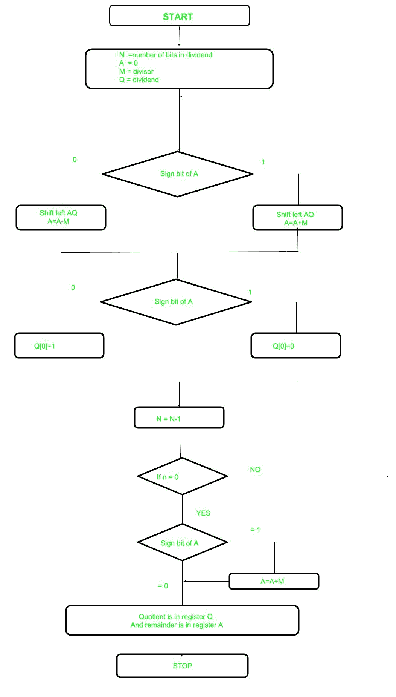

# 无符号整数的不可恢复除法

> 原文：[https://www.geeksforgeeks.org/non-restoring-division-unsigned-integer/](https://www.geeksforgeeks.org/non-restoring-division-unsigned-integer/)

在早前的帖子[恢复除法](https://www.geeksforgeeks.org/restoring-division-algorithm-unsigned-integer/)中了解到恢复除法。现在，这里执行非恢复除法，它没有恢复除法复杂，因为涉及更简单的操作，即加法和减法，现在也执行恢复步骤。在该方法中，依赖于寄存器的符号位，该位最初包含名为 `a` 的零。

下面是流程图。



让我们选择相关步骤：

*   **步骤 1：** 首先用相应的值初始化寄存器（`Q` = 被除数，`M` = 除数，`A` = 0，`n` = 被除数的位数）
*   **步骤 2：** 检查寄存器 `A` 的符号位
*   **步骤 3：** 如果是，`AQ` 的左移内容，执行 `A = A + M`，否则左移 `AQ`，执行 `A = A - M`（表示将 `M` 的 2 的补码加到 `A`，存储到 `A`）
*   **步骤 4：** 再次是寄存器 `A` 的符号位
*   **步骤 5：** 如果符号位为 1，`Q[0]` 变为 0，否则 `Q[0]` 变为 1（`Q[0]` 表示寄存器 `Q` 的最低有效位）
*   **步骤 6：** 将数值减 1
*   **步骤 7：** 如果 `N` 不等于零，进入**步骤 2**，否则进入下一步
*   **步骤 8：** 如果 `A` 的符号位为 1，则执行 `A = A + M`
*   **步骤 9：** 寄存器 `Q` 包含商，`A` 包含余数

**示例：** 对无符号整数执行非恢复除法

```
Dividend = 11
Divisor  = 3
-M = 11101
```

| 步骤 | M | A | Q | 行动 |
| :--- | :--- | :--- | :--- | :--- |
| 4 | 00011 | 00000 | 1011 | 开始 |
| | | 00001 | 011_ | `AQ` 左移 |
| | | 11110 | 011_ | `A = A - M` |
| 3 | | 11110 | 0110 | `Q[0] = 0` |
| | | 11101 | 110_ | `AQ` 左移 |
| | | 11111 | 110_ | `A = A + M` |
| 2 | | 11111 | 1100 | `Q[0] = 0` |
| | | 11111 | 100_ | `AQ` 左移 |
| | | 00010 | 100_ | `A = A + M` |
| 1 | | 00010 | 1001 | `Q[0] = 1` |
| | | 00101 | 001_ | `AQ` 左移 |
| | | 00010 | 001_ | `A = A - M` |
| 0 | | 00010 | 0011 | `Q[0] = 1` |

```
Quotient  = 3 (Q)
Remainder = 2 (A)
```