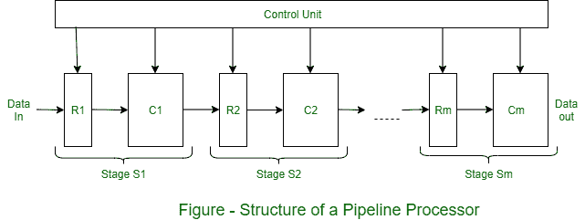

# 流水线架构及其示意图

> 原文:[https://www . geesforgeks . org/pipelined-architecture-with-its-diagram/](https://www.geeksforgeeks.org/pipelined-architecture-with-its-diagram/)

`流水线处理器`由 `m` 个数据处理电路的序列组成，称为`级`或`段`，它们共同对通过它们的数据操作数流执行单个操作。每个阶段都会进行一些处理，但只有在操作数集通过整个流水线之后，才能获得最终结果。如图所示，`级 S_(i)` 包含一个多字输入寄存器或锁存器 `R_(i)` ，和一个数据路径电路 `C_(i)` ，通常是组合的。`R_(i)` 在管道中移动时保存部分处理的结果；它们还充当缓冲器，防止相邻级相互干扰。

一个公共时钟信号使 `R_(i)` 同步改变状态。每个 `R_(i)` 从前一级 `S_(i-1)` 接收一组新的输入数据 `D_(i-1)` ，但 `R_(1)` 除外，其数据由外部源提供。`D_(i-1)` 代表 `C_(i-1)` 在前一个时钟周期计算的结果。一旦 `D_(i-1)` 已经被加载到 `R_(i)` 中，`C_(i)` 前进到 `D_(i-1)` 以计算新的数据集 `D_(i)` 。因此，在每个时钟周期，每个阶段都将其先前的结果转移到下一个阶段，并计算一组新的结果。

