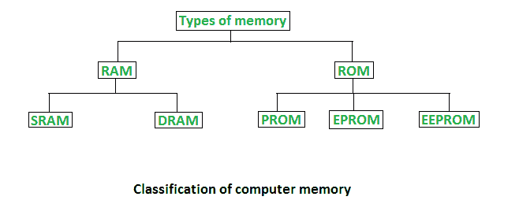
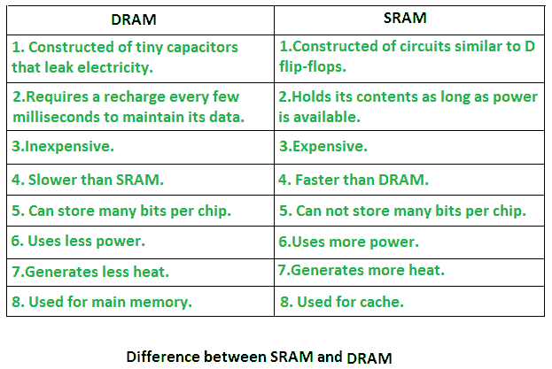
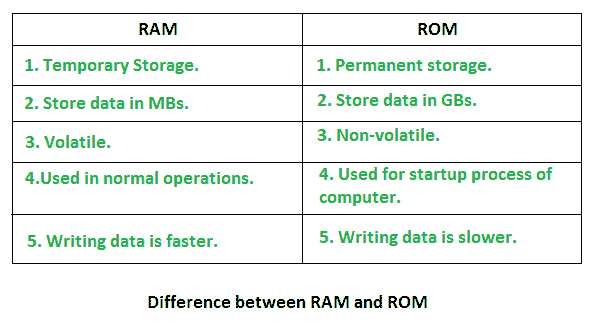

# 随机存取存储器(RAM)和只读存储器(ROM)

> 原文：[https://www.geeksforgeeks.org/random-access-memory-ram-and-read-only-memory-rom/](https://www.geeksforgeeks.org/random-access-memory-ram-and-read-only-memory-rom/)

内存是计算系统中最重要的元素，因为没有内存，计算机就无法执行简单的任务。计算机内存有两种基本类型——主内存（`RAM`和`ROM`）和辅助内存（硬盘、光盘等）。`RAM`是主易失性存储器，`ROM`是主非易失性存储器。

## 随机存取存储器（RAM）

*   也称为读写存储器或主存储器。
*   中央处理器在执行程序时需要的程序和数据都存储在这个存储器中。
*   它是一个易失性存储器，因为断电时数据会丢失。
*   `RAM`进一步分为两种类型：[`SRAM`](https://www.geeksforgeeks.org/sram-full-form/)（静态随机存取存储器）和 [`DRAM`](https://www.geeksforgeeks.org/dram-full-form/)（动态随机存取存储器）。

## 只读存储器（ROM）

*   存储操作系统所必需的重要信息，如启动计算机所必需的程序。
*   它是非易失性存储器。
*   始终保留其数据。
*   用于嵌入式系统或编程不需要改变的地方。
*   用于计算器和外围设备。
*   `ROM`进一步分为四种类型：`MROM`、[`PROM`](https://www.geeksforgeeks.org/prom-full-form/)、[`EPROM`](https://www.geeksforgeeks.org/eprom-full-form/)、[`EEPROM`](https://www.geeksforgeeks.org/eeprom-full-form/)。

### 只读存储器的类型

*   **`PROM`（可编程只读存储器）** – 可由用户编程。一旦编程，其中的数据和指令就不能更改。
*   **`EPROM`（可擦除可编程只读存储器）** – 可重新编程。要清除其中的数据，将其暴露在紫外线下。要重新编程，清除所有先前的数据。
*   **`EEPROM`（电可擦除可编程只读存储器）** – 施加电场即可擦除数据，无需紫外线。我们只能擦除芯片的一部分。
*   **`MROM`（掩膜只读存储器）** – 掩膜只读存储器是一种在生产时被掩膜的只读存储器。像其他类型的只读存储器一样，掩膜只读存储器不能使用户改变存储在其中的数据。如果可以的话，这个过程会很困难或者很慢。

