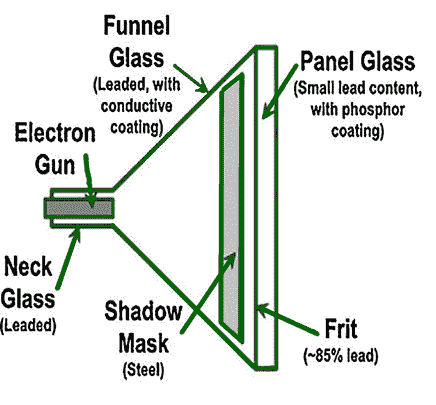
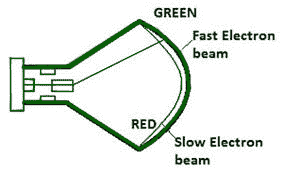
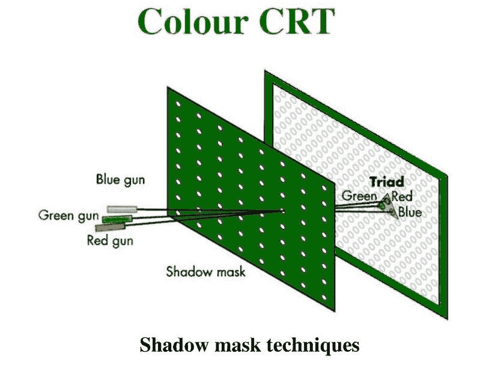

# 刷新计算机图形学中的输出设备

> 原文：[https://www.geeksforgeeks.org/refresh-type-output-devices-in-computer-graphics/](https://www.geeksforgeeks.org/refresh-type-output-devices-in-computer-graphics/)

`CRT` 代表阴极射线管。它是一个高架玻璃管。电子管一侧的电子枪产生一束电子束，射向电子管的前端或屏幕。屏幕的内侧涂有磷物质，当它被电子阻挡时会发光。

## Standard CRT
在标准 `CRT` 中，电子枪发射电子束，电子束落在磷光涂层上，从而产生发光现象以显示文本或图片。由于余辉，光线会持续一段时间，为了能够连续观看图像，因此需要以足够高的频率定期刷新图像，使得变化的图像在人眼看来是一幅连续的画面。

## 电子束穿透阴极射线管
具有磷光体涂层的普通阴极射线管只产生一种颜色的图像。用于画线的彩色阴极射线管在多层磷光体上显示图像。颜色是通过控制光束加速电位来实现的。屏幕上涂有一层绿色磷光体，红色磷光体沉积在该层上。

当低电位电子束撞击屏幕时，只有红磷被激发，从而产生红色痕迹。更高速度的光束将穿透绿色磷光体，通过改变光束电势增加光输出的绿色成分，可以产生不同的红色和绿色光的组合。

## Shadow mask CRT
大多数彩色电视机和计算机显示器使用荫罩彩色 `CRT`，其屏幕涂有磷光体，屏幕后面有一块金属板，上面有按特定图案排列的小孔。它使用三个电子枪分别产生红、绿、蓝三色光输出。

枪以三角形方式排列。偏转系统对三束电子束进行操作，同时将它们带到荫罩上的同一焦点。所有三束电子束通过荫罩上的一个孔，并在所述点撞击荧光体。

`Figure –` Colour CRT Shadow mask techniques
