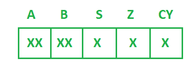
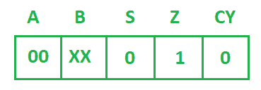
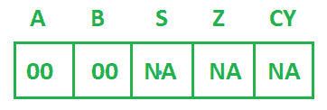
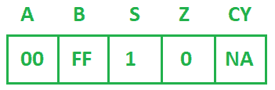
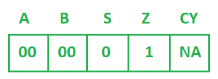
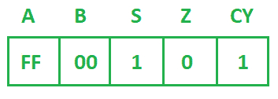

# 指令后登记内容和标志状态

> 原文：[https://www.geeksforgeeks.org/register-content-and-flag-status-after-instructions/](https://www.geeksforgeeks.org/register-content-and-flag-status-after-instructions/)

基本上就是给你一套指令和[8085 微处理器](https://www.geeksforgeeks.org/pin-diagram-8085-microprocessor/)的寄存器和标志的初始内容。每次指令后，您必须找到[寄存器](https://www.geeksforgeeks.org/registers-8085-microprocessor/)和[标志状态](https://www.geeksforgeeks.org/flag-register-8085-microprocessor/)的内容。

最初，`T2`

下面是该组指令：

```
SUB A
MOV B, A
DCR B
INR B
SUI 01H
HLT 
```

**假设：**
每条指令将使用前一条指令的结果进行寄存器。以下是带有寄存器内容和标志状态的每条指令的描述：

*   **Instruction-1:**
    `SUB A` 指令将累加器自身的内容相减。它用于清除累加器的内容。此操作后，寄存器和标志的内容将如下图所示。



*   **Instruction-2:**
    `MOV B, A` 将从源寄存器（`A`）复制内容到目标寄存器（`B`）。由于它是数据传输指令，因此不会影响任何标志。此操作后，寄存器和标志的内容将如下图所示。



*   **Instruction-3:**
    `DCR B` 将寄存器 `B` 的内容减 1。`DCR` 操作不影响进位标志（`CY`）。

```
    B-00H 0 0 0 0  0 0 0 0 
```

对于 `DCR`，`B` 取 `01H` 的 2 的补码，`01H` 的 2 的补码：

```
     0 0 0 0  0 0 0 1
     1 1 1 1  1 1 1 0  (1's complement)
                  + 1
    ------------------
     1 1 1 1  1 1 1 1 
    ------------------

+(00)  0 0 0 0  0 0 0 0 
    -----------------------
           1 1 1 1  1 1 1 1   
    ----------------------  
```

（`FFH`）这将是 `B` 的内容。所以在这个操作之后，寄存器和标志的内容将如下图所示。



*   **Instruction-4:**
    `INR B` 将寄存器 `B` 的内容加 1。`INR` 操作不影响进位标志（`CY`）。

```
    B(FFH)     
            1 1 1 1  1 1 1 1 
    +(01)   0 0 0 0  0 0 0 1 
           ------------------
    CY=1    0 0 0 0  0 0 0 0  
           ------------------ 
```

（`0 0 0 0 0 0 0`）将是寄存器 `B` 的内容。因此，在此操作之后，寄存器和标志的内容将如下图所示。



*   **Instruction-5:**
    `SUI 01H` 将从累加器的内容中减去 `01H` 并将结果存储在累加器中。

```
    A-00H  0 0 0 0  0 0 0 0 
```

对于 `SUI`，`01H` 取 `01H` 的 2 的补码，`01H` 的 2 的补码：

```
           0 0 0 0  0 0 0 1
           1 1 1 1  1 1 1 0  (1's complement)
                        + 1
          ------------------
           1 1 1 1  1 1 1 1 
          ------------------ 
    +(00)  0 0 0 0  0 0 0 0   (Content of the accumulator)
        -----------------------
           1 1 1 1  1 1 1 1   
```

（`FFH`）这将存储在蓄能器中。在此操作之后，寄存器和标志的内容将如下图所示。



`HLT` 将终止程序的执行。