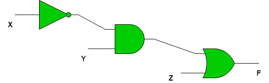
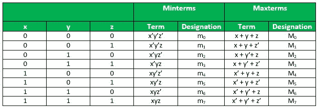

# 布尔函数的表示

> 原文: [https://www.geeksforgeeks.org/representation-of-boolean-functions/](https://www.geeksforgeeks.org/representation-of-boolean-functions/)

一个**布尔函数**由一个代数表达式描述，该表达式由二进制变量、常数 0 和 1 以及逻辑运算符号 `+`、`.`、`'` 组成。对于所涉及的二进制变量的一组给定值，布尔函数可以有 0 或 1 的值。例如，布尔函数 `F = x'y + z` 是根据三个二进制变量 `x`、`y`、`z` 定义的。如果同时 `x=0` 和 `y=1` 或 `z=1`，函数等于 1。

每一个布尔函数都可以用一个代数表达式来表示，比如上面提到的，或者用真值表来表示。一个函数可以通过几个代数表达式来表示，因为它们在逻辑上是等价的，但是每个函数只有一个唯一的真值表。

布尔函数可以从代数表达式转换成由以特定结构连接的逻辑门组成的电路图。`F` 的电路图如下：



## 规范和标准形式

任何二元变量都可以采用两种形式之一，`x` 或 `x'`。布尔函数可以用 `n` 个二进制变量来表示。如果所有的二进制变量使用“与”运算组合在一起，那么总共有 `2^n` 种组合，因为每个变量可以采取两种形式。

每一种组合称为**小项**或**标准积**。一个小项由 `m_i` 表示，其中 `i` 是指定小项的二进制数的十进制等价物。

**重要提示：** 在一个小项中，如果变量为 1，二进制变量是未加引号的，如果变量为 0，即如果小项为 `xy'`，那么这意味着 `x=1` 和 `y=0`。

例如，对于两个变量中的布尔函数，最小项是：
`m_0 = x'y'`, `m_1 = x'y`, `m_2 = xy'`, `m_3 = xy`

类似地，如果变量通过或运算组合在一起，那么得到的项称为**最大项**或**标准和**。最大项由 `M_i` 表示，其中 `i` 是最大项指定的二进制数的十进制等价物。

**重要提示：** 在最大项中，如果变量为 0，则二进制变量未被填充，如果变量为 1，则二进制变量被填充，即如果最大项为 `x' + y`，则意味着 `x' = 1` 和 `y = 0`。

例如，对于两个变量的布尔函数，最大项是：
`M_0 = x + y`, `M_1 = x + y'`, `M_2 = x' + y`, `M_3 = x' + y'`

三变量函数的最小项和最大项如下图所示：



## 最小项和最大项的关系

每个最小项都是其对应的最大项的补码。例如，对于双变量布尔函数：
`m_i = M_i'` 或 `M_i = m_i'`

## 构造布尔函数

现在我们知道了什么是 minterms 和 maxterms，可以用它们来构造布尔表达式。

“一个布尔函数可以用代数方法从给定的真值表中表达出来，方法是为每个变量组合形成一个小项，在函数中产生一个 1，然后取所有这些项的或。”

例如，考虑两个函数 `f1` 和 `f2`，真值表如下：

| x | y | z | f1 | f2 |
|---|---|---|----|----|
| 0 | 0 | 0 | 0  | 0  |
| 0 | 0 | 1 | 1  | 0  |
| 0 | 1 | 0 | 0  | 0  |
| 0 | 1 | 1 | 0  | 1  |
| 1 | 0 | 0 | 1  | 0  |
| 1 | 0 | 1 | 0  | 1  |
| 1 | 1 | 0 | 0  | 1  |
| 1 | 1 | 1 | 1  | 1  |

函数 `f1` 对于以下 `x`、`y`、`z` 的组合为 1：001，100，111。对应的最小项为：`x'y'z`、`xy'z'`、`xyz`。

因此 `f1` 的代数表达式是：
`f1(x, y, z) = x'y'z + xy'z' + xyz`
`f1(x, y, z) = m_1 + m_4 + m_7`

类似地，`f2` 的代数表达式是：
`f2(x, y, z) = m_3 + m_5 + m_6 + m_7`

如果我们在 `f1` 和 `f2` 上使用德摩根定律，所有 1 都变成 0，所有 0 都变成 1。因此我们得到：
`f1(x, y, z)' = m_0 + m_2 + m_3 + m_5 + m_6`
`f2(x, y, z)' = m_0 + m_1 + m_2 + m_4`

关于再次使用德摩根定律：
`f1(x, y, z) = (m_0 + m_2 + m_3 + m_5 + m_6)'`
`f1(x, y, z) = m_0' . m_2' . m_3' . m_5' . m_6'`
`f1(x, y, z) = M_0 . M_2 . M_3 . M_5 . M_6`

和
`f2(x, y, z) = (m_0 + m_1 + m_2 + m_4)'`
`f2(x, y, z) = m_0' . m_1' . m_2' . m_4'`
`f2(x, y, z) = M_0 . M_1 . M_2 . M_4`

我们可以从上面得出结论，布尔函数可以表示为一个**最小项之和**或者一个**最大项之积**。

表示为最小项之和或最大项之积的布尔函数被称为**规范形式**。

### 例 1

用 SOP 和 POS 形式表达以下布尔表达式：
`F = x + y'z`

**解：** 表达式可以通过乘以 `k + k' = 1` 将每个项中的缺失变量相加转化为 SOP 形式，其中 `k` 为缺失变量。
这是从 `1.x = x.1 = x` 推导而来。
```
F = x(y + y') + y'z
F = xy + xy' + y'z
F = xy(z + z') + xy'(z + z') + (x + x')y'z
F = xyz + xyz' + xy'z + xy'z' + xy'z + x'y'z
```
按照升序重新排列最小项：
```
F = x'y'z + xy'z' + xy'z + xyz' + xyz
F = m_1 + m_4 + m_5 + m_6 + m_7
```
如果我们想要 POS 表单，我们可以如上所述对 SOP 表单进行双重否定，从而得到：
`F = M_0 . M_2 . M_3`

SOP 和 POS 表单有一个简短的表示符号：
```
F(x, y, z) = ∑(1, 4, 5, 6, 7)
F(x, y, z) = ∏(0, 2, 3)
```

## 标准形式

规范形式是从函数真值表中得到的基本形式。这些形式通常不用于表示函数，因为它们编写起来很麻烦，最好用尽可能少的文字来表示函数。

有两种标准形式：

1.  **乘积之和 (SOP)**：一种布尔表达式，包含带有一个或多个字面量的“与”项，或在一起。
2.  **和之乘积 (POS)**：一种布尔表达式，包含带有一个或多个字面量的“或”项，与在一起。

**注：** 以上表达式不等价，只是举例。

## GATE CS 角题

练习下列问题将帮助你测试你的知识。所有的问题在前几年的 GATE 考试或 GATE 模拟考试中都被问过。强烈建议你练习一下。

1.  [GATE CS 2010，问题 6](https://www.geeksforgeeks.org/gate-gate-cs-2010-question-6/)
2.  [GATE CS 2008，问题 7](https://www.geeksforgeeks.org/gate-gate-cs-2008-question-7/)
3.  [GATE CS 2014 第 1 集，第 17 题](https://www.geeksforgeeks.org/gate-gate-cs-2014-set-1-question-17/)

## 参考文献

《数字设计》第五版，作者：莫里斯·马诺和迈克尔·西莱蒂

本文由**奇拉·曼瓦尼**供稿。如果你喜欢 GeeksforGeeks 并想投稿，你也可以使用 [contribute.geeksforgeeks.org](http://www.contribute.geeksforgeeks.org) 写一篇文章或者把你的文章邮寄到 contribute@geeksforgeeks.org。看到你的文章出现在极客博客主页上，帮助其他极客。

如果你发现任何不正确的地方，或者你想分享更多关于上面讨论的话题的信息，请写评论。