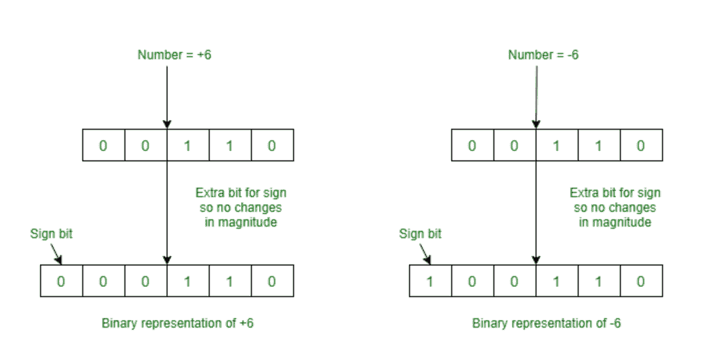
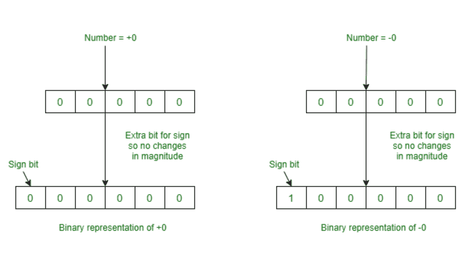
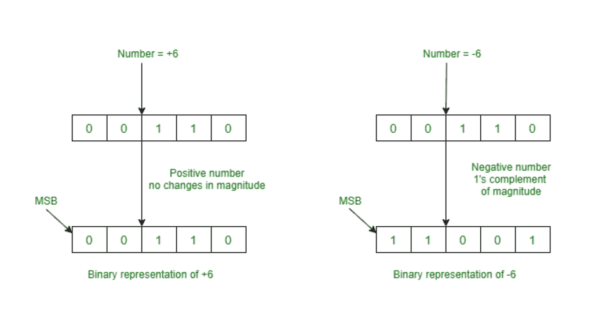
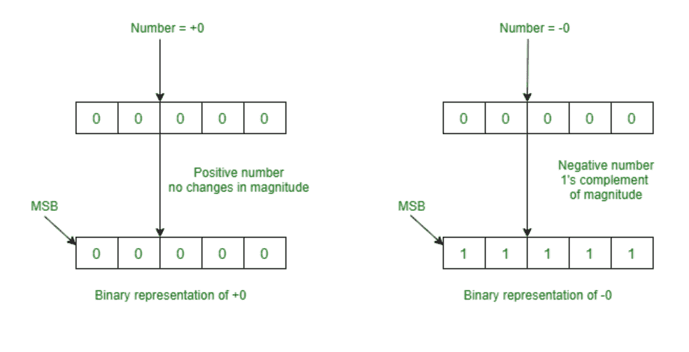
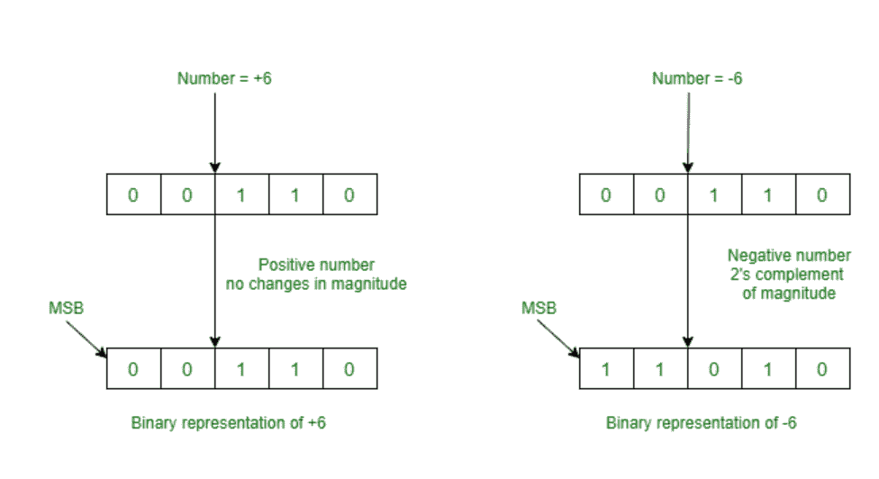
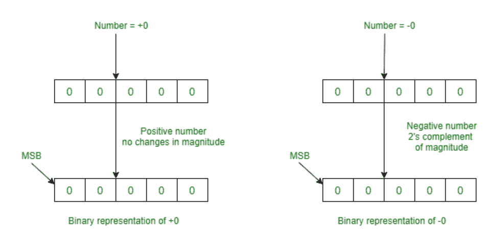

# 负二进制数的表示

> 原文：[https://www.geeksforgeeks.org/representation-of-negative-binary-numbers/](https://www.geeksforgeeks.org/representation-of-negative-binary-numbers/)

由于[二进制数](https://www.geeksforgeeks.org/binary-representation-of-a-given-number/)每个位置或位只能有两个符号 `0` 或 `1`，因此不可能在二进制数前面加上减号或加号。

我们用一个减号代表负二进制数。在计算机数字表示法中，这些数字可以借助于一个额外的位或标志来区分，这个位或标志在有符号数字的二进制数字表示系统中称为符号位或符号标志。这个额外的位称为符号位或符号标志，对于正数，符号位的值为 `0`，对于负二进制数，符号位的值为 `1`。

正数大小的表示很容易，不需要任何改变。负数的大小的表示相应地改变以表示它。

## 表示量值的方法

这些是：符号-量值法、`1` 的补码法、`2` 的补码法。这些用例子解释如下。

### 1. Signed Magnitude Method

我们只添加一个额外的符号位来识别负数和正数。符号位对于负数为 `1`，对于正数为 `0`。

**数字范围：**
对于 `n` 位寄存器，`MSB` 为符号位，而 `(n-1)` 位为幅度位。那么，可以存储的负最低数为 `-(2^(k-1) -1)`，可以存储的正最大数为 `(2^(k-1) -1)`。

但是，这个（符号）表示有一个不明确的数字 `0` 表示。这意味着 `0` 有两种不同的表示，一种是 `-0`（例如，六位寄存器中的 `1 00000`），第二种是 `+0`（例如，六位寄存器中的 `00000`）。

### 2. 1’s Complement Method

请注意，`MSB` 始终是符号位，如果它是 `0`，则没有变化。在负数的情况下，`MSB` 始终是 `1`。我们只对负数取 `1` 的补码以在计算机中表示。

**数字范围：**
对于 `n` 位寄存器，可以存储的最低负数为 `-(2^(n-1) -1)`，可以存储的最大正数为 `(2^(n-1) -1)`。

但是，这个（符号）表示有一个不明确的数字 `0` 表示。这意味着 `0` 有两种不同的表示，一种是 `-0`（例如，五位寄存器中的 `1 1111`），第二种是 `+0`（例如，五位寄存器中的 `0 0000`）。

### 3. 2’s Complement Method

请注意，`MSB` 始终是符号位，如果它是 `0`，则没有变化。在负数的情况下，`MSB` 始终是 `1`。我们只对负数取 `2` 的补码以在计算机中表示。

因为 `+0` 和 `-0` 只有一种表示，所以这个 `2` 的补码表示比符号表示和 `1` 的补码表示好。

**数字范围：**
对于 `n` 位寄存器，可以存储的最低负数为 `-(2^(n-1))`，可以存储的最大正数为 `(2^(n-1) -1)`。