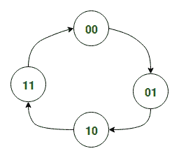
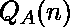
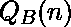
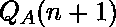
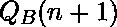
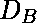
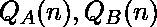
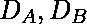
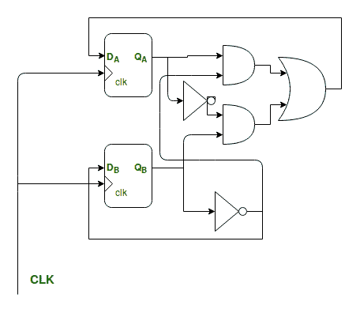

# RTL设计与时序逻辑设计

> 原文：[https://www.geeksforgeeks.org/rtl-register-transfer-level-design-vs-sequential-logic-design/](https://www.geeksforgeeks.org/rtl-register-transfer-level-design-vs-sequential-logic-design/)

在本文中，我们试图解释寄存器传输级（RTL）设计和时序逻辑设计之间的根本区别。

在 ``RTL设计`` 方法中，不同类型的寄存器，如计数器、移位寄存器、SIPO（串行输入并行输出）、PISO（并行输入串行输出）被用作任何时序逻辑电路的基本构建模块。

另一方面，``同步时序逻辑设计`` 方法论中，不同的逻辑门和不同的存储元件如触发器（随时存储电路的状态）被用作时序逻辑电路的基本构造块。

## 同步时序逻辑设计过程示例

下面的例子解释了使用状态图的同步时序逻辑设计过程及其缺点：

假设我们要设计一个2位同步二进制计数器，其计数序列为：

```
00 -> 01 -> 10 -> 11 -> 00 -> 01 -> ..... so on.
```

### 步骤1：绘制状态图

在第一步，我们绘制一个 ``State Diagram`` 来表示上述时序电路。表示上述计数器的状态图如下所示：



<center>**图 –** 2位加法计数器的状态图</center>

### 步骤2：推导状态表

在下一步，我们从上面给出的 ``State Diagram`` 推导出 ``State Table``。

状态表如下所示：

<center>

| 当前状态 Q(n) | 下一状态 Q(n+1) | 输出 |
| --- | --- | --- |
| 00 | 01 | 01 |
| 01 | 10 | 10 |
| 10 | 11 | 11 |
| 11 | 00 | 00 |

</center>

### 步骤3：选择触发器类型并确定数量

在第三步，我们需要选择将用于存储电路状态的触发器类型。为简单起见，我们将考虑正边沿触发的D型触发器。我们还需要确定表示电路内部状态所需的触发器数量。所需触发器数量的通用公式为：

```
总触发器数量 = ceil(log2(N))
其中，
N = 状态表中的总状态数
```

然后我们需要记下所选触发器的 ``激励表``。D型触发器的激励表如下所示：

<center>

| 当前状态 Q(n) | 下一状态 Q(n+1) | D |
| --- | --- | --- |
| X | 0 | 0 |
| X | 1 | 1 |

</center>

### 步骤4：合并状态表与激励表

在这一步，我们将第二步的状态表与上一步的激励表合并如下：

<center>

|  |  |  |  |  |  |
| --- | --- | --- | --- | --- | --- |
| 0 | 0 | 0 | 1 | 0 | 1 |
| 0 | 1 | 1 | 0 | 1 | 0 |
| 1 | 0 | 1 | 1 | 1 | 1 |
| 1 | 1 | 0 | 0 | 0 | 0 |

</center>

### 步骤5：推导布尔函数并完成电路

接下来，从上表中，我们尝试将  表示为  的布尔函数。

在这种情况下，两个  的表达式都是微不足道的。

```
D_A = Q_A \oplus Q_B \hspace{2.5cm}       D_B = \overline Q_B
```

最终时序电路如下所示：



<center>**图 –** 最终电路</center>

## 上述流程的缺点

*   从上面的例子中，我们观察到 ``同步时序逻辑设计过程`` 是一个相当复杂的过程，即使对于像上面这样的简单电路，也需要我们经历一系列定义明确的步骤。
*   其次，如果 ``状态的数量`` 变大，那么这个过程就变得麻烦和耗时，有时甚至是不可能的。

## RTL设计方法的引入

为了解决时序逻辑设计过程的上述缺点，并使数字设计人员能够轻松设计更复杂的电路，引入了 ``RTL设计`` 方法。RTL设计最受欢迎的例子是处理器，它只不过是一个非常复杂的 ``有限状态机``，具有非常多的状态。

## RTL设计与时序逻辑设计的主要区别

RTL设计和时序逻辑设计的主要区别如下：

<center>

| RTL设计 | 时序逻辑设计 |
| --- | --- |
| 在RTL设计中，基本的构建模块是寄存器、多路复用器、加法器。 | 在时序逻辑设计中，基本的构件是逻辑门、触发器。 |
| RTL设计更接近逻辑电路的行为设计，因为它模拟不同寄存器之间的数据流，因此更直观。 | 与RTL设计过程相比，时序逻辑设计过程本质上更机械。 |
| 最后，与时序逻辑设计相比，RTL建模允许我们更容易地合成具有大量状态的复杂电路。 | 时序逻辑设计技术仅适用于具有少量状态的电路。 |

</center>