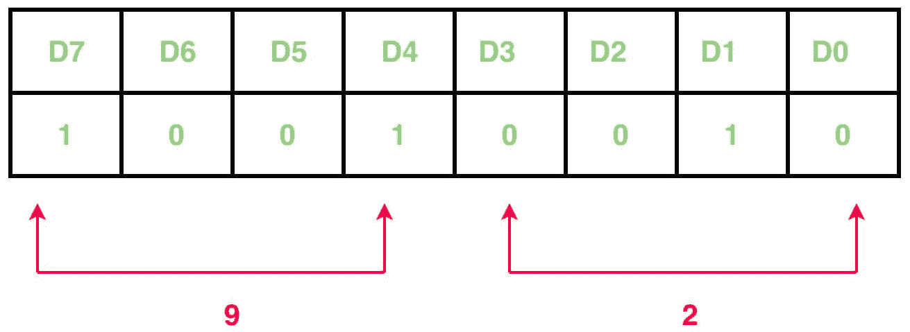
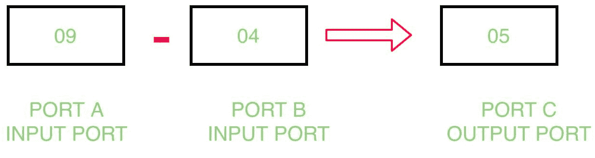

# 通过 8255 与 8085 微处理器的接口

## 问题
编写一个汇编程序，通过 8255 与 8085 微处理器的接口，确定从 `Port A` 减去 `Port B` 的内容，并将结果存储在 `Port C` 中。

## 示例



## 算法
1.  构造 `控制字寄存器`
2.  从 `Port A` 和 `Port B` 输入数据
3.  减去 `Port A` 和 `Port B` 的内容
4.  在 `Port C` 显示结果
5.  暂停程序

## 程序
| 记忆术 | 评论 |
| --- | --- |
| `MVI A, 92` | `A` |
| `OUT 83` | `控制寄存器` |
| `IN 81` | `a` |
| `MOV B, A` | `B` |
| `IN 80` | `一个` |
| `SUB B` | `A` |
| `OUT 82` | `端口 C` |
| `RET` | 返回 |

## 解释
1.  **`MVI A, 92`**: 表示 `控制寄存器` 的值为 `92`。
```
    D7=1         I/O mode
    D6=0 & D5=0  Port A is in mode 0
    D4=1         Port A is taking input
    D3=0 & D0=0  Port C is not taking part
    D2=0         Port B is in mode 0
    D1=1         Port B is taking input
```
2.  **`OUT 83`**: 将 `A` 的值放入 `端口控制寄存器` 的端口号 `83H`。
3.  **`IN 81`**: 从 `端口 b` 的端口号 `81H` 取输入。
4.  **`MOV B, A`**: 将 `A 寄存器` 的内容复制到 `B 寄存器`。
5.  **`IN 80`**: 从 `端口 a` 的端口号 `80H` 取输入。
6.  **`SUB B`**: 减去 `A 寄存器` 和 `B 寄存器` 的内容。
7.  **`OUT 82`**: 在 `81H` 中显示结果，`81H` 是 `端口 c` 的端口号。
8.  **`RET`**: 返回。