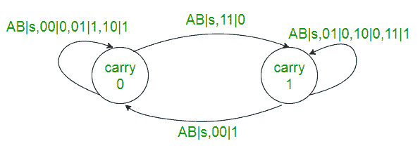
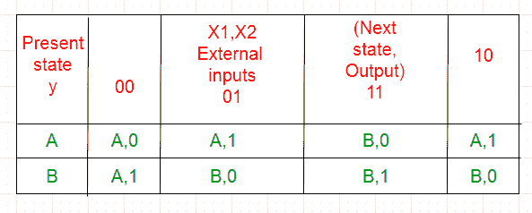
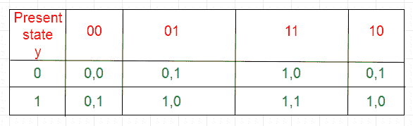
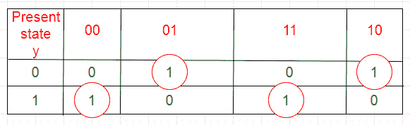
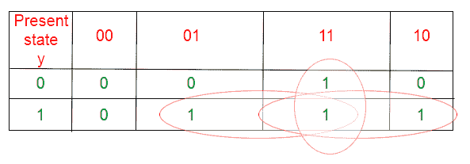
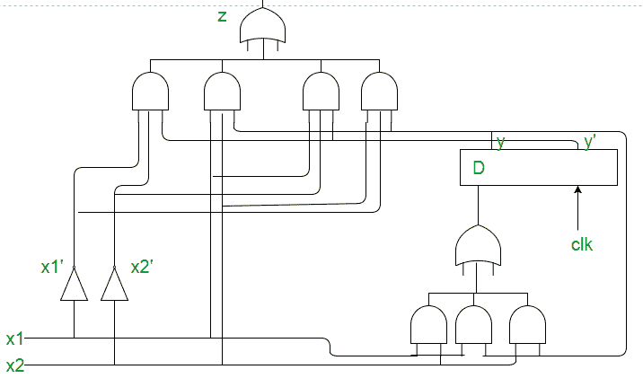

# 数字逻辑中的同步时序电路

> 原文：[https://www.geeksforgeeks.org/synchronous-sequential-circuits-in-digital-logic/](https://www.geeksforgeeks.org/synchronous-sequential-circuits-in-digital-logic/)

解决问题的步骤：
1.  根据问题陈述或给定的状态表绘制状态图。
    **例：** 串行加法器。
    串行加法器的功能可以用下面的状态图来描述。`X1` 和 `X2` 是输入，`A` 和 `B` 是代表进位的状态。
    

2.  绘制状态表。如果有任何冗余状态，则减少状态表。
    

3.  选择**状态分配**，即根据状态总数为状态分配二进制数。还要决定电路的存储元件（触发器）。
    `A -> 0`
    `B -> 1`

4.  替换状态表中的赋值，得到过渡表：
    

5.  将输出表与过渡表分开。
    

    

    z = x1x’2y+x’1x2y’+x1x2y+x1x’2y’
    

6.  触发器的激励表由过渡表使用触发器的输出得到。
    **D 触发器的激励表：**
    

    

    D = x1x2+x1y+x2y
    

7.  使用门电路和触发器绘制电路图。
    

本文由 **Kriti Kushwaha** 贡献。
如果您发现任何错误，或者想分享更多关于上述讨论主题的信息，请发表评论。