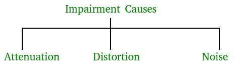
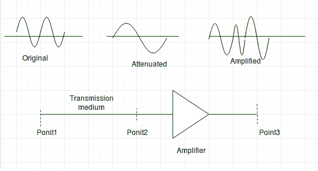
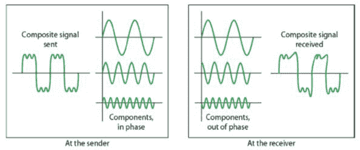
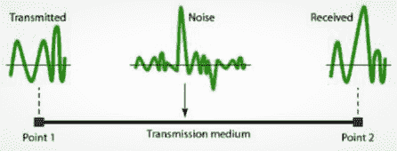

# 数据通信中的传输损伤

> 原文: [https://www.geeksforgeeks.org/transmission-impairment-in-data-communication/](https://www.geeksforgeeks.org/transmission-impairment-in-data-communication/)

在通信系统中，模拟信号通过传输介质传输，这往往会降低模拟信号的质量，这意味着介质开头的信号与介质结尾的信号不一样。这种缺陷会导致信号受损。以下是减值的原因。

## 损伤原因



*   **衰减（Attenuation）** – 它意味着能量的损失。信号强度随着距离的增加而减小，这导致在克服介质电阻时能量损失。这也被称为衰减信号。放大器用于放大衰减的信号，将其恢复为原始信号并补偿这种损失。



*   图片来源 – [aviationchief](http://www.aviationchief.com/uploads/9/2/0/9/92098238/19_1.jpg)

衰减以`分贝(dB)`为单位测量。它测量两个信号或一个信号在两个不同点的相对强度。

> `衰减(分贝)= 10log10(P2/P1)`

`P1`是发送端的功率，`P2`是接收端的功率。

有些地方分贝也是用电压而不是功率来定义的。在这种情况下，因为功率与电压的平方成正比，所以公式为

> `衰减(分贝)= 20log10(V2/V1)`

`V1`是发送端的电压，`V2`是接收端的电压。

*   **失真（Distortion）** – 表示信号形式或形状的变化。这通常见于由不同频率组成的复合信号。每个频率分量在介质中的传播速度各不相同。这就是为什么它会延迟到达最终目的地，每个组件到达的时间不同，从而导致失真。因此，它们在接收端与在发送端具有不同的相位。



*   **噪声（Noise）** – 与原始信号混合的随机或不需要的信号称为噪声。噪声有几种类型，例如感应噪声、串扰噪声、热噪声和脉冲噪声，它们可能会损坏信号。

**感应**噪声来源于电机、电器等。这些设备充当发送天线，传输介质充当接收天线。**热**噪声是电子在电线中的运动，产生额外的信号。**串扰**噪声是指一根线影响另一根线。**脉冲**噪声是来自闪电或电力线的高能量信号。



*   为了找到理论比特率限制，我们需要知道比率。信噪比定义为

```
SNR = AVG SIGNAL POWER / AVG NOISE POWER
```

## 参考资料

*   [数据通信与网络第四版 作者: Forouzan](https://www.flipkart.com/data-communications-networking-4th/p/itmef2pbg6kmz67f)
*   [数据通信 – slide share](https://www.slideshare.net/SyedRizwanAli/data-communication-unit-1)