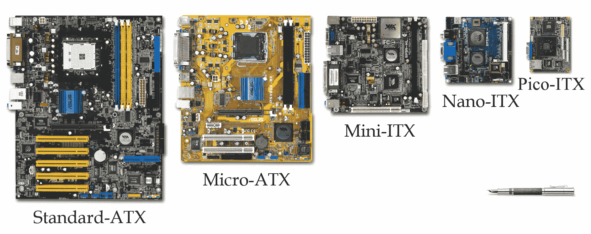
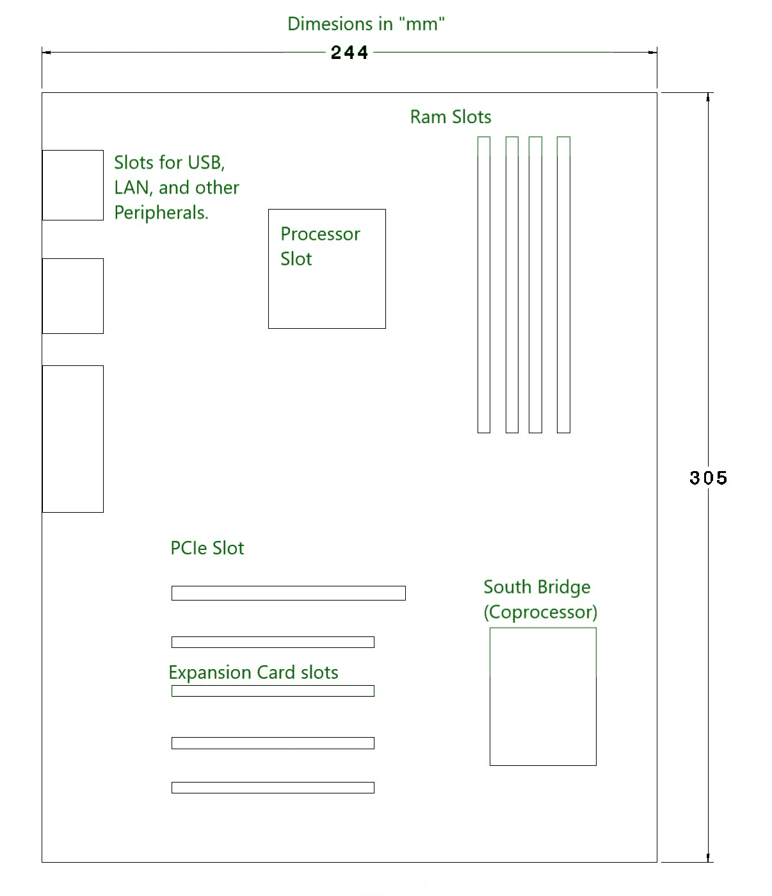
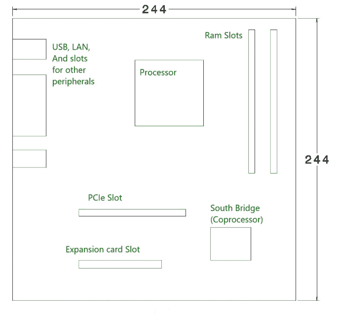
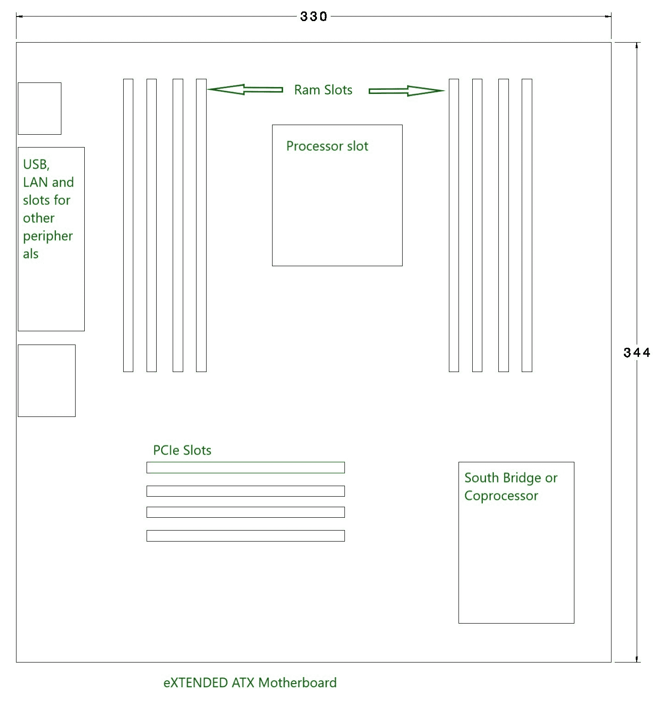

# 主板类型

> 原文:[https://www.geeksforgeeks.org/types-of-motherboards/](https://www.geeksforgeeks.org/types-of-motherboards/)

[主板](https://www.geeksforgeeks.org/what-is-a-motherboard/)的尺寸并不多，但在本文中，我们将讨论可用的选项以及何时使用合适的尺寸。



`主板`采用名为高级技术扩展(`ATX`)的外形规格进行描述，该外形规格由`英特尔`公司发明，多年来一直是行业标准。`ATX`不仅描述了主板布局，还为电源和`PC`机柜以及不同的连接器制定了规格，以实现兼容性。

## 主流台式电脑主板尺寸

现在，让我们来讨论一下主流台式电脑细分市场中可用的不同尺寸。

主要有三种尺寸：

```
1. Standard ATX
2. Micro ATX
3. eXtendend ATX 
```

这些解释如下。

### Standard ATX

`Standard ATX`主板尺寸为`305*244mm`（长*宽），这些尺寸可能因不同制造商而异。该主板提供更多的扩展插槽，最多四个`RAM`插槽，两个或更多`PCIe`插槽用于双显卡，以及更多`USB`和其他连接端口。其尺寸也为组件之间留出了空间，有利于气流以控制热量。这种尺寸的主板适用于那些需要更多扩展插槽和不同连接端口，并处理繁重工作负载的用户。该主板只能安装在支持全尺寸`ATX`或`Extended ATX`主板的机箱中。



### Micro ATX

`Micro ATX`主板尺寸为`244*244 mm`（长*宽）（这些尺寸可能因不同制造商而异）。与`Standard ATX`板相比，该主板的端口和插槽较少。这种类型的主板更适合那些不需要太多连接性和后续升级（如添加更多内存、额外`GPU`或显卡以及添加`PCI`卡）的用户。该板可以安装在任何有足够`244*244 mm`空间的机箱中，也可以安装在更大的、兼容`Standard ATX`和`Extended ATX`主板的机箱中。



### eXtendend ATX

`eXtendend ATX`主板尺寸为`344*330 mm`（这些尺寸可能因不同制造商而异）。该主板设计用于双`CPU`和单`CPU`配置，拥有多达8个`RAM`插槽，并有更多的`PCIe`和`PCI`插槽，用于添加不同用途的`PCI`卡。它用于工作站和服务器。一些`EATX`主板也专为桌面计算设计，并且有充足的空间用于散热和连接外围设备。



如今技术越来越先进，你可以在`Micro ATX`板或`Standard ATX`板上找到所有这些额外的插槽和电源。