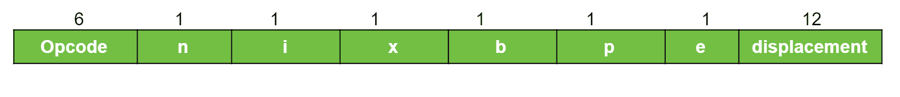

# UltraSPARC 架构

> 原文:[https://www.geeksforgeeks.org/ultrasparc-architecture/](https://www.geeksforgeeks.org/ultrasparc-architecture/)

**UltraSPARC 架构**属于 SPARC(可扩展处理器架构)处理器家族。这种体系结构适用于各种微型计算机和超级计算机。UltraSPARC 是精简指令集计算机的一个例子。

## 内存

内存由 8 位字节组成。两个连续的字节形成一个半字，四个字节形成一个字，八个字节形成一个双字。UltraSPARC 程序在**虚拟地址空间**（2<sup>64</sup> 字节）上运行。虚拟地址空间被划分为页，这些页存储在物理内存或磁盘上。

## 寄存器

UltraSPARC 架构包含一个大型寄存器文件，拥有超过 100 个通用寄存器。任何过程只能访问其中的 32 个寄存器。SPARC 硬件使用寄存器窗口来管理不同过程的所有操作。
除了这些寄存器文件，UltraSPARC 还使用程序计数器、代码寄存器和其他控制寄存器。

## 数据格式

*   整数存储为 8 位、16 位、32 位或 64 位二进制数。
*   字符用 8 位 ASCII 码表示。
*   浮点用三种不同的格式表示，即单精度格式、双精度格式和四精度格式。

## 指令格式

SPARC 架构使用三种基本指令格式。所有指令都是 32 位长，前两位用于标识正在使用的格式。

**格式 1-** 用于调用指令。


**格式 2-** 用于分支指令。


**格式 3-** 由所有剩余指令使用，如寄存器加载和存储。



其中，

```
n=间接模式,
i=立即寻址,
x=变址寻址,
b=基址寻址,
p=程序计数器,
e=指数寻址
```

## 寻址模式

内存中的操作数使用以下三种模式之一进行寻址：

```
模式                      目标地址(TA) 计算
PC 相对寻址               TA=(PC) + 位移量

带位移量的寄存器间接寻址  TA=(寄存器) + 位移量

带变址的寄存器间接寻址    TA=(寄存器-1) + (寄存器-2)
```

*PC 相对寻址仅用于分支指令。*

## 指令集

与 CISC 机器相比，该架构的指令数量较少。唯一访问内存的指令是加载和存储。所有其他指令仅对寄存器进行操作。SPARC 系统上的指令执行是流水线化的，这意味着在执行一条指令的同时，下一条指令正从内存中取出并解码。

## 输入输出

I/O 设备之间的通信和 SPARC 运算都是通过内存完成的。输入和输出可以用计算机的常规指令集来执行，不需要特殊的输入输出指令。