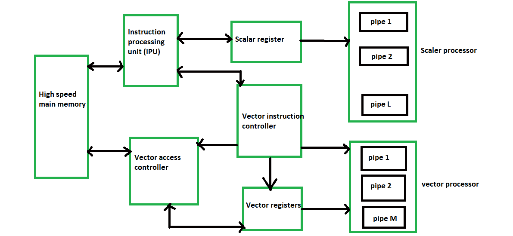

# 矢量处理器分类

> 原文：[https://www.geeksforgeeks.org/vector-processor-classification/](https://www.geeksforgeeks.org/vector-processor-classification/)

根据操作数在向量处理器中的检索位置，流水线向量计算机分为两种架构配置：

## 内存到内存架构

在`内存到内存`架构中，源操作数、中间结果和最终结果直接从主内存中检索（读取）。对于`内存到内存`的向量指令，必须指定基址、偏移量、增量和向量长度的信息，以便能够在主内存和流水线之间传输数据流。像`TI-ASC`、`CDC STAR-100`和`Cyber-205`这样的处理器在内存中有矢量指令到内存格式。`内存到内存`架构的要点是：

*   大小没有限制
*   在这种体系结构中，速度相对较慢

## 寄存器到寄存器架构

在`寄存器到寄存器`架构中，操作数和结果通过使用大量向量寄存器或标量寄存器间接从主存储器中检索。像`Cray-1`和`Fujitsu VP-200`这样的处理器使用寄存器中的向量指令来注册格式。`寄存器到寄存器`架构的要点是：

*   `寄存器到寄存器`体系结构的大小有限。
*   与`内存到内存`架构相比，速度非常高。
*   这种架构的硬件成本很高。

现代多流水线矢量计算机的框图如下所示：

典型的流水线矢量处理器。