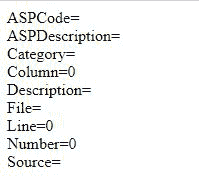

# ASP 错误对象属性

> 原文: [https://www.geeksforgeeks.org/asp-asperror-object-properties/](https://www.geeksforgeeks.org/asp-asperror-object-properties/)

## ASPCode
`ASPCode` 用于返回由 IIS 服务器生成的错误代码的字符串值。此属性应用于 Error 对象。它是 Error 对象的内置方法。

**语法:**
```vb
ASPError.ASPCode()
```

## ASPDescription
`ASPDescription` 用于返回错误的详细描述。

**语法:**
```vb
ASPError.ASPDescription()
```

## Category
`Category` 属性用于返回错误的来源。

**语法:**
```vb
ASPError.Category()
```

## Column
`Column` 属性用于返回生成错误的 ASP 文件中的列位置。

**语法:**
```vb
ASPError.Column()
```

## Description
`Description` 属性用于返回错误的简要描述。

**语法:**
```vb
ASPError.Description()
```

## File
`File` 属性用于返回产生错误的 ASP 文件的名称。

**语法:**
```vb
ASPError.File()
```

## Line
`Line` 属性用于返回生成错误的 ASP 文件中的行号。

**语法:**
```vb
ASPError.Line()
```

## Number
`Number` 属性用于返回错误的标准 COM 错误代码。

**语法:**
```vb
ASPError.Number()
```

## Source
`Source` 属性用于返回发生错误行的实际源代码。

**语法:**
```vb
ASPError.Source()
```

## 示例代码
下面的代码涵盖了错误对象的所有属性。

### 动态服务器页面
```vb
<%
dim objErr
set objErr=Server.GetLastError()

response.write("ASPCode=" & objErr.ASPCode)
response.write("<br>")
response.write("ASPDescription=" & objErr.ASPDescription)
response.write("<br>")
response.write("Category=" & objErr.Category)
response.write("<br>")
response.write("Column=" & objErr.Column)
response.write("<br>")
response.write("Description=" & objErr.Description)
response.write("<br>")
response.write("File=" & objErr.File)
response.write("<br>")
response.write("Line=" & objErr.Line)
response.write("<br>")
response.write("Number=" & objErr.Number)
response.write("<br>")
response.write("Source=" & objErr.Source)
%>
```

**输出:**
