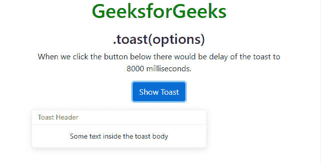
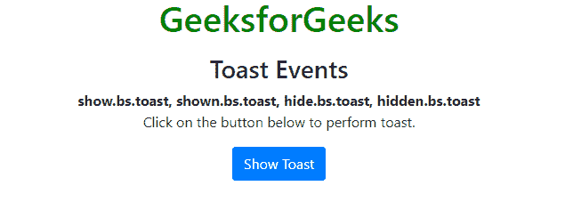
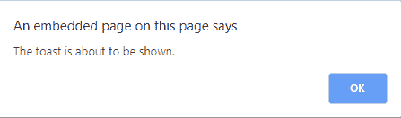
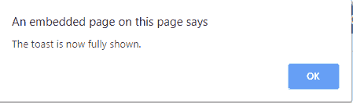
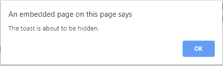
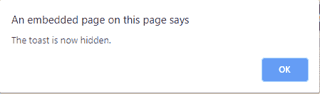

# Bootstrap 4 | Toast

> 原文: [https://www.geeksforgeeks.org/bootstrap-4-toast/](https://www.geeksforgeeks.org/bootstrap-4-toast/)

Toast 用于创建类似于警报框的东西，当有事情发生时，它会显示一小段时间，比如几秒钟。比如当用户点击一个按钮或者提交一个表单和许多其他动作时。

- `.toast`: 有助于制作 toast。
- `.toast-header`: 它有助于创建 toast 标题。
- `.toast-body`: 它有助于创造 toast 主体。

## Toast 方法

- `.toast(options)`: 用 `options` 参数激活 toast 有帮助。在下面的实现中，我们移除了 toast 的渐变效果，并且当 toast 显示时，我们将它的隐藏延迟到 8000 毫秒。它有三个选项 `animation`，`autohide`，`delay`。有关这些选项的更多信息，请参考[链接](https://www.geeksforgeeks.org/bootstrap-tooltips/)。

### 示例

```html
<!DOCTYPE html>
<html lang="en">

<head>
    <title>Bootstrap Example</title>
    <meta charset="utf-8">
    <meta name="viewport" content="width=device-width, initial-scale=1">
    <link rel="stylesheet" href="https://maxcdn.bootstrapcdn.com/bootstrap/4.3.1/css/bootstrap.min.css">
    <script src="https://ajax.googleapis.com/ajax/libs/jquery/3.4.0/jquery.min.js"></script>
    <script src="https://cdnjs.cloudflare.com/ajax/libs/popper.js/1.14.7/umd/popper.min.js"></script>
    <script src="https://maxcdn.bootstrapcdn.com/bootstrap/4.3.1/js/bootstrap.min.js"></script>
</head>

<body style="text-align: center">
    <h1 style="color:green">GeeksforGeeks</h1>
    <div class="container mt-3">
        <h3>.toast(options)</h3>
        <p>When we click the button below there would be delay of the toast to 8000 milliseconds.</p>
        <button type="button" class="btn btn-primary" id="myBtn">Show Toast</button>
        <div class="toast mt-3">
            <div class="toast-header">
                Toast Header
            </div>
            <div class="toast-body">
                Some text inside the toast body
            </div>
        </div>
    </div>
    <script>
        $(document).ready(function() {
            $('#myBtn').click(function() {
                $('.toast').toast({
                    animation: false,
                    delay: 2000
                });
                $('.toast').toast('show');
            });
        });
    </script>
</body>

</html>
```

**输出:**



- `.toast('show')`: 显示 toast。
- `.toast('hide')`: 它隐藏 toast。
- `.toast('handle')`: 它处理 toast。

## Toast 事件

### 示例

```html
<!DOCTYPE html>
<html lang="en">

<head>
    <title>Bootstrap Example</title>
    <meta charset="utf-8">
    <meta name="viewport" content="width=device-width, initial-scale=1">
    <link rel="stylesheet" href="https://maxcdn.bootstrapcdn.com/bootstrap/4.3.1/css/bootstrap.min.css">
    <script src="https://ajax.googleapis.com/ajax/libs/jquery/3.4.0/jquery.min.js"></script>
    <script src="https://cdnjs.cloudflare.com/ajax/libs/popper.js/1.14.7/umd/popper.min.js"></script>
    <script src="https://maxcdn.bootstrapcdn.com/bootstrap/4.3.1/js/bootstrap.min.js"></script>
</head>

<body style="text-align:center">
    <h1 style="color:green">GeeksforGeeks</h1>
    <div class="container mt-3">
        <h3>Toast Events</h3>
        <code>show.bs.toast</code>, <code>shown.bs.toast</code>, <code>hide.bs.toast</code>, <code>hidden.bs.toast</code>
        <p>Click on the button below to perform toast.</p>
        <button type="button" class="btn btn-primary" id="myShowBtn">Show Toast</button>
        <div class="toast mt-3">
            <div class="toast-header">
                Toast Header
            </div>
            <div class="toast-body">
                Some text inside the toast body
            </div>
        </div>
    </div>
    <script>
        $(document).ready(function() {
            $("#myShowBtn").click(function() {
                $('.toast').toast('show');
            });
            $('.toast').on('show.bs.toast', function() {
                alert('The toast is about to be shown.');
            });
            $('.toast').on('shown.bs.toast', function() {
                alert('The toast is now fully shown.');
            });
            $('.toast').on('hide.bs.toast', function() {
                alert('The toast is about to be hidden.');
            });
            $('.toast').on('hidden.bs.toast', function() {
                alert('The toast is now hidden.');
            });
        });
    </script>
</body>

</html>
```

**输出:**



`show.bs.toast`: 它发生在 toast 即将展示的时候。



`shown.bs.toast`: 当 toast 显示时就会出现。



`hide.bs.toast`: toast 即将隐藏时发生。



`hidden.bs.toast`: 当 toast 完全隐藏时就会发生。



## 支持的浏览器

- 谷歌 Chrome
- 微软公司出品的 web 浏览器
- 火狐浏览器
- 歌剧
- 旅行队