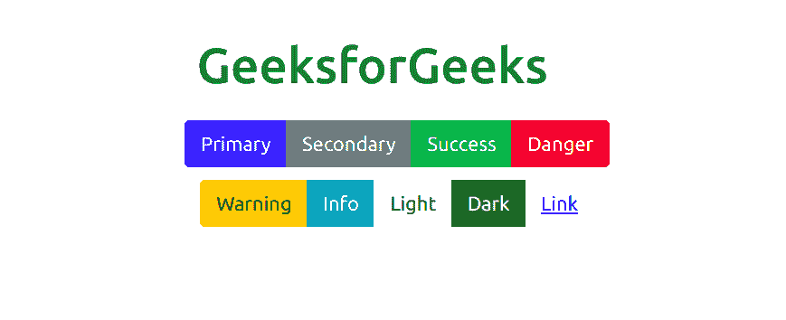
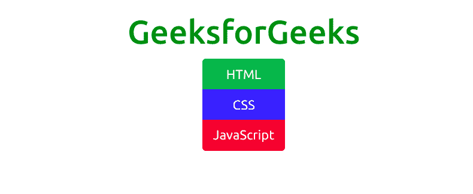
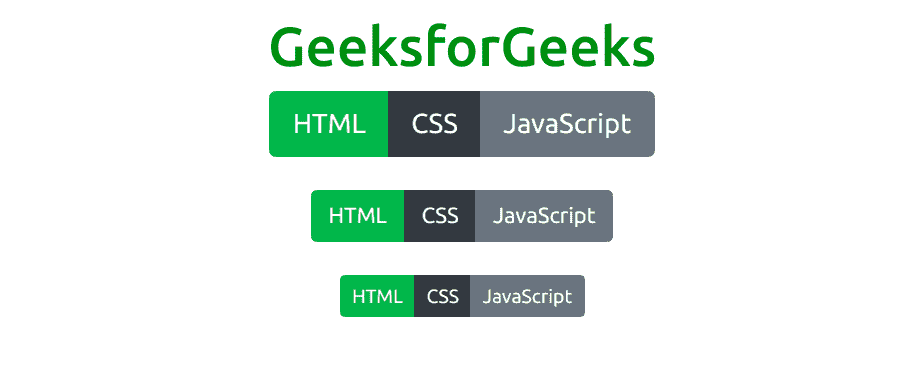
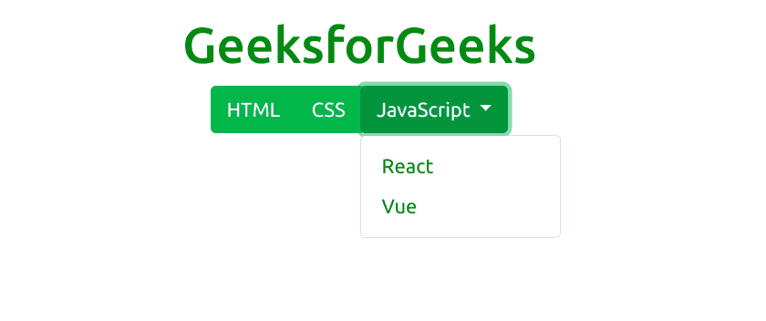
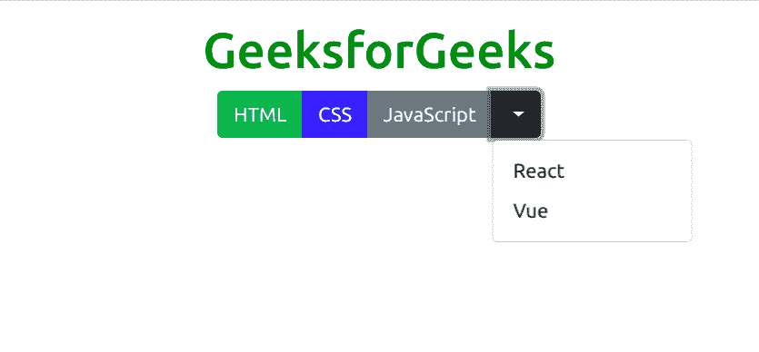
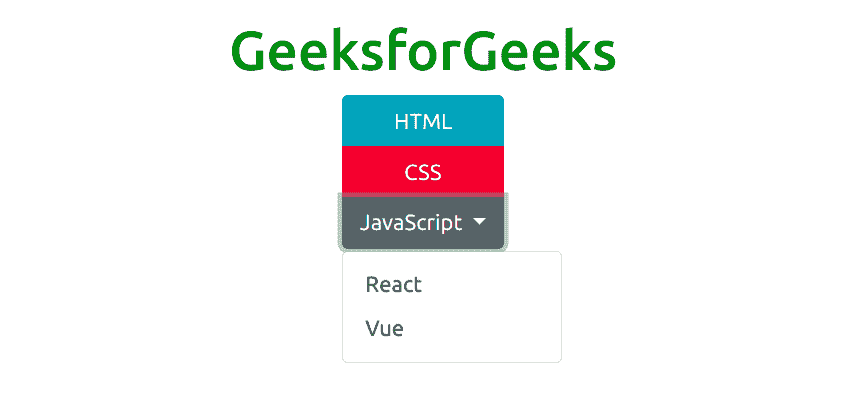

# Bootstrap 5 | 按钮组

> 原文: [https://www.geeksforgeeks.org/bootstrap-5-button-group/](https://www.geeksforgeeks.org/bootstrap-5-button-group/)

Bootstrap 5 是 Bootstrap 的最新主要版本，在该版本中，他们修改了用户界面并进行各种更改。按钮组是 Bootstrap 5 提供的一个组件，它有助于将一系列按钮组合成一行。它支持所有类型的按钮。

## 语法

```html
<div class="btn-group"> Buttons... <div>
```

## 类型

以下是 Bootstrap 5 中提供的九种按钮类型：

*   `btn-primary`
*   `btn-secondary`
*   `btn-success`
*   `btn-danger`
*   `btn-warning`
*   `btn-info`
*   `btn-light`
*   `btn-dark`
*   `btn-link`

## 水平排列的按钮组

`.btn-group` 类用于创建水平排列的按钮组。

### 示例

本示例用于展示 Bootstrap 5 中水平排列的按钮组的工作情况。

```html
<!DOCTYPE html>
<html>
<head>
    <title>
        Bootstrap 5 | Buttons group
    </title>
    <!-- Load Bootstrap -->
    <link rel="stylesheet" 
          href="https://stackpath.bootstrapcdn.com/bootstrap/5.0.0-alpha1/css/bootstrap.min.css"
          integrity="sha384-r4NyP46KrjDleawBgD5tp8Y7UzmLA05oM1iAEQ17CSuDqnUK2+k9luXQOfXJCJ4I" 
          crossorigin="anonymous">
</head>
<body>
    <div style="text-align: center;
           width: 600px; margin-top:100px;">
        <h1 style="color: green;">
            GeeksforGeeks
        </h1>
    </div>
    <div style="width: 600px;height: 200px;
          margin:20px;text-align: center;">
        <div class="btn-group">
            <button type="button" class="btn btn-primary">
                Primary</button>
            <button type="button" class="btn btn-secondary">
                Secondary</button>
            <button type="button" class="btn btn-success">
                Success</button>
            <button type="button" class="btn btn-danger">
                Danger</button>
        </div>
        <div class="btn-group" style="margin-top: 10px;">
            <button type="button" class="btn btn-warning">
                Warning</button>
            <button type="button" class="btn btn-info">
                Info</button>
            <button type="button" class="btn btn-light">
                Light</button>
            <button type="button" class="btn btn-dark">
                Dark</button>
            <button type="button" class="btn btn-link">
                Link</button>
        </div>
    </div>
</body>
</html>
```

### 输出



## 垂直排列的按钮组

`.btn-group-vertical` 类用于父 `div` 中以创建垂直按钮组。

### 示例

该示例用于显示 Bootstrap 5 中垂直排列的按钮组的工作情况。

```html
<!DOCTYPE html>
<html>
<head>
    <title>
        Bootstrap 5 | Buttons group
    </title>
    <!-- Load Bootstrap -->
    <link rel="stylesheet" 
          href="https://stackpath.bootstrapcdn.com/bootstrap/5.0.0-alpha1/css/bootstrap.min.css"
          integrity="sha384-r4NyP46KrjDleawBgD5tp8Y7UzmLA05oM1iAEQ17CSuDqnUK2+k9luXQOfXJCJ4I" 
          crossorigin="anonymous">
</head>
<body style="text-align:center;">
    <div class="container mt-3">
        <h1 style="color:green;">
            GeeksforGeeks
        </h1>
        <div class="btn-group-vertical">
            <button type="button" 
                    class="btn btn-success">
                HTML
            </button>
            <button type="button" 
                    class="btn btn-primary">
                CSS
            </button>
            <button type="button" 
                    class="btn btn-danger">
                JavaScript
            </button>
        </div>
    </div>
</body>
</html>
```

### 输出



## 按钮组尺寸

整个按钮组可以通过在 `.btn-group` 父元素中包含类 `btn-group-*`（`*` 可以是 `sm`、`md` 或 `lg`）来赋予相同的大小，而不是在每个按钮中包含尺寸类。

### 示例

该示例使用 Bootstrap 5 中的按钮组显示按钮大小的工作方式。

```html
<!DOCTYPE html>
<html>
<head>
    <title>
        Bootstrap 5 | Buttons group
    </title>
    <!-- Load Bootstrap -->
    <link rel="stylesheet" 
          href="https://stackpath.bootstrapcdn.com/bootstrap/5.0.0-alpha1/css/bootstrap.min.css"
          integrity="sha384-r4NyP46KrjDleawBgD5tp8Y7UzmLA05oM1iAEQ17CSuDqnUK2+k9luXQOfXJCJ4I"
          crossorigin="anonymous">
</head>
<body style="text-align:center;">
    <div class="container mt-3">
        <h1 style="color:green;">
            GeeksforGeeks
        </h1>
        <div class="container">
            <div class="btn-group btn-group-lg">
                <button type="button" 
                        class="btn btn-success">
                    HTML
                </button>
                <button type="button" class="btn btn-dark">
                    CSS
                </button>
                <button type="button"
                        class="btn btn-secondary">
                    JavaScript
                </button>
            </div>
            <br><br>
            <div class="btn-group btn-group-md">
                <button type="button" 
                        class="btn btn-success">
                    HTML
                </button>
                <button type="button" 
                        class="btn btn-dark">
                    CSS
                </button>
                <button type="button" 
                        class="btn btn-secondary">
                    JavaScript
                </button>
            </div>
            <br><br>
            <div class="btn-group btn-group-sm">
                <button type="button" 
                        class="btn btn-success">
                    HTML
                </button>
                <button type="button" 
                        class="btn btn-dark">
                    CSS
                </button>
                <button type="button" 
                        class="btn btn-secondary">
                    JavaScript
                </button>
            </div>
        </div>
    </div>
</body>
</html>
```

### 输出



## 嵌套按钮组和制作下拉菜单

一个按钮组可以嵌套在另一个按钮组内，并可以这种方式创建下拉菜单。

### 单按钮下拉

### 示例

```html
<!DOCTYPE html>
<html>
<head>
    <title>
        Bootstrap 5 | Buttons group
    </title>
    <!-- Load Bootstrap -->
    <link rel="stylesheet" 
          href="https://stackpath.bootstrapcdn.com/bootstrap/5.0.0-alpha1/css/bootstrap.min.css"
          integrity="sha384-r4NyP46KrjDleawBgD5tp8Y7UzmLA05oM1iAEQ17CSuDqnUK2+k9luXQOfXJCJ4I" 
          crossorigin="anonymous">
    <script src="https://cdn.jsdelivr.net/npm/popper.js@1.16.0/dist/umd/popper.min.js"
            integrity="sha384-Q6E9RHvbIyZFJoft+2mJbHaEWldlvI9IOYy5n3zV9zzTtmI3UksdQRVvoxMfooAo"
            crossorigin="anonymous">
    </script>
    <script src="https://stackpath.bootstrapcdn.com/bootstrap/5.0.0-alpha1/js/bootstrap.min.js"
            integrity="sha384-oesi62hOLfzrys4LxRF63OJCXdXDipiYWBnvTl9Y9/TRlw5xlKIEHpNyvvDShgf/"
            crossorigin="anonymous">
    </script>
</head>
<body style="text-align:center;">
    <div class="container mt-3">
        <h1 style="color:green;">
            GeeksforGeeks
        </h1>
        <div class="container">
            <div class="btn-group">
                <button type="button" 
                        class="btn btn-success">
                    HTML
                </button>
                <button type="button"
                        class="btn btn-success btn-group">
                    CSS
                </button>
```

# Bootstrap 5 按钮组示例

## Split Button Dropdown

```html
<div class="btn-group">
    <div class="dropdown">
        <button type="button" class="btn btn-success dropdown-toggle" data-toggle="dropdown">
            JavaScript<span class="caret"></span>
        </button>
        <ul class="dropdown-menu" role="menu">
            <li><a class="dropdown-item" href="#">React</a></li>
            <li><a class="dropdown-item" href="#">Vue</a></li>
        </ul>
    </div>
</div>
```

**输出:**



## Bootstrap 5 按钮组

**Example:**

```html
<!DOCTYPE html>
<html>
<head>
    <title>Bootstrap 5 | Buttons group</title>
    <!-- Load Bootstrap -->
    <link rel="stylesheet"
          href="https://stackpath.bootstrapcdn.com/bootstrap/5.0.0-alpha1/css/bootstrap.min.css"
          integrity="sha384-r4NyP46KrjDleawBgD5tp8Y7UzmLA05oM1iAEQ17CSuDqnUK2+k9luXQOfXJCJ4I"
          crossorigin="anonymous">
    <script src="https://cdn.jsdelivr.net/npm/popper.js@1.16.0/dist/umd/popper.min.js"
            integrity="sha384-Q6E9RHvbIyZFJoft+2mJbHaEWldlvI9IOYy5n3zV9zzTtmI3UksdQRVvoxMfooAo"
            crossorigin="anonymous"></script>
    <script src="https://stackpath.bootstrapcdn.com/bootstrap/5.0.0-alpha1/js/bootstrap.min.js"
            integrity="sha384-oesi62hOLfzrys4LxRF63OJCXdXDipiYWBnvTl9Y9/TRlw5xlKIEHpNyvvDShgf/"
            crossorigin="anonymous"></script>
</head>
<body style="text-align:center;">
    <div class="container mt-3">
        <h1 style="color:green;">GeeksforGeeks</h1>
        <div class="container">
            <div class="btn-group">
                <button type="button" class="btn btn-success">HTML</button>
                <button type="button" class="btn btn-primary btn-group">CSS</button>
                <div class="btn-group">
                    <button type="button" class="btn btn-secondary">JavaScript</button>
                    <button type="button" class="btn btn-dark dropdown-toggle" data-toggle="dropdown">
                        <span class="caret"></span>
                    </button>
                    <ul class="dropdown-menu" role="menu">
                        <li><a class="dropdown-item" href="#">React</a></li>
                        <li><a class="dropdown-item" href="#">Vue</a></li>
                    </ul>
                </div>
            </div>
        </div>
    </div>
</body>
</html>
```

**输出:**



## Split Button Vertical Dropdown

Bootstrap 5 也支持 **Split Button Vertical Dropdown**。

**Example:**

```html
<!DOCTYPE html>
<html>
<head>
    <title>Bootstrap 5 | Buttons group</title>
    <!-- Load Bootstrap -->
    <link rel="stylesheet"
          href="https://stackpath.bootstrapcdn.com/bootstrap/5.0.0-alpha1/css/bootstrap.min.css"
          integrity="sha384-r4NyP46KrjDleawBgD5tp8Y7UzmLA05oM1iAEQ17CSuDqnUK2+k9luXQOfXJCJ4I"
          crossorigin="anonymous">
    <script src="https://cdn.jsdelivr.net/npm/popper.js@1.16.0/dist/umd/popper.min.js"
            integrity="sha384-Q6E9RHvbIyZFJoft+2mJbHaEWldlvI9IOYy5n3zV9zzTtmI3UksdQRVvoxMfooAo"
            crossorigin="anonymous"></script>
    <script src="https://stackpath.bootstrapcdn.com/bootstrap/5.0.0-alpha1/js/bootstrap.min.js"
            integrity="sha384-oesi62hOLfzrys4LxRF63OJCXdXDipiYWBnvTl9Y9/TRlw5xlKIEHpNyvvDShgf/"
            crossorigin="anonymous"></script>
</head>
<body style="text-align:center;">
    <div class="container mt-3">
        <h1 style="color:green;">GeeksforGeeks</h1>
        <div class="container">
            <div class="btn-group-vertical">
                <button type="button" class="btn btn-info">HTML</button>
                <button type="button" class="btn btn-danger">CSS</button>
                <div class="btn-group">
                    <button type="button" class="btn btn-secondary dropdown-toggle" data-toggle="dropdown">
                        JavaScript
                    </button>
                    <ul class="dropdown-menu" role="menu">
                        <li><a class="dropdown-item" href="#">React</a></li>
                        <li><a class="dropdown-item" href="#">Vue</a></li>
                    </ul>
                </div>
            </div>
        </div>
    </div>
</body>
</html>
```

**输出:**

