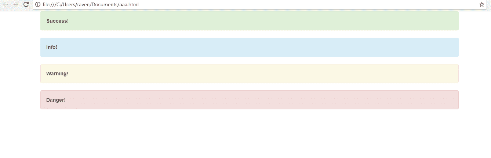
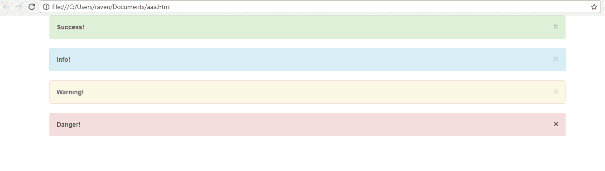
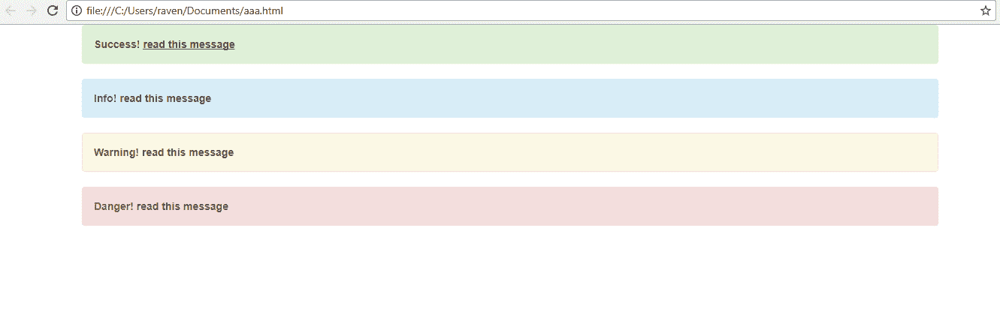
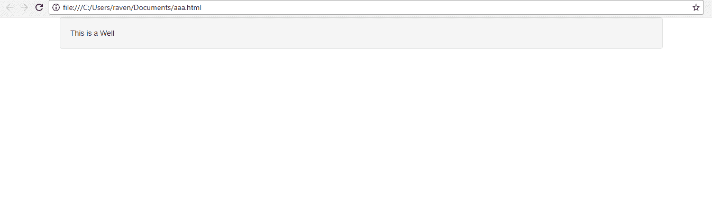
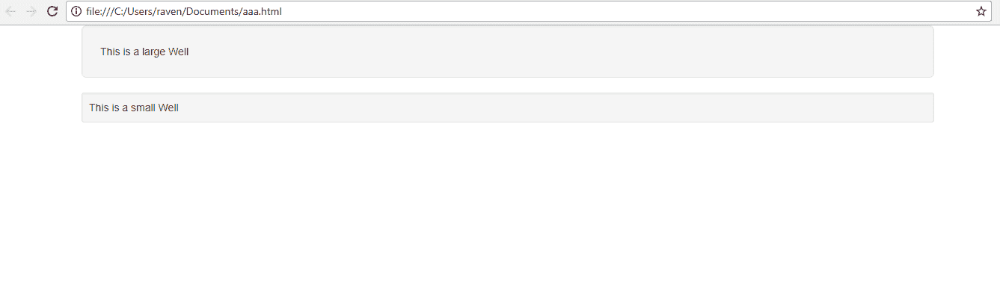
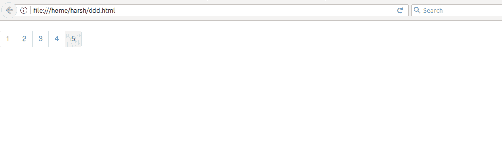
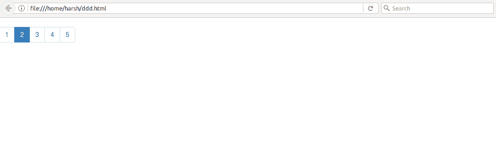
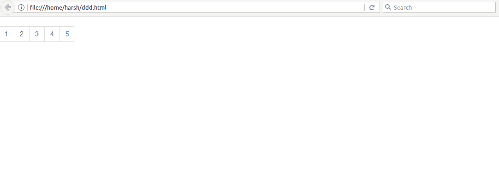
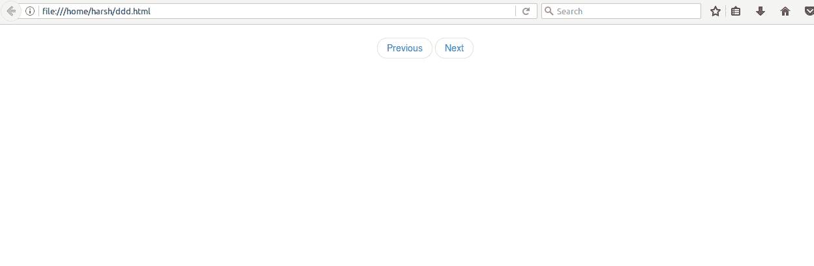
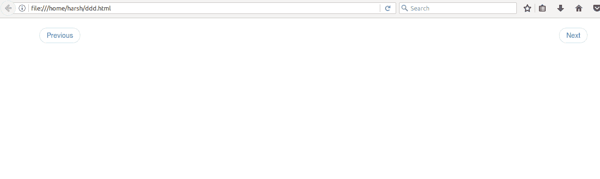

# Bootstrap（第 7 部分）| 警报、井、分页和寻呼机

> 原文：[https://www.geeksforgeeks.org/bootstrap-part-7-alerts-wells-pagination-pager/](https://www.geeksforgeeks.org/bootstrap-part-7-alerts-wells-pagination-pager/)

1.  [介绍与安装](https://www.geeksforgeeks.org/beginning-bootstrap-part-1/)
2.  [网格系统](https://www.geeksforgeeks.org/bootstrap-part-2/)
3.  [按钮、图形、表格](https://www.geeksforgeeks.org/bootstrap-part-3/)
4.  [垂直表单、水平表单、内联表单](https://www.geeksforgeeks.org/bootstrap-part-4/)
5.  [下拉菜单和响应式标签页](https://www.geeksforgeeks.org/bootstrap-part-5/)
6.  [进度条和巨幕](https://www.geeksforgeeks.org/bootstrap-part-6-progress-bar-jumbotron/)

## 警报

我们经常在一些网站上看到在完成一个动作之前或之后的某些提醒。这些警报消息是突出显示的文本，在执行流程时需要考虑这些文本。Bootstrap 允许我们使用预定义的类在网站上显示这些警告消息。

如何使用 Bootstrap 类添加警报消息：

1.  在 `div` 元素中，添加一个 `alert` 类。
2.  使用以下类设置消息框：
    - 绿色 – `alert-success`
    - 蓝色 – `alert-info`
    - 黄色 – `alert-warning`
    - 红色 – `alert-danger`
3.  写下您想为警报消息写的文本，并关闭 `div` 元素。

```html
<div class="alert alert-success">
  <strong>Success!</strong>
</div>

<div class="alert alert-info">
  <strong>Info!</strong>
</div>

<div class="alert alert-warning">
  <strong>Warning!</strong>
</div>

<div class="alert alert-danger">
  <strong>Danger!</strong>
</div>
```

**输出：**



### 可取消的警报

要关闭警报消息，您需要在警报中添加一个 x 图标。要添加图标，请在您的 `div` 元素中添加一个类 `alert-dismissable`。然后添加一个类 `close` 和 `data-dismiss="alert"` 到一个链接或按钮，如下所示：

```html
<div class="alert alert-success alert-dismissable">
<a href="#" class="close" data-dismiss="alert" aria-label="close">×</a>
  <strong>Success!</strong>
</div>

<div class="alert alert-info alert-dismissable">
<a href="#" class="close" data-dismiss="alert" aria-label="close">×</a>
  <strong>Info!</strong>
</div>

<div class="alert alert-warning alert-dismissable">
<a href="#" class="close" data-dismiss="alert" aria-label="close">×</a>
  <strong>Warning!</strong>
</div>

<div class="alert alert-danger alert-dismissable">
<a href="#" class="close" data-dismiss="alert" aria-label="close">×</a>
  <strong>Danger!</strong>
</div>
```

**输出：**



### 警报链接

要添加警报消息的链接，只需在 `a` 元素内添加一个 `alert-link` 类。这将创建一个与警告消息框字体颜色相同的链接。然后使用 `a` 标签添加一个链接到文本，如下所示：

```html
<div class="alert alert-success">
  <strong>Success!</strong>
<a href="#" class="alert-link">read this message</a>
</div>

<div class="alert alert-info alert-dismissable">
  <strong>Info!</strong>
<a href="#" class="alert-link">read this message</a>
</div>

<div class="alert alert-warning alert-dismissable">
  <strong>Warning!</strong>
<a href="#" class="alert-link">read this message</a>
</div>

<div class="alert alert-danger alert-dismissable">
  <strong>Danger!</strong>
<a href="#" class="alert-link">read this message</a>
</div>
```

**输出：**



## 井

一个 `well` 类就是简单的用来在一些有圆角和填充的文字周围加一个灰色的方框。
要在网页中添加井，只需在 `div` 元素中包含 `well` 类，然后写下要保存在井中的文本并关闭 `div` 标签。

```html
<div class="well">This is a Well</div>
```

**输出：**



### 井的尺寸

井的默认尺寸为中等，但是我们可以分别使用类 `well-lg` 和 `well-sm` 来增加或减少井的尺寸。

```html
<div class="well well-lg">This is a large Well</div>
<div class="well well-sm">This is a small Well</div>
```

**输出：**



## 分页

我们都见过有很多网页的网站，或者当我们在谷歌上搜索时，在不同的网页上有很多搜索结果，编号为 1。使用 Bootstrap 可以在网站中轻松添加此功能。
用于分页的预定义类是 `pagination`。
要为您的网站添加分页，请在 `ul` 标签中包含 `pagination` 类，如下所示：

```html
<ul class="pagination">
  <li><a href="#">1</a></li>
  <li><a href="#">2</a></li>
  <li><a href="#">3</a></li>
  <li><a href="#">4</a></li>
  <li><a href="#">5</a></li>
</ul>
```

**输出：**



### 活动页面

要显示活动页面，使用类 `active` 如下：

```html
<ul class="pagination">
  <li><a href="#">1</a></li>
  <li class="active"><a href="#">2</a></li>
  <li><a href="#">3</a></li>
  <li><a href="#">4</a></li>
  <li><a href="#">5</a></li>
</ul>
```

**输出：**



### 禁用页面

要禁用页面转到某个链接，使用类 `disabled` 如下：

```html
<ul class="pagination">
  <li><a href="#">1</a></li>
  <li class="disabled"><a href="#">2</a></li>
  <li><a href="#">3</a></li>
  <li><a href="#">4</a></li>
  <li><a href="#">5</a></li>
</ul>
```

**输出：**



## 寻呼机

我们都在网页上看到过“上一页”和“下一页”按钮来导航到其他页面。Bootstrap 提供了一个预定义的类来有效地实现这个寻呼机。寻呼机提供了移动到下一页或上一页的链接。
要给你的网页添加一个寻呼机，给 `div` 元素添加一个类 `pager`，并提供上一页和下一页的链接，如下所示：

```html
<ul class="pager">
   <li><a href="#">Previous</a></li>
   <li><a href="#">Next</a></li>
</ul>
```

**输出：**



要将这些导航按钮与网页的侧面对齐，请使用 `previous` 和 `next` 类，链接如下：

```html
<ul class="pager">
  <li class="previous"><a href="#">Previous</a></li>
  <li class="next"><a href="#">Next</a></li>
</ul>
```

**输出：**



## 支持的浏览器

*   Google Chrome
*   Microsoft Edge
*   Firefox
*   Opera
*   Safari

本文由 **Ayush Saxena** 供稿。如果您喜欢 GeeksforGeeks 并想投稿，您也可以使用 [write.geeksforgeeks.org](https://write.geeksforgeeks.org) 写一篇文章或者把您的文章邮寄到 review-team@geeksforgeeks.org。看到您的文章出现在 GeeksforGeeks 主页上，帮助其他 Geeks。
如果您发现任何不正确的地方，或者您想分享更多关于上面讨论的话题的信息，请写评论。