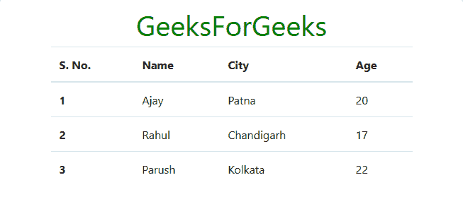
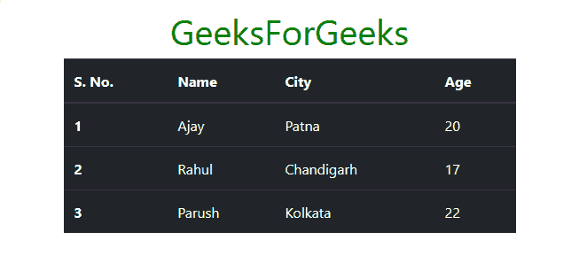
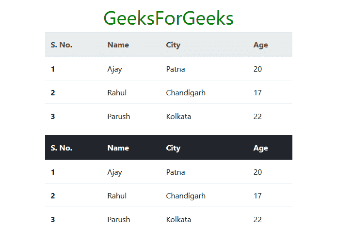
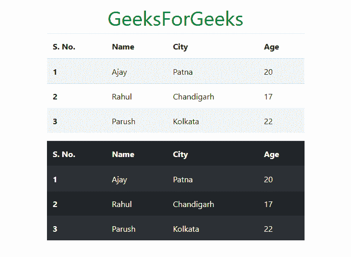
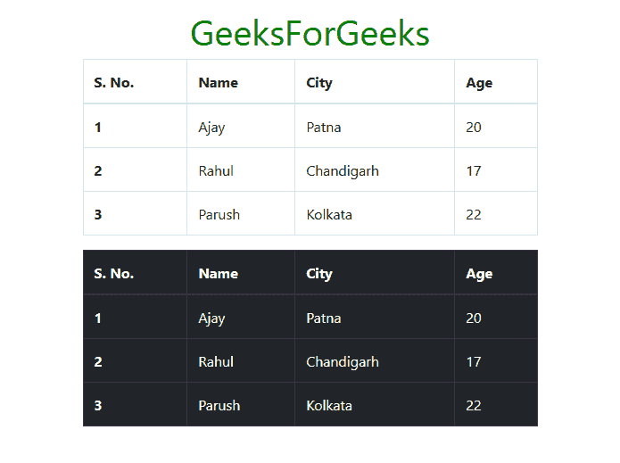

# Bootstrap 表格集合-1

> 原文：[https://www.geeksforgeeks.org/bootstrap-tables-set-1/](https://www.geeksforgeeks.org/bootstrap-tables-set-1/)

Bootstrap 为我们提供了一系列的类，可以用来对表格应用各种样式，比如改变标题外观，使行被剥离，添加或删除边框，使行可悬停。Bootstrap 还提供了使表格响应的类。

## 简单表格
要创建简单的 Bootstrap 表格，在 `<table>` 中添加 `table` 类，如下所示。

**例：**

```html
<!DOCTYPE html>
<html lang="en">
  <head>
    <!-- Required meta tags -->
    <meta charset="utf-8">
    <meta name="viewport" content="width=device-width, initial-scale=1, shrink-to-fit=no">

    <!-- Bootstrap CSS -->
    <link rel="stylesheet" href="https://stackpath.bootstrapcdn.com/bootstrap/4.2.1/css/bootstrap.min.css" integrity="sha384-GJzZqFGwb1QTTN6wy59ffF1BuGJpLSa9DkKMp0DgiMDm4iYMj70gZWKYbI706tWS" crossorigin="anonymous">

    <title>Bootstrap | Tables</title>

    <style>
      h1{
        color: green;
        text-align: center;
      }
      div{
        margin-top: 10px;
      }
    </style>

  </head>
  <body>
    <div class="container">
      <h1>GeeksForGeeks</h1>

      <!-- Bootstrap table class -->
      <table class="table">
        <thead>
          <tr>
            <th scope="col">S. No.</td>
            <th scope="col">Name</td>
            <th scope="col">City</td>
            <th scope="col">Age</td>
          </tr>
        </thead>
        <tbody>
          <tr>
            <th scope="row">1</td>
            <td>Ajay</td>
            <td>Patna</td>
            <td>20</td>
          </tr>
          <tr>
            <th scope="row">2</td>
            <td>Rahul</td>
            <td>Chandigarh</td>
            <td>17</td>
          </tr>
          <tr>
            <th scope="row">3</td>
            <td>Parush</td>
            <td>Kolkata</td>
            <td>22</td>
          </tr>
        </tbody>
      </table>

    </div>
  </body>
</html>
```

**输出：**



## 深色表格
要使表格以深色背景和浅色字体出现，请在 `<table>` 标签中使用 `table` 和 `table-dark` 类，如下所示。

**例：**

```html
<!DOCTYPE html>
<html lang="en">
  <head>
    <!-- Required meta tags -->
    <meta charset="utf-8">
    <meta name="viewport" content="width=device-width, initial-scale=1, shrink-to-fit=no">

    <!-- Bootstrap CSS -->
    <link rel="stylesheet" href="https://stackpath.bootstrapcdn.com/bootstrap/4.2.1/css/bootstrap.min.css" integrity="sha384-GJzZqFGwb1QTTN6wy59ffF1BuGJpLSa9DkKMp0DgiMDm4iYMj70gZWKYbI706tWS" crossorigin="anonymous">

    <title>Bootstrap | Tables</title>

    <style>
      h1{
        color: green;
        text-align: center;
      }
      div{
        margin-top: 10px;
      }
    </style>

  </head>
  <body>
    <div class="container">
      <h1>GeeksForGeeks</h1>

      <!-- table, table-dark -->
      <table class="table table-dark">
        <thead>
          <tr>
            <th scope="col">S. No.</td>
            <th scope="col">Name</td>
            <th scope="col">City</td>
            <th scope="col">Age</td>
          </tr>
        </thead>
        <tbody>
          <tr>
            <th scope="row">1</td>
            <td>Ajay</td>
            <td>Patna</td>
            <td>20</td>
          </tr>
          <tr>
            <th scope="row">2</td>
            <td>Rahul</td>
            <td>Chandigarh</td>
            <td>17</td>
          </tr>
          <tr>
            <th scope="row">3</td>
            <td>Parush</td>
            <td>Kolkata</td>
            <td>22</td>
          </tr>
        </tbody>
      </table>

    </div>
  </body>
</html>
```

**输出：**



## 标题外观
要使表格标题显示为浅灰色，请在 `<table>` 中使用 `table` 类和在 `<thead>` 中使用 `thead-light` 类；要使表格标题显示为深灰色，请在 `<table>` 中使用 `table` 类和在 `<thead>` 中使用 `thead-dark` 类。请参见下面的示例进行说明。

**例：**

```html
<!DOCTYPE html>
<html lang="en">
  <head>
    <!-- Required meta tags -->
    <meta charset="utf-8">
    <meta name="viewport" content="width=device-width, initial-scale=1, shrink-to-fit=no">

    <!-- Bootstrap CSS -->
    <link rel="stylesheet" href="https://stackpath.bootstrapcdn.com/bootstrap/4.2.1/css/bootstrap.min.css" integrity="sha384-GJzZqFGwb1QTTN6wy59ffF1BuGJpLSa9DkKMp0DgiMDm4iYMj70gZWKYbI706tWS" crossorigin="anonymous">

    <title>Bootstrap | Tables</title>

    <style>
      h1{
        color: green;
        text-align: center;
      }
      div{
        margin-top: 10px;
      }
    </style>

  </head>
  <body>
    <div class="container">
      <h1>GeeksForGeeks</h1>

      <!-- table, thead-light -->
      <table class="table">
        <thead class="thead-light">
          <tr>
            <th scope="col">S. No.</td>
            <th scope="col">Name</td>
            <th scope="col">City</td>
            <th scope="col">Age</td>
          </tr>
        </thead>
        <tbody>
          <tr>
            <th scope="row">1</td>
            <td>Ajay</td>
            <td>Patna</td>
            <td>20</td>
          </tr>
          <tr>
            <th scope="row">2</td>
            <td>Rahul</td>
            <td>Chandigarh</td>
            <td>17</td>
          </tr>
          <tr>
            <th scope="row">3</td>
            <td>Parush</td>
            <td>Kolkata</td>
            <td>22</td>
          </tr>
        </tbody>
      </table>

      <!-- table, thead-dark -->
      <table class="table">
        <thead class="thead-dark">
          <tr>
            <th scope="col">S. No.</td>
            <th scope="col">Name</td>
            <th scope="col">City</td>
            <th scope="col">Age</td>
          </tr>
        </thead>
        <tbody>
          <tr>
            <th scope="row">1</td>
            <td>Ajay</td>
            <td>Patna</td>
            <td>20</td>
          </tr>
          <tr>
            <th scope="row">2</td>
            <td>Rahul</td>
            <td>Chandigarh</td>
            <td>17</td>
          </tr>
          <tr>
            <th scope="row">3</td>
            <td>Parush</td>
            <td>Kolkata</td>
            <td>22</td>
          </tr>
        </tbody>
      </table>

    </div>
  </body>
</html>
```

**输出：**



## 剥离行
要使表格出现明暗交替的行，在 `<table>` 标签内使用 `table` 和 `table-striped` 类的组合。我们还可以利用 `<table>` 标签内的 `table`、`table-dark`、`table-striped` 类的组合，使暗表出现明暗交替的行。请参见下面的示例进行说明。

**例：**

# 超文本标记语言

```html
<!DOCTYPE html>
<html lang="en">
  <head>
    <!-- Required meta tags -->
    <meta charset="utf-8">
    <meta name="viewport" content="width=device-width, initial-scale=1, shrink-to-fit=no">

    <!-- Bootstrap CSS -->
    <link rel="stylesheet" href="https://stackpath.bootstrapcdn.com/bootstrap/4.2.1/css/bootstrap.min.css" integrity="sha384-GJzZqFGwb1QTTN6wy59ffF1BuGJpLSa9DkKMp0DgiMDm4iYMj70gZWKYbI706tWS" crossorigin="anonymous">

    <title>Bootstrap | Tables</title>

    <style>
      h1{
        color: green;
        text-align: center;
      }
      div{
        margin-top: 10px;
      }
    </style>

  </head>
  <body>
    <div class="container">
      <h1>GeeksForGeeks</h1>

      <!-- table, table-stripped -->
      <table class="table table-stripped">
        <thead>
          <tr>
            <th scope="col">S. No.</td>
            <th scope="col">Name</td>
            <th scope="col">City</td>
            <th scope="col">Age</td>
          </tr>
        </thead>
        <tbody>
          <tr>
            <th scope="row">1</td>
            <td>Ajay</td>
            <td>Patna</td>
            <td>20</td>
          </tr>
          <tr>
            <th scope="row">2</td>
            <td>Rahul</td>
            <td>Chandigarh</td>
            <td>17</td>
          </tr>
          <tr>
            <th scope="row">3</td>
            <td>Parush</td>
            <td>Kolkata</td>
            <td>22</td>
          </tr>
        </tbody>
      </table>

      <!-- table, table-stripped, table-dark -->
      <table class="table table-stripped table-dark">
        <thead>
          <tr>
            <th scope="col">S. No.</td>
            <th scope="col">Name</td>
            <th scope="col">City</td>
            <th scope="col">Age</td>
          </tr>
        </thead>
        <tbody>
          <tr>
            <th scope="row">1</td>
            <td>Ajay</td>
            <td>Patna</td>
            <td>20</td>
          </tr>
          <tr>
            <th scope="row">2</td>
            <td>Rahul</td>
            <td>Chandigarh</td>
            <td>17</td>
          </tr>
          <tr>
            <th scope="row">3</td>
            <td>Parush</td>
            <td>Kolkata</td>
            <td>22</td>
          </tr>
        </tbody>
      </table>

    </div>
  </body>
</html>
```

**输出:**



## 条纹表格

要使表格及其每个单元格被边框包围，请使用类`table-bordered`以及类`table`内的`<table>`标签。我们还可以通过使用类`table`、`table-dark`、`table-bordered`内`<table>`标签的组合，使暗表及其每个单元格被边框包围。请参见下面的示例进行说明。

**例:**

```html
<!DOCTYPE html>
<html lang="en">
  <head>
    <!-- Required meta tags -->
    <meta charset="utf-8">
    <meta name="viewport" content="width=device-width, initial-scale=1, shrink-to-fit=no">

    <!-- Bootstrap CSS -->
    <link rel="stylesheet" href="https://stackpath.bootstrapcdn.com/bootstrap/4.2.1/css/bootstrap.min.css" integrity="sha384-GJzZqFGwb1QTTN6wy59ffF1BuGJpLSa9DkKMp0DgiMDm4iYMj70gZWKYbI706tWS" crossorigin="anonymous">

    <title>Bootstrap | Tables</title>

    <style>
      h1{
        color: green;
        text-align: center;
      }
      div{
        margin-top: 10px;
      }
    </style>

  </head>
  <body>
    <div class="container">
      <h1>GeeksForGeeks</h1>

      <!-- table, table-bordered -->
      <table class="table table-bordered">
        <thead>
          <tr>
            <th scope="col">S. No.</td>
            <th scope="col">Name</td>
            <th scope="col">City</td>
            <th scope="col">Age</td>
          </tr>
        </thead>
        <tbody>
          <tr>
            <th scope="row">1</td>
            <td>Ajay</td>
            <td>Patna</td>
            <td>20</td>
          </tr>
          <tr>
            <th scope="row">2</td>
            <td>Rahul</td>
            <td>Chandigarh</td>
            <td>17</td>
          </tr>
          <tr>
            <th scope="row">3</td>
            <td>Parush</td>
            <td>Kolkata</td>
            <td>22</td>
          </tr>
        </tbody>
      </table>

      <!-- table, table-bordered, table-dark -->
      <table class="table table-bordered table-dark">
        <thead>
          <tr>
            <th scope="col">S. No.</td>
            <th scope="col">Name</td>
            <th scope="col">City</td>
            <th scope="col">Age</td>
          </tr>
        </thead>
        <tbody>
          <tr>
            <th scope="row">1</td>
            <td>Ajay</td>
            <td>Patna</td>
            <td>20</td>
          </tr>
          <tr>
            <th scope="row">2</td>
            <td>Rahul</td>
            <td>Chandigarh</td>
            <td>17</td>
          </tr>
          <tr>
            <th scope="row">3</td>
            <td>Parush</td>
            <td>Kolkata</td>
            <td>22</td>
          </tr>
        </tbody>
      </table>

    </div>
  </body>
</html>
```

**输出:**



## 边框表格

**支持的浏览器:**

*   谷歌 Chrome
*   微软公司出品的 web 浏览器
*   火狐浏览器
*   歌剧
*   狩猎