# Bootstrap 文本实用工具（对齐、换行、字重等）

> 原文：[https://www.geeksforgeeks.org/bootstrap-text-utilities-alignment-wrapping-weight-etc/](https://www.geeksforgeeks.org/bootstrap-text-utilities-alignment-wrapping-weight-etc/)

**Bootstrap** 是最受欢迎的开源前端框架之一，它帮助我们开发响应迅速、移动优先的网站和网络应用程序。作为其产品的一部分，Bootstrap 为我们提供了一组类，称为**文本实用程序**类，它控制各种文本属性，如文本对齐、文本换行、文本溢出、文本转换、字体粗细、斜体、等宽、重置文本颜色、移除文本装饰。

## 引导断点

*   **sm:** 视口大于 576px。
*   **md:** 视口大于 768px。
*   **lg:** 视口大于 992px。
*   **xl:** 视口大于 1200px。

现在让我们看看各种**类**。

## 文本对齐

*   **`text-justify`:** 顾名思义，该类用于将文本对齐设置为两端对齐状态。

**示例：**

```html
<!DOCTYPE html>
<html>
  <head>
    <!-- Custom CSS -->
    <style>
      p{
        border: 1px dashed black;
      }
      h1.text-center{
        color: green;
      }
    </style>
    <!-- Bootstrap CSS -->
    <link rel="stylesheet" href="https://stackpath.bootstrapcdn.com/bootstrap/4.2.1/css/bootstrap.min.css" integrity="sha384-GJzZqFGwb1QTTN6wy59ffF1BuGJpLSa9DkKMp0DgiMDm4iYMj70gZWKYbI706tWS" crossorigin="anonymous">
    <title>Bootstrap Text Utilities</title>
  </head>
  <body>
    <!-- Bootstrap class for making the entire div responsive -->
    <div class="container">
      <h1 class="text-center">GeeksForGeeks</h1>
      <h3>text-justify</h3>
      <!-- text-justify class -->
      <p class="text-justify">
        Prepare for the Recruitment drive of product
        based companies like Microsoft, Amazon, Adobe
        etc with a free online placement preparation
        course. The course focuses on various MCQ's
        & Coding question likely to be asked in the
        interviews & make your upcoming placement
        season efficient and successful.
      </p>
    </div>
    <!-- Link JavaScript -->
    <!-- jQuery first, then Popper.js, then Bootstrap JS -->
    <script src="https://code.jquery.com/jquery-3.3.1.slim.min.js" integrity="sha384-q8i/X+965DzO0rT7abK41JStQIAqVgRVzpbzo5smXKp4YfRvH+8abtTE1Pi6jizo" crossorigin="anonymous"></script>
    <script src="https://cdnjs.cloudflare.com/ajax/libs/popper.js/1.14.6/umd/popper.min.js" integrity="sha384-wHAiFfRlMFy6i5SRaxvfOCifBUQy1xHdJ/yoi7FRNXMRBu5WHdZYu1hA6ZOblgut" crossorigin="anonymous"></script>
    <script src="https://stackpath.bootstrapcdn.com/bootstrap/4.2.1/js/bootstrap.min.js" integrity="sha384-B0UglyR+jN6CkvvICOB2joaf5I4l3gm9GU6Hc1og6Ls7i6U/mkkaduKaBhlAXv9k" crossorigin="anonymous"></script>
  </body>
</html>
```

**输出：**

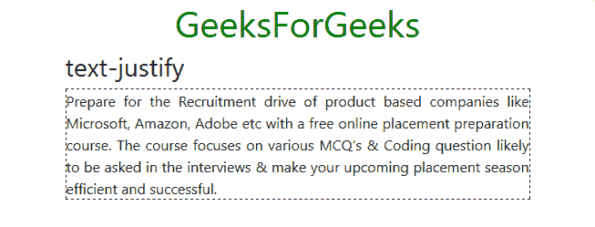

*   **`text-center`:** 它将所有屏幕尺寸的文本对齐方式设置为居中。

**示例：**

```html
<!DOCTYPE html>
<html>
  <head>
    <!-- Custom CSS -->
    <style>
      p{
        border: 1px dashed black;
      }
      h1.text-center{
        color: green;
      }
    </style>
    <!-- Bootstrap CSS -->
    <link rel="stylesheet" href="https://stackpath.bootstrapcdn.com/bootstrap/4.2.1/css/bootstrap.min.css" integrity="sha384-GJzZqFGwb1QTTN6wy59ffF1BuGJpLSa9DkKMp0DgiMDm4iYMj70gZWKYbI706tWS" crossorigin="anonymous">
    <title>Bootstrap Text Utilities</title>
  </head>
  <body>
    <!-- Bootstrap class for making the entire div responsive -->
    <div class="container">
      <h1 class="text-center">GeeksForGeeks</h1>
      <h3>text-center</h3>
      <!-- text-center class -->
      <p class="text-center">
        Prepare for the Recruitment drive of product
        based companies like Microsoft, Amazon, Adobe
        etc with a free online placement preparation
        course. The course focuses on various MCQ's
        & Coding question likely to be asked in the
        interviews & make your upcoming placement
        season efficient and successful.
      </p>
    </div>
    <!-- Link JavaScript -->
    <!-- jQuery, Popper.js, Bootstrap JS -->
    <script src="https://code.jquery.com/jquery-3.3.1.slim.min.js" integrity="sha384-q8i/X+965DzO0rT7abK41JStQIAqVgRVzpbzo5smXKp4YfRvH+8abtTE1Pi6jizo" crossorigin="anonymous"></script>
    <script src="https://cdnjs.cloudflare.com/ajax/libs/popper.js/1.14.6/umd/popper.min.js" integrity="sha384-wHAiFfRlMFy6i5SRaxvfOCifBUQy1xHdJ/yoi7FRNXMRBu5WHdZYu1hA6ZOblgut" crossorigin="anonymous"></script>
    <script src="https://stackpath.bootstrapcdn.com/bootstrap/4.2.1/js/bootstrap.min.js" integrity="sha384-B0UglyR+jN6CkvvICOB2joaf5I4l3gm9GU6Hc1og6Ls7i6U/mkkaduKaBhlAXv9k" crossorigin="anonymous"></script>
  </body>
</html>
```

**输出：**

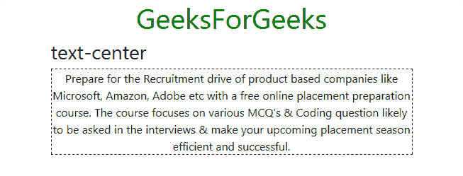

*   **`text-left`:** 它将所有屏幕尺寸的文本对齐方式设置为左对齐。

**示例：**

```html
<!DOCTYPE html>
<html>
  <head>
    <!-- Custom CSS -->
    <style>
      p{
        border: 1px dashed black;
      }
      h1.text-center{
        color: green;
      }
    </style>
    <!-- Bootstrap CSS -->
    <link rel="stylesheet" href="https://stackpath.bootstrapcdn.com/bootstrap/4.2.1/css/bootstrap.min.css" integrity="sha384-GJzZqFGwb1QTTN6wy59ffF1BuGJpLSa9DkKMp0DgiMDm4iYMj70gZWKYbI706tWS" crossorigin="anonymous">
    <title>Bootstrap Text Utilities</title>
  </head>
  <body>
    <!-- Bootstrap class for making the entire div responsive -->
    <div class="container">
      <h1 class="text-center">GeeksForGeeks</h1>
      <h3>text-left</h3>
      <!-- text-left class -->
      <p class="text-left">
        Prepare for the Recruitment drive of product
        based companies like Microsoft, Amazon, Adobe
        etc with a free online placement preparation
        course. The course focuses on various MCQ's
        & Coding question likely to be asked in the
        interviews & make your upcoming placement
        season efficient and successful.
      </p>
    </div>
    <!-- Link JavaScript -->
    <!-- jQuery, Popper.js, Bootstrap JS -->
    <script src="https://code.jquery.com/jquery-3.3.1.slim.min.js" integrity="sha384-q8i/X+965DzO0rT7abK41JStQIAqVgRVzpbzo5smXKp4YfRvH+8abtTE1Pi6jizo" crossorigin="anonymous"></script>
    <script src="https://cdnjs.cloudflare.com/ajax/libs/popper.js/1.14.6/umd/popper.min.js" integrity="sha384-wHAiFfRlMFy6i5SRaxvfOCifBUQy1xHdJ/yoi7FRNXMRBu5WHdZYu1hA6ZOblgut" crossorigin="anonymous"></script>
    <script src="https://stackpath.bootstrapcdn.com/bootstrap/4.2.1/js/bootstrap.min.js" integrity="sha384-B0UglyR+jN6CkvvICOB2joaf5I4l3gm9GU6Hc1og6Ls7i6U/mkkaduKaBhlAXv9k" crossorigin="anonymous"></script>
  </body>
</html>
```

**输出：**

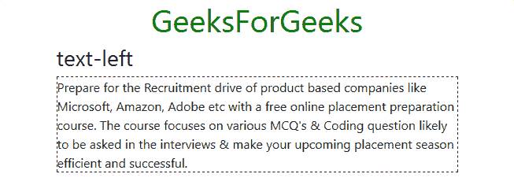

*   **`text-right`:** 它将所有屏幕尺寸的文本对齐方式设置为右对齐。

**示例：**

```html
<!DOCTYPE html>
<html>
  <head>
    <!-- Custom CSS -->
    <style>
      p{
        border: 1px dashed black;
      }
      h1.text-center{
        color: green;
      }
    </style>
    <!-- Bootstrap CSS -->
    <link rel="stylesheet" href="https://stackpath.bootstrapcdn.com/bootstrap/4.2.1/css/bootstrap.min.css" integrity="sha384-GJzZqFGwb1QTTN6wy59ffF1BuGJpLSa9DkKMp0DgiMDm4iYMj70gZWKYbI706tWS" crossorigin="anonymous">
    <title>Bootstrap Text Utilities</title>
  </head>
  <body>
    <!-- Bootstrap class for making the entire div responsive -->
    <div class="container">
      <h1 class="text-center">GeeksForGeeks</h1>
      <h3>text-right</h3>
```

# Bootstrap 文本工具类

## 文本对齐

Bootstrap 提供了一系列可以根据视口大小改变文本对齐方式的类。

*   **`text-(viewport)-(align)`**: 根据视口尺寸设置文本对齐。
    *   **`text-sm-left`**: 在大于 576px (sm) 的视口中将文本对齐设置为向左。
    *   **`text-md-left`**: 在尺寸大于 768px (md) 的视口中将文本对齐设置为向左。
    *   **`text-lg-left`**: 在尺寸大于 992px (lg) 的视口中将文本对齐设置为向左。
    *   **`text-xl-left`**: 在尺寸大于 1200px (xl) 的视口中将文本对齐设置为向左。
    *   **`text-sm-center`**: 将文本对齐设置为在大于 576px (sm) 的视口上居中。
    *   **`text-md-center`**: 将文本对齐设置为在尺寸大于 768px (md) 的视口上居中。
    *   **`text-lg-center`**: 将文本对齐设置为在尺寸大于 992px (lg) 的视口上居中。
    *   **`text-xl-center`**: 将文本对齐设置为在尺寸大于 1200px (xl) 的视口上居中。
    *   **`text-sm-right`**: 在尺寸大于 576px (sm) 的视口中将文本对齐设置为向右。
    *   **`text-md-right`**: 在尺寸大于 768px (md) 的视口中将文本对齐设置为向右。
    *   **`text-lg-right`**: 在大于 992px (lg) 的视口中将文本对齐设置为向右。
    *   **`text-xl-right`**: 在尺寸大于 1200px (xl) 的视口中将文本对齐设置为向右。

### 示例: `text-sm-right`

```html
<!DOCTYPE html>
<html>
  <head>
    <!-- Custom CSS -->
    <style>
      p{
        border: 1px dashed black;
      }
      h1.text-center{
        color: green;
      }
    </style>
    <!-- Bootstrap CSS -->
    <link rel="stylesheet" href="https://stackpath.bootstrapcdn.com/bootstrap/4.2.1/css/bootstrap.min.css" integrity="sha384-GJzZqFGwb1QTTN6wy59ffF1BuGJpLSa9DkKMp0DgiMDm4iYMj70gZWKYbI706tWS" crossorigin="anonymous">
    <title>Bootstrap Text Utilities</title>
  </head>
  <body>
    <!-- Bootstrap class for making the enire div responsive -->
    <div class="container">
      <h1 class="text-center">GeeksForGeeks</h1>
      <h3>text-sm-right</h3>
      <!-- text-sm-right -->
      <p class="text-sm-right">
        Prepare for the Recruitment drive of product
        based companies like Microsoft, Amazon, Adobe
        etc with a free online placement preparation
        course. The course focuses on various MCQ's
        & Coding question likely to be asked in the
        interviews & make your upcoming placement
        season efficient and successful.
      </p>
    </div>
    <!-- Link JavaScript -->
    <!-- jQuery, Popper.js, Bootstrap JS -->
    <script src="https://code.jquery.com/jquery-3.3.1.slim.min.js" integrity="sha384-q8i/X+965DzO0rT7abK41JStQIAqVgRVzpbzo5smXKp4YfRvH+8abtTE1Pi6jizo" crossorigin="anonymous"></script>
    <script src="https://cdnjs.cloudflare.com/ajax/libs/popper.js/1.14.6/umd/popper.min.js" integrity="sha384-wHAiFfRlMFy6i5SRaxvfOCifBUQy1xHdJ/yoi7FRNXMRBu5WHdZYu1hA6ZOblgut" crossorigin="anonymous"></script>
    <script src="https://stackpath.bootstrapcdn.com/bootstrap/4.2.1/js/bootstrap.min.js" integrity="sha384-B0UglyR+jN6CkvvICOB2joaf5I4l3gm9GU6Hc1og6Ls7i6U/mkkaduKaBhlAXv9k" crossorigin="anonymous"></script>
  </body>
</html>
```

**输出:**
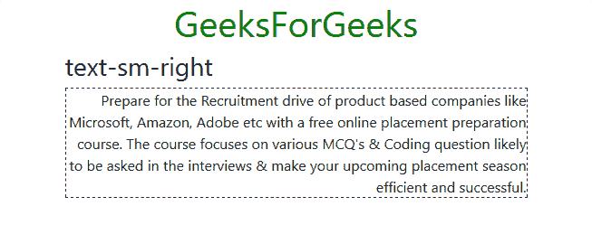

**注意:** 可以组合 `text-(align)` 和 `text-(viewport)-(align)`，以及两种不同的 `text-(viewport)-(align)`，根据不同的视口获得不同的对齐。类似地，当视口大小大于 768px (md) 时，可以使用 `text-center` 和 `text-md-right`，在较小的视口中，文本将居中对齐。

## 文本换行

*   **`text-wrap`**: 在应用的元素上设置文本换行。

```html
<!DOCTYPE html>
<html>
  <head>
    <!-- Custom CSS -->
    <style>
      p{
        border: 1px dashed black;
      }
      h1.text-center{
        color: green;
      }
    </style>
    <!-- Bootstrap CSS -->
    <link rel="stylesheet" href="https://stackpath.bootstrapcdn.com/bootstrap/4.2.1/css/bootstrap.min.css" integrity="sha384-GJzZqFGwb1QTTN6wy59ffF1BuGJpLSa9DkKMp0DgiMDm4iYMj70gZWKYbI706tWS" crossorigin="anonymous">
    <title>Bootstrap Text Utilities</title>
  </head>
  <body>
    <!-- Bootstrap class for making the enire div responsive -->
    <div class="container">
      <h1 class="text-center">GeeksForGeeks</h1>
      <h3>text-wrap</h3>
      <!-- text-wrap -->
      <p class="text-wrap" style="width: 30rem;">
        Prepare for the Recruitment drive of product
        based companies like Microsoft, Amazon, Adobe
        etc with a free online placement preparation
        course. The course focuses on various MCQ's
        & Coding question likely to be asked in the
        interviews & make your upcoming placement
        season efficient and successful.
      </p>
    </div>
    <!-- Link JavaScript -->
    <!-- jQuery, Popper.js, Bootstrap JS -->
    <script src="https://code.jquery.com/jquery-3.3.1.slim.min.js" integrity="sha384-q8i/X+965DzO0rT7abK41JStQIAqVgRVzpbzo5smXKp4YfRvH+8abtTE1Pi6jizo" crossorigin="anonymous"></script>
    <script src="https://cdnjs.cloudflare.com/ajax/libs/popper.js/1.14.6/umd/popper.min.js" integrity="sha384-wHAiFfRlMFy6i5SRaxvfOCifBUQy1xHdJ/yoi7FRNXMRBu5WHdZYu1hA6ZOblgut" crossorigin="anonymous"></script>
    <script src="https://stackpath.bootstrapcdn.com/bootstrap/4.2.1/js/bootstrap.min.js" integrity="sha384-B0UglyR+jN6CkvvICOB2joaf5I4l3gm9GU6Hc1og6Ls7i6U/mkkaduKaBhlAXv9k" crossorigin="anonymous"></script>
  </body>
</html>
```

**输出:**
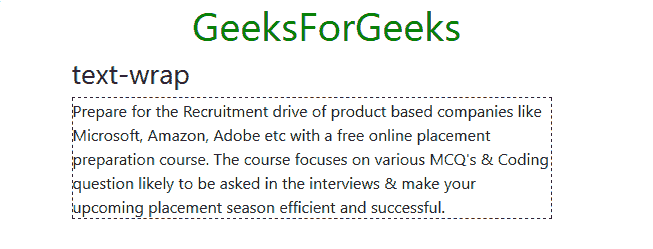

*   **`text-nowrap`**: 移除应用元素上的文本换行。

```html
<!DOCTYPE html>
<html>
  <head>
    <!-- Custom CSS -->
    <style>
      p{
        border: 1px dashed black;
      }
      h1.text-center{
        color: green;
      }
    </style>
    <!-- Bootstrap CSS -->
    <link rel="stylesheet" href="https://stackpath.bootstrapcdn.com/bootstrap/4.2.1/css/bootstrap.min.css" integrity="sha384-GJzZqFGwb1QTTN6wy59ffF1BuGJpLSa9DkKMp0DgiMDm4iYMj70gZWKYbI706tWS" crossorigin="anonymous">
    <title>Bootstrap Text Utilities</title>
  </head>
  <body>
    <!-- Bootstrap class for making the enire div responsive -->
    <div class="container">
      <h1 class="text-center">GeeksForGeeks</h1>
      <h3>text-nowrap</h3>
      <!-- text-nowrap -->
      <p class="text-nowrap" style="width: 30rem;">
        Prepare for the Recruitment drive of product
        based companies like Microsoft, Amazon, Adobe
        etc with a free online placement preparation
        course. The course focuses on various MCQ's
        & Coding question likely to be asked in the
        interviews & make your upcoming placement
        season efficient and successful.
      </p>
    </div>
    <!-- Link JavaScript -->
    <!-- jQuery, Popper.js, Bootstrap JS -->
    <script src="https://code.jquery.com/jquery-3.3.1.slim.min.js" integrity="sha384-q8i/X+965DzO0rT7abK41JStQIAqVgRVzpbzo5smXKp4YfRvH+8abtTE1Pi6jizo" crossorigin="anonymous"></script>
    <script src="https://cdnjs.cloudflare.com/ajax/libs/popper.js/1.14.6/umd/popper.min.js" integrity="sha384-wHAiFfRlMFy6i5SRaxvfOCifBUQy1xHdJ/yoi7FRNXMRBu5WHdZYu1hA6ZOblgut" crossorigin="anonymous"></script>
    <script src="https://stackpath.bootstrapcdn.com/bootstrap/4.2.1/js/bootstrap.min.js" integrity="sha384-B0UglyR+jN6CkvvICOB2joaf5I4l3gm9GU6Hc1og6Ls7i6U/mkkaduKaBhlAXv9k" crossorigin="anonymous"></script>
  </body>
</html>
```

# Bootstrap 文本工具类

## text-truncate

`text-truncate` 类用于在应用的元素上设置带省略号的截断。

```html
<!DOCTYPE html>
<html>
  <head>
    <!-- Custom CSS -->
    <style>
      p{
        border: 1px dashed black;
      }

      h1.text-center{
        color: green;
      }
    </style>

    <!-- Bootstrap CSS -->
    <link rel="stylesheet" href="https://stackpath.bootstrapcdn.com/bootstrap/4.2.1/css/bootstrap.min.css" integrity="sha384-GJzZqFGwb1QTTN6wy59ffF1BuGJpLSa9DkKMp0DgiMDm4iYMj70gZWKYbI706tWS" crossorigin="anonymous">

    <title>Bootstrap Text Utilities</title>
  </head>
  <body>
    <!-- Bootstrap class for making the enire div responsive -->
    <div class="container">
      <h1 class="text-center">GeeksForGeeks</h1>
      <h3>text-truncate</h3>

      <!-- text-truncate -->
      <p class="text-truncate" style="width: 30rem;">
        Prepare for the Recruitment drive of product
        based companies like Microsoft, Amazon, Adobe
        etc with a free online placement preparation
        course. The course focuses on various MCQ's
        & Coding question likely to be asked in the
        interviews & make your upcoming placement
        season efficient and successful.
      </p>
    </div>

    <!-- Link JavaScript -->
    <!-- jQuery, Popper.js, Bootstrap JS -->
    <script src="https://code.jquery.com/jquery-3.3.1.slim.min.js" integrity="sha384-q8i/X+965DzO0rT7abK41JStQIAqVgRVzpbzo5smXKp4YfRvH+8abtTE1Pi6jizo" crossorigin="anonymous"></script>
    <script src="https://cdnjs.cloudflare.com/ajax/libs/popper.js/1.14.6/umd/popper.min.js" integrity="sha384-wHAiFfRlMFy6i5SRaxvfOCifBUQy1xHdJ/yoi7FRNXMRBu5WHdZYu1hA6ZOblgut" crossorigin="anonymous"></script>
    <script src="https://stackpath.bootstrapcdn.com/bootstrap/4.2.1/js/bootstrap.min.js" integrity="sha384-B0UglyR+jN6CkvvICOB2joaf5I4l3gm9GU6Hc1og6Ls7i6U/mkkaduKaBhlAXv9k" crossorigin="anonymous"></script>
  </body>
</html>
```

**输出:**
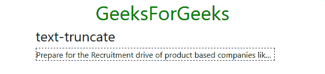

## 字体粗细和斜体

### font-weight-bold

`font-weight-bold` 用于将字体文本设置为粗体。

```html
<!DOCTYPE html>
<html>
  <head>
    <!-- Custom CSS -->
    <style>
      p{
        border: 1px dashed black;
      }

      h1.text-center{
        color: green;
      }
    </style>

    <!-- Bootstrap CSS -->
    <link rel="stylesheet" href="https://stackpath.bootstrapcdn.com/bootstrap/4.2.1/css/bootstrap.min.css" integrity="sha384-GJzZqFGwb1QTTN6wy59ffF1BuGJpLSa9DkKMp0DgiMDm4iYMj70gZWKYbI706tWS" crossorigin="anonymous">

    <title>Bootstrap Text Utilities</title>
  </head>
  <body>
    <!-- Bootstrap class for making the enire div responsive -->
    <div class="container">
      <h1 class="text-center">GeeksForGeeks</h1>
      <h3>font-weight-bold</h3>

      <!-- font-weight-bold -->
      <p class="font-weight-bold">
        Prepare for the Recruitment drive of product
        based companies like Microsoft, Amazon, Adobe
        etc with a free online placement preparation
        course. The course focuses on various MCQ's
        & Coding question likely to be asked in the
        interviews & make your upcoming placement
        season efficient and successful.
      </p>
    </div>

    <!-- Link JavaScript -->
    <!-- jQuery, Popper.js, Bootstrap JS -->
    <script src="https://code.jquery.com/jquery-3.3.1.slim.min.js" integrity="sha384-q8i/X+965DzO0rT7abK41JStQIAqVgRVzpbzo5smXKp4YfRvH+8abtTE1Pi6jizo" crossorigin="anonymous"></script>
    <script src="https://cdnjs.cloudflare.com/ajax/libs/popper.js/1.14.6/umd/popper.min.js" integrity="sha384-wHAiFfRlMFy6i5SRaxvfOCifBUQy1xHdJ/yoi7FRNXMRBu5WHdZYu1hA6ZOblgut" crossorigin="anonymous"></script>
    <script src="https://stackpath.bootstrapcdn.com/bootstrap/4.2.1/js/bootstrap.min.js" integrity="sha384-B0UglyR+jN6CkvvICOB2joaf5I4l3gm9GU6Hc1og6Ls7i6U/mkkaduKaBhlAXv9k" crossorigin="anonymous"></script>
  </body>
</html>
```

**输出:**
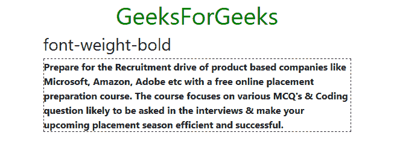

### font-weight-bolder

`font-weight-bolder` 用于设置比其父元素更粗的字体。

```html
<!DOCTYPE html>
<html>
  <head>
    <!-- Custom CSS -->
    <style>
      p{
        border: 1px dashed black;
      }

      h1.text-center{
        color: green;
      }
    </style>

    <!-- Bootstrap CSS -->
    <link rel="stylesheet" href="https://stackpath.bootstrapcdn.com/bootstrap/4.2.1/css/bootstrap.min.css" integrity="sha384-GJzZqFGwb1QTTN6wy59ffF1BuGJpLSa9DkKMp0DgiMDm4iYMj70gZWKYbI706tWS" crossorigin="anonymous">

    <title>Bootstrap Text Utilities</title>
  </head>
  <body>
    <!-- Bootstrap class for making the enire div responsive -->
    <div class="container">
      <h1 class="text-center">GeeksForGeeks</h1>
      <h3>font-weight-bolder</h3>

      <!-- font-weight-bolder -->
      <p class="font-weight-bolder">
        Prepare for the Recruitment drive of product
        based companies like Microsoft, Amazon, Adobe
        etc with a free online placement preparation
        course. The course focuses on various MCQ's
        & Coding question likely to be asked in the
        interviews & make your upcoming placement
        season efficient and successful.
      </p>
    </div>

    <!-- Link JavaScript -->
    <!-- jQuery, Popper.js, Bootstrap JS -->
    <script src="https://code.jquery.com/jquery-3.3.1.slim.min.js" integrity="sha384-q8i/X+965DzO0rT7abK41JStQIAqVgRVzpbzo5smXKp4YfRvH+8abtTE1Pi6jizo" crossorigin="anonymous"></script>
    <script src="https://cdnjs.cloudflare.com/ajax/libs/popper.js/1.14.6/umd/popper.min.js" integrity="sha384-wHAiFfRlMFy6i5SRaxvfOCifBUQy1xHdJ/yoi7FRNXMRBu5WHdZYu1hA6ZOblgut" crossorigin="anonymous"></script>
    <script src="https://stackpath.bootstrapcdn.com/bootstrap/4.2.1/js/bootstrap.min.js" integrity="sha384-B0UglyR+jN6CkvvICOB2joaf5I4l3gm9GU6Hc1og6Ls7i6U/mkkaduKaBhlAXv9k" crossorigin="anonymous"></script>
  </body>
</html>
```

**输出:**
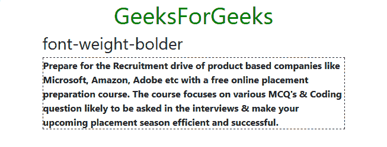

### font-weight-normal

`font-weight-normal` 用于设置正常字体粗细。

```html
<!DOCTYPE html>
<html>
  <head>
    <!-- Custom CSS -->
    <style>
      p{
        border: 1px dashed black;
      }

      h1.text-center{
        color: green;
      }
    </style>

    <!-- Bootstrap CSS -->
    <link rel="stylesheet" href="https://stackpath.bootstrapcdn.com/bootstrap/4.2.1/css/bootstrap.min.css" integrity="sha384-GJzZqFGwb1QTTN6wy59ffF1BuGJpLSa9DkKMp0DgiMDm4iYMj70gZWKYbI706tWS" crossorigin="anonymous">
```

# Bootstrap Text Utilities

## font-weight-normal

`font-weight-normal` 用于将文本设置为正常字体粗细。

```html
<!DOCTYPE html>
<html>
  <head>
    <!-- Custom CSS -->
    <style>
      p{
        border: 1px dashed black;
      }
      h1.text-center{
        color: green;
      }
    </style>
    <!-- Bootstrap CSS -->
    <link rel="stylesheet" href="https://stackpath.bootstrapcdn.com/bootstrap/4.2.1/css/bootstrap.min.css" integrity="sha384-GJzZqFGwb1QTTN6wy59ffF1BuGJpLSa9DkKMp0DgiMDm4iYMj70gZWKYbI706tWS" crossorigin="anonymous">
    <title>Bootstrap Text Utilities</title>
  </head>
  <body>
    <!-- Bootstrap class for making the enire div responsive -->
    <div class="container">
      <h1 class="text-center">GeeksForGeeks</h1>
      <h3>font-weight-normal</h3>
      <!-- font-weight-normal -->
      <p class="font-weight-normal">
        Prepare for the Recruitment drive of product
        based companies like Microsoft, Amazon, Adobe
        etc with a free online placement preparation
        course. The course focuses on various MCQ's
        & Coding question likely to be asked in the
        interviews & make your upcoming placement
        season efficient and successful.
      </p>
    </div>
    <!-- Link JavaScript -->
    <!-- jQuery, Popper.js, Bootstrap JS -->
    <script src="https://code.jquery.com/jquery-3.3.1.slim.min.js" integrity="sha384-q8i/X+965DzO0rT7abK41JStQIAqVgRVzpbzo5smXKp4YfRvH+8abtTE1Pi6jizo" crossorigin="anonymous"></script>
    <script src="https://cdnjs.cloudflare.com/ajax/libs/popper.js/1.14.6/umd/popper.min.js" integrity="sha384-wHAiFfRlMFy6i5SRaxvfOCifBUQy1xHdJ/yoi7FRNXMRBu5WHdZYu1hA6ZOblgut" crossorigin="anonymous"></script>
    <script src="https://stackpath.bootstrapcdn.com/bootstrap/4.2.1/js/bootstrap.min.js" integrity="sha384-B0UglyR+jN6CkvvICOB2joaf5I4l3gm9GU6Hc1og6Ls7i6U/mkkaduKaBhlAXv9k" crossorigin="anonymous"></script>
  </body>
</html>
```

**输出:**
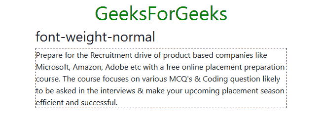

## font-weight-light

`font-weight-light` 用于将文本设置为较细的字体粗细。

```html
<!DOCTYPE html>
<html>
  <head>
    <!-- Custom CSS -->
    <style>
      p{
        border: 1px dashed black;
      }
      h1.text-center{
        color: green;
      }
    </style>
    <!-- Bootstrap CSS -->
    <link rel="stylesheet" href="https://stackpath.bootstrapcdn.com/bootstrap/4.2.1/css/bootstrap.min.css" integrity="sha384-GJzZqFGwb1QTTN6wy59ffF1BuGJpLSa9DkKMp0DgiMDm4iYMj70gZWKYbI706tWS" crossorigin="anonymous">
    <title>Bootstrap Text Utilities</title>
  </head>
  <body>
    <!-- Bootstrap class for making the enire div responsive -->
    <div class="container">
      <h1 class="text-center">GeeksForGeeks</h1>
      <h3>font-weight-light</h3>
      <!-- font-weight-light -->
      <p class="font-weight-light">
        Prepare for the Recruitment drive of product
        based companies like Microsoft, Amazon, Adobe
        etc with a free online placement preparation
        course. The course focuses on various MCQ's
        & Coding question likely to be asked in the
        interviews & make your upcoming placement
        season efficient and successful.
      </p>
    </div>
    <!-- Link JavaScript -->
    <!-- jQuery, Popper.js, Bootstrap JS -->
    <script src="https://code.jquery.com/jquery-3.3.1.slim.min.js" integrity="sha384-q8i/X+965DzO0rT7abK41JStQIAqVgRVzpbzo5smXKp4YfRvH+8abtTE1Pi6jizo" crossorigin="anonymous"></script>
    <script src="https://cdnjs.cloudflare.com/ajax/libs/popper.js/1.14.6/umd/popper.min.js" integrity="sha384-wHAiFfRlMFy6i5SRaxvfOCifBUQy1xHdJ/yoi7FRNXMRBu5WHdZYu1hA6ZOblgut" crossorigin="anonymous"></script>
    <script src="https://stackpath.bootstrapcdn.com/bootstrap/4.2.1/js/bootstrap.min.js" integrity="sha384-B0UglyR+jN6CkvvICOB2joaf5I4l3gm9GU6Hc1og6Ls7i6U/mkkaduKaBhlAXv9k" crossorigin="anonymous"></script>
  </body>
</html>
```

**输出:**
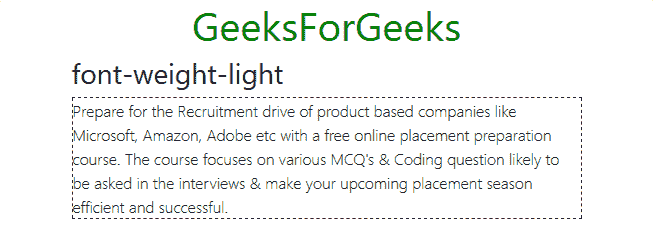

## font-weight-lighter

`font-weight-lighter` 用于将字体粗细设置为比其父元素更细。

```html
<!DOCTYPE html>
<html>
  <head>
    <!-- Custom CSS -->
    <style>
      p{
        border: 1px dashed black;
      }
      h1.text-center{
        color: green;
      }
    </style>
    <!-- Bootstrap CSS -->
    <link rel="stylesheet" href="https://stackpath.bootstrapcdn.com/bootstrap/4.2.1/css/bootstrap.min.css" integrity="sha384-GJzZqFGwb1QTTN6wy59ffF1BuGJpLSa9DkKMp0DgiMDm4iYMj70gZWKYbI706tWS" crossorigin="anonymous">
    <title>Bootstrap Text Utilities</title>
  </head>
  <body>
    <!-- Bootstrap class for making the enire div responsive -->
    <div class="container">
      <h1 class="text-center">GeeksForGeeks</h1>
      <h3>font-weight-lighter</h3>
      <!-- font-weight-lighter -->
      <p class="font-weight-lighter">
        Prepare for the Recruitment drive of product
        based companies like Microsoft, Amazon, Adobe
        etc with a free online placement preparation
        course. The course focuses on various MCQ's
        & Coding question likely to be asked in the
        interviews & make your upcoming placement
        season efficient and successful.
      </p>
    </div>
    <!-- Link JavaScript -->
    <!-- jQuery, Popper.js, Bootstrap JS -->
    <script src="https://code.jquery.com/jquery-3.3.1.slim.min.js" integrity="sha384-q8i/X+965DzO0rT7abK41JStQIAqVgRVzpbzo5smXKp4YfRvH+8abtTE1Pi6jizo" crossorigin="anonymous"></script>
    <script src="https://cdnjs.cloudflare.com/ajax/libs/popper.js/1.14.6/umd/popper.min.js" integrity="sha384-wHAiFfRlMFy6i5SRaxvfOCifBUQy1xHdJ/yoi7FRNXMRBu5WHdZYu1hA6ZOblgut" crossorigin="anonymous"></script>
    <script src="https://stackpath.bootstrapcdn.com/bootstrap/4.2.1/js/bootstrap.min.js" integrity="sha384-B0UglyR+jN6CkvvICOB2joaf5I4l3gm9GU6Hc1og6Ls7i6U/mkkaduKaBhlAXv9k" crossorigin="anonymous"></script>
  </body>
</html>
```

**输出:**
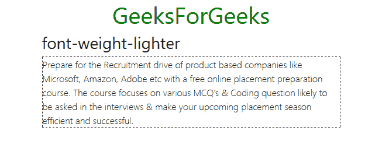

## font-italic

`font-italic` 用于将字体样式设置为斜体。

```html
<!DOCTYPE html>
<html>
  <head>
    <!-- Custom CSS -->
    <style>
      p{
        border: 1px dashed black;
      }
      h1.text-center{
        color: green;
      }
    </style>
    <!-- Bootstrap CSS -->
    <link rel="stylesheet" href="https://stackpath.bootstrapcdn.com/bootstrap/4.2.1/css/bootstrap.min.css" integrity="sha384-GJzZqFGwb1QTTN6wy59ffF1BuGJpLSa9DkKMp0DgiMDm4iYMj70gZWKYbI706tWS" crossorigin="anonymous">
    <title>Bootstrap Text Utilities</title>
  </head>
  <body>
    <!-- Bootstrap class for making the enire div responsive -->
    <div class="container">
      <h1 class="text-center">GeeksForGeeks</h1>
      <h3>font-italic</h3>
      <!-- font-italic -->
      <p class="font-italic">
        Prepare for the Recruitment drive of product
        based companies like Microsoft, Amazon, Adobe
        etc with a free online placement preparation
        course. The course focuses on various MCQ's
        & Coding question likely to be asked in the
        interviews & make your upcoming placement
        season efficient and successful.
      </p>
    </div>
    <!-- Link JavaScript -->
    <!-- jQuery, Popper.js, Bootstrap JS -->
    <script src="https://code.jquery.com/jquery-3.3.1.slim.min.js" integrity="sha384-q8i/X+965DzO0rT7abK41JStQIAqVgRVzpbzo5smXKp4YfRvH+8abtTE1Pi6jizo" crossorigin="anonymous"></script>
    <script src="https://cdnjs.cloudflare.com/ajax/libs/popper.js/1.14.6/umd/popper.min.js" integrity="sha384-wHAiFfRlMFy6i5SRaxvfOCifBUQy1xHdJ/yoi7FRNXMRBu5WHdZYu1hA6ZOblgut" crossorigin="anonymous"></script>
    <script src="https://stackpath.bootstrapcdn.com/bootstrap/4.2.1/js/bootstrap.min.js" integrity="sha384-B0UglyR+jN6CkvvICOB2joaf5I4l3gm9GU6Hc1og6Ls7i6U/mkkaduKaBhlAXv9k" crossorigin="anonymous"></script>
  </body>
</html>
```

**输出:**
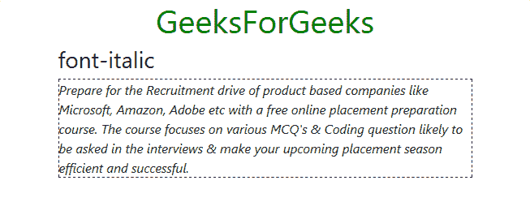

## 等间距

### text-monospace

`text-monospace` 用于将文本字体更改为等宽字体。

```html
<!DOCTYPE html>
<html>
  <head>
    <!-- Custom CSS -->
    <style>
      p{
        border: 1px dashed black;
      }

      h1.text-center{
        color: green;
      }
    </style>

    <!-- Bootstrap CSS -->
    <link rel="stylesheet" href="https://stackpath.bootstrapcdn.com/bootstrap/4.2.1/css/bootstrap.min.css" integrity="sha384-GJzZqFGwb1QTTN6wy59ffF1BuGJpLSa9DkKMp0DgiMDm4iYMj70gZWKYbI706tWS" crossorigin="anonymous">

    <title>Bootstrap Text Utilities</title>
  </head>
  <body>
    <!-- Bootstrap class for making the enire div responsive -->
    <div class="container">
      <h1 class="text-center">GeeksForGeeks</h1>
      <h3>text-monospace</h3>
      <!-- text-monospace -->
      <p class="text-monospace">
        Prepare for the Recruitment drive of product
        based companies like Microsoft, Amazon, Adobe
        etc with a free online placement preparation
        course. The course focuses on various MCQ's
        & Coding question likely to be asked in the
        interviews & make your upcoming placement
        season efficient and successful.
      </p>
    </div>

    <!-- Link JavaScript -->
    <!-- jQuery, Popper.js, Bootstrap JS -->
    <script src="https://code.jquery.com/jquery-3.3.1.slim.min.js" integrity="sha384-q8i/X+965DzO0rT7abK41JStQIAqVgRVzpbzo5smXKp4YfRvH+8abtTE1Pi6jizo" crossorigin="anonymous"></script>
    <script src="https://cdnjs.cloudflare.com/ajax/libs/popper.js/1.14.6/umd/popper.min.js" integrity="sha384-wHAiFfRlMFy6i5SRaxvfOCifBUQy1xHdJ/yoi7FRNXMRBu5WHdZYu1hA6ZOblgut" crossorigin="anonymous"></script>
    <script src="https://stackpath.bootstrapcdn.com/bootstrap/4.2.1/js/bootstrap.min.js" integrity="sha384-B0UglyR+jN6CkvvICOB2joaf5I4l3gm9GU6Hc1og6Ls7i6U/mkkaduKaBhlAXv9k" crossorigin="anonymous"></script>
  </body>
</html>
```

### 输出
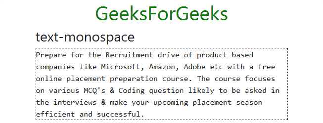

## 重置颜色

*   `text-reset`: It is used to remove the font color from the text to font color inherited from its parent element.

```html
<!DOCTYPE html>
<html>
  <head>
    <!-- Custom CSS -->
    <style>
      p{
        border: 1px dashed black;
        color: blue;
      }
      h1.text-center{
        color: green;
      }
    </style>

    <!-- Bootstrap CSS -->
    <link rel="stylesheet" href="https://stackpath.bootstrapcdn.com/bootstrap/4.2.1/css/bootstrap.min.css" integrity="sha384-GJzZqFGwb1QTTN6wy59ffF1BuGJpLSa9DkKMp0DgiMDm4iYMj70gZWKYbI706tWS" crossorigin="anonymous">

    <title>Bootstrap Text Utilities</title>
  </head>
  <body>
    <!-- Bootstrap class for making the enire div responsive -->
    <div class="container">
      <h1 class="text-center">GeeksForGeeks</h1>
      <h3>text-reset</h3>
      <!-- text-reset -->
      <p class="text-reset">
        Prepare for the Recruitment drive of product
        based companies like Microsoft, Amazon, Adobe
        etc with a free online placement preparation
        course. The course focuses on various MCQ's
        & Coding question likely to be asked in the
        interviews & make your upcoming placement
        season efficient and successful.
      </p>
    </div>

    <!-- Link JavaScript -->
    <!-- jQuery, Popper.js, Bootstrap JS -->
    <script src="https://code.jquery.com/jquery-3.3.1.slim.min.js" integrity="sha384-q8i/X+965DzO0rT7abK41JStQIAqVgRVzpbzo5smXKp4YfRvH+8abtTE1Pi6jizo" crossorigin="anonymous"></script>
    <script src="https://cdnjs.cloudflare.com/ajax/libs/popper.js/1.14.6/umd/popper.min.js" integrity="sha384-wHAiFfRlMFy6i5SRaxvfOCifBUQy1xHdJ/yoi7FRNXMRBu5WHdZYu1hA6ZOblgut" crossorigin="anonymous"></script>
    <script src="https://stackpath.bootstrapcdn.com/bootstrap/4.2.1/js/bootstrap.min.js" integrity="sha384-B0UglyR+jN6CkvvICOB2joaf5I4l3gm9GU6Hc1og6Ls7i6U/mkkaduKaBhlAXv9k" crossorigin="anonymous"></script>
  </body>
</html>
```

### 输出
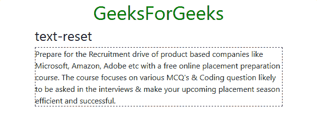

## 移除文字装饰

*   `text-decoration-none`: It is used to remove all the text decoration from the text.

```html
<!DOCTYPE html>
<html>
  <head>
    <!-- Custom CSS -->
    <style>
      p{
        border: 1px dashed black;
        text-decoration: line-through;
      }
      h1.text-center{
        color: green;
      }
    </style>

    <!-- Bootstrap CSS -->
    <link rel="stylesheet" href="https://stackpath.bootstrapcdn.com/bootstrap/4.2.1/css/bootstrap.min.css" integrity="sha384-GJzZqFGwb1QTTN6wy59ffF1BuGJpLSa9DkKMp0DgiMDm4iYMj70gZWKYbI706tWS" crossorigin="anonymous">

    <title>Bootstrap Text Utilities</title>
  </head>
  <body>
    <!-- Bootstrap class for making the enire div responsive -->
    <div class="container">
      <h1 class="text-center">GeeksForGeeks</h1>
      <h3>text-decoration-none</h3>
      <!-- text-decoration-none -->
      <p class="text-decoration-none">
        Prepare for the Recruitment drive of product
        based companies like Microsoft, Amazon, Adobe
        etc with a free online placement preparation
        course. The course focuses on various MCQ's
        & Coding question likely to be asked in the
        interviews & make your upcoming placement
        season efficient and successful.
      </p>
    </div>

    <!-- Link JavaScript -->
    <!-- jQuery, Popper.js, Bootstrap JS -->
    <script src="https://code.jquery.com/jquery-3.3.1.slim.min.js" integrity="sha384-q8i/X+965DzO0rT7abK41JStQIAqVgRVzpbzo5smXKp4YfRvH+8abtTE1Pi6jizo" crossorigin="anonymous"></script>
    <script src="https://cdnjs.cloudflare.com/ajax/libs/popper.js/1.14.6/umd/popper.min.js" integrity="sha384-wHAiFfRlMFy6i5SRaxvfOCifBUQy1xHdJ/yoi7FRNXMRBu5WHdZYu1hA6ZOblgut" crossorigin="anonymous"></script>
    <script src="https://stackpath.bootstrapcdn.com/bootstrap/4.2.1/js/bootstrap.min.js" integrity="sha384-B0UglyR+jN6CkvvICOB2joaf5I4l3gm9GU6Hc1og6Ls7i6U/mkkaduKaBhlAXv9k" crossorigin="anonymous"></script>
  </body>
</html>
```

### 输出
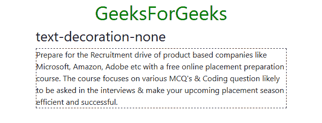