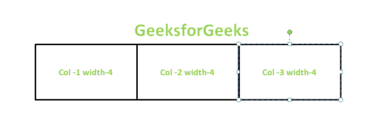
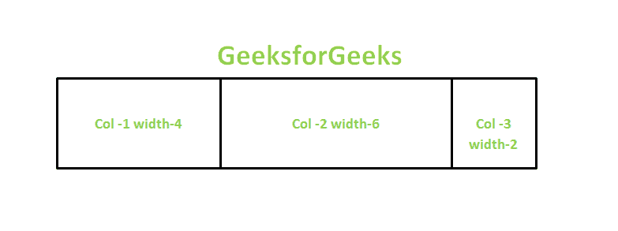
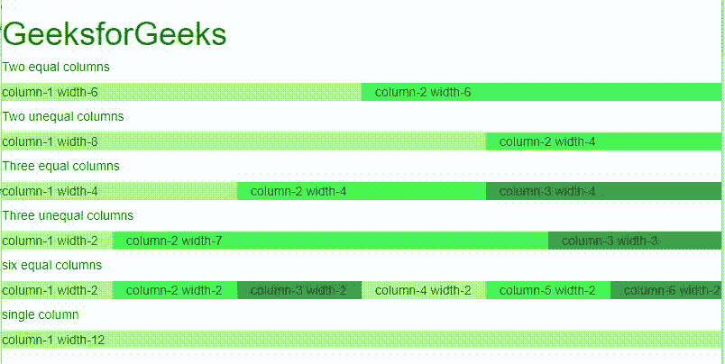

# 在 Bootstrap 中解释基本的网格结构

> 原文: [https://www.geeksforgeeks.org/explain-the-basic-grid-structure-in-bootstrap/](https://www.geeksforgeeks.org/explain-the-basic-grid-structure-in-bootstrap/)

`Bootstrap grid` 是由 [Flexbox](https://www.geeksforgeeks.org/css-flexbox-and-its-properties/) 组成的非常强大的工具，使网站开发更容易。它完全响应，还可以根据设备宽度调整容器中的项目。`.container` 类需要通过包装网格的所有元素来使网格正常工作。Bootstrap 网格中有 12 列，虽然没有必要使用所有的列，但是总和不能超过 12。它们也可以根据喜好合并成更宽的列。

根据设备或浏览器的宽度，Bootstrap 网格系统具有以下类别。

| 类别 | 设备尺寸 | 用途 |
| --- | --- | --- |
| `.col-` | 浏览器宽度小于 576px 的设备 | 用于超小设备 |
| `.col-sm` | 浏览器宽度等于或大于 576px 的设备 | 用于小型设备 |
| `.col-md` | 浏览器宽度等于或大于 768px 的设备 | 用于中型设备 |
| `.col-lg` | 屏幕宽度等于或大于 992px 的设备 | 用于大型设备 |
| `.col-xl` | 屏幕宽度等于或大于 1200px 的设备 | 用于超大型设备 |

`sm`、`md`、`lg` 和 `xl` 分别表示设备尺寸，即小型、中型、大型和超大型。

**对于 3 个等宽的列，即每列宽度为 4–**

```html
<div class="container">
 <div class="row">
     <div class="col-sm-4">Col-1 width-4</div>
     <div class="col-sm-4">Col-2 width-4</div>
     <div class="col-sm-4">Col-3 width-4</div>
 </div>
</div>
```

**输出:**



**对于网页上宽度不等的 3 列–**

```html
<div class="container">
    <div class="row">
          <div class="col-sm-4">Col-1 width-4</div>
          <div class="col-sm-6">Col-2 width-6</div>
         <div class="col-sm-2">Col-3 width-2</div>
    </div>
</div>
```

**输出:**



**示例:** 以下示例描述了各种列大小的 Bootstrap 网格结构。

## 超文本标记语言

```html
<!DOCTYPE html>
<html>

<head>
    <link rel="stylesheet" href="https://maxcdn.bootstrapcdn.com/bootstrap/3.4.1/css/bootstrap.min.css">
</head>

<body>
    <h1 style="color:green;">
        GeeksforGeeks
    </h1>

<h5>Two equal columns</h5>

<div class="row">
        <div class="col-sm-6" style="background-color:rgb(173, 248, 164);">
            column-1 width-6
        </div>
        <div class="col-sm-6" style="background-color:rgb(71, 240, 121);">
            column-2 width-6
        </div>
    </div>

<h5>Two unequal columns</h5>

<div class="row">
        <div class="col-sm-8" style="background-color:rgb(173, 248, 164);">
            column-1 width-8
        </div>
        <div class="col-sm-4" style="background-color:rgb(71, 240, 121);">
            column-2 width-4
        </div>
    </div>

<h5>Three equal columns</h5>

<div class="row">
        <div class="col-sm-4" style="background-color:rgb(173, 248, 164);">
            column-1 width-4
        </div>
        <div class="col-sm-4" style="background-color:rgb(71, 240, 121);">
            column-2 width-4
        </div>
        <div class="col-sm-4" style="background-color:rgb(55, 165, 70);">
            column-3 width-4
        </div>
    </div>

<h5>Three unequal columns</h5>

<div class="row">
        <div class="col-sm-2" style="background-color:rgb(173, 248, 164);">
            column-1 width-2
        </div>
        <div class="col-sm-7" style="background-color:rgb(71, 240, 121);">
            column-2 width-7
        </div>
        <div class="col-sm-3" style="background-color:rgb(55, 165, 70);">
            column-3 width-3
        </div>
    </div>

<h5>six equal columns</h5>

<div class="row">
        <div class="col-sm-2" style="background-color:rgb(173, 248, 164);">
            column-1 width-2
        </div>
        <div class="col-sm-2" style="background-color:rgb(71, 240, 121);">
            column-2 width-2
        </div>
        <div class="col-sm-2" style="background-color:rgb(55, 165, 70);">
            column-3 width-2
        </div>
        <div class="col-sm-2" style="background-color:rgb(173, 248, 164);">
            column-4 width-2
        </div>
        <div class="col-sm-2" style="background-color:rgb(71, 240, 121);">
            column-5 width-2
        </div>
        <div class="col-sm-2" style="background-color:rgb(55, 165, 70);">
            column-6 width-2
        </div>
    </div>

<h5>single column</h5>

<div class="row">
        <div class="col-sm-12" style="background-color:rgb(173, 248, 164);">
            column-1 width-12
        </div>
    </div>
</body>

</html>
```

**输出:**

